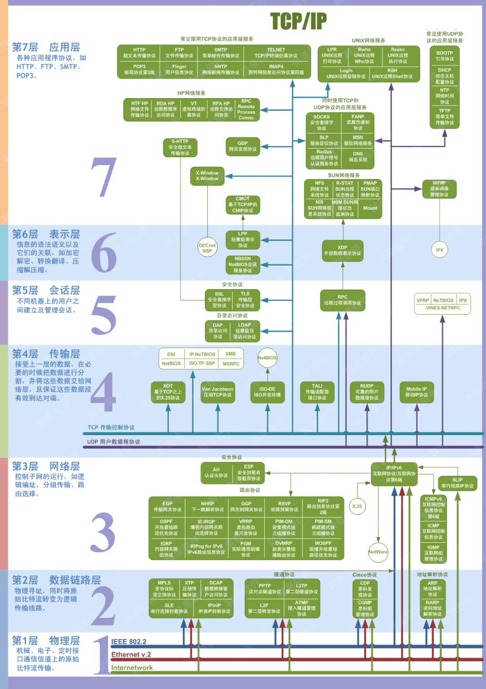
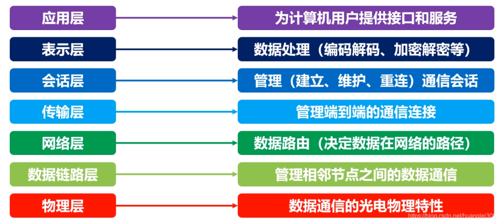
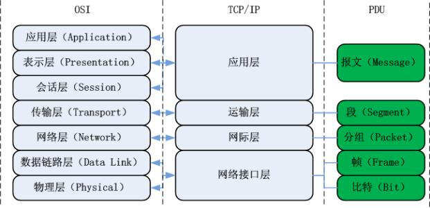
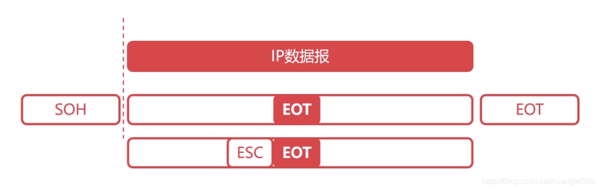
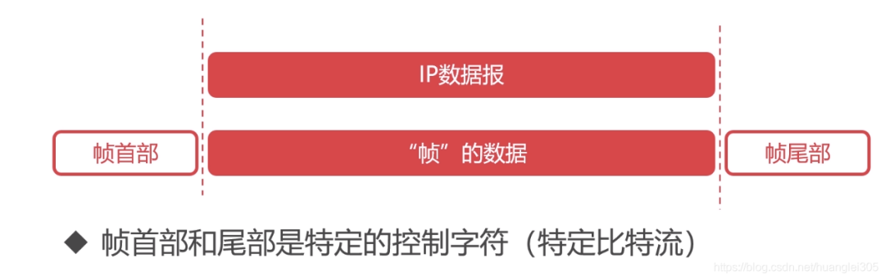
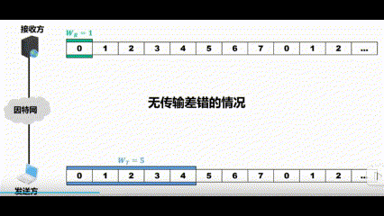
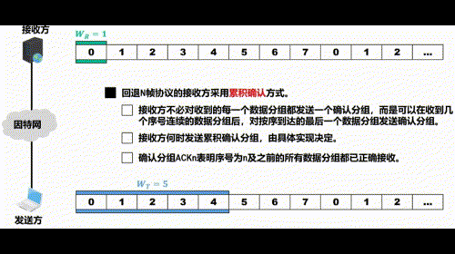

# 计算机网络知识点

# 一、计算机网络概述

思维导图 : 
https://kdocs.cn/l/caeqpkG0MW07

`网络`由若干 `结点(node)`, 和连接这些结点的 `链路(Link)` 组成.  结点可以是各种 `终端设备`和 `网络互联设备`. 链路, 可以是有线, 和无线的.

我们可把这个网络作为一个整体, 跟外界互连时, 把它抽象成一个云.

## 1.1 计算机网络的分类

### 以太网 因特网  互联网

以太网（Ethernet），是当今现有局域网采用的最通用的通信协议标准. 是一个数据链路层协议, 它规定了包括物理层的连线、电子信号和介质访问层协议的内容. 以太网络使用CSMA/CD（载波监听多路访问及冲突检测）技术，并以10M/S的速率（仅指标准以太网的速率而已）运行在多种类型的电缆上。以太网与IEEE802.3系列标准相类似。

局域网是指在某一区域内由多台计算机互联成的计算机组.

以太网分为: 标准以太网(10Mbit/s), 快速以太网(100Mbit/s), 千兆以太网(10Gbit/s).

目前局域网基本上都是使用以太网标准. 以太网就是LAN的一种.

`互联网(internet)`, 由若干 `网络` 和 连接这些网络的`路由器` 组成. 互联网是由 `网络` 组成的网络.

因特网(Internet), 是世界上最大的, 由众多互联网互相连接而成的特定的计算机网络. 连接因特网的各种通信设备, 称为主机(Host).

> 网络 -> (+路由器)互联网 -> 因特网

因特网层级:

RFC (Request for comments)

因特网的核心部分 的关键, 在于其中的路由器(一类有芯片的专用计算机, 负责实现分组交换, 转发收到的分组). 核心部分为边缘部分提供连通性和数据交换等服务.

### 电路交换 分组交换 报文交换

电路交换:

这种交换不适合计算机那种`突发式数据传送`, 因为电路交换在这种场景下的线路传输效率会很低. 线路上真正在传数据的时间不到10%甚至只有1%. 所以计算机使用`分组交换`.

分组交换:

分组交换基于存储转发的技术. 源主机将待发送的整块数据构造成若干个分组并发送出去, 分组传送途中的各个交换节点(即路由器)对分组进行存储转发, 目的主机收到这些分组后将他们还原为原始数据块.

待发送的整块数据称为 `报文(Message)`. 较长的报文不适合直接传输. 若报文太长, 对交换节点的缓存容量也有要求, 处理错误也比较低效. 因此需把长报文, 划分为若干短小的`等长数据段`, 并在每个数据段前加上 由必要控制信息(如源地址, 目的地址等)组成的`首部(header)`. 这样一个个`分组(Packet)`就构造完毕了.

分组是在分组交换网上传送的`数据单元`.

`源主机`H1把分组发送到`分组交换网`中, 其中的`分组交换机`收到一个分组后, 先把它`缓存`下来, 然后从它的Header中`提取目的地址`, 按照目的地址`查找自己的转发表`, 找到相应的`转发接口`将分组`转发出去`. 经过多次这样的存储转发, 分组最后被转发到目的主机H3. H3获取全部分组后, 去掉各自首部, 还原数据. 

过程:

这只是演示H1到H3的分组交换, 然而实际上这个分组交换网中有许许多多的分组交换在进行中.
同时, 若R1到R2之间的通信量过大, 那R1可以把分组转发给R5, 再依次转发到H3.

报文交换:
它是分组交换的前身.

三种对比:

### 网络的定义

## 1.2 计算机网络的体系结构

### 三个参考模型

OSI参考模型: 

TCP/IP参考模型: 

IP: Internet Protocol 网际协议
TCP: Transmission Control Protocol 传输控制协议
UDP: 用户数据包协议 User Datagram Protocol

TCP/IP四层模型与OSI体系结构对比：

TCP/IP体系结构各层的主要协议:

原理参考模型:

### 分层的必要性

网络是个非常复杂的系统, "分层" 可以将庞大复杂的问题转为 若干较小的局部问题.

- 物理层

最简单的情况, 电脑连电脑.

1. 采用什么传输媒介(物理层之下)

2. 采用什么物理接口

3. 用什么信号表示0和1

高电平 为 1 低电平 为0 
严格说来 传输媒介不属于物理层范围, 传输的信号也不是简单的数字基带信号. 只为了好理解而作的简化.

- 数据链路层

实用的计算机网络往往由多台计算机互连而成. 下图三台主机通过总线互连成一个总线型网络.

1. 如何标识网络中的各个主机(主机编址, 如MAC)

2. 如何从比特流中区分出地址和数据(数据封装格式)

主机在发送数据时应该给数据附加上源地址和目的地址. 其他主机接收到后, 根据目的地址和自身地址是否匹配, 来决定是否接受此数据.

要把源地址跟目的地址附加到数据上, 需要收发双方约定好数据的封装格式. 

3. 如何协调各主机争用总线(媒体接入控制)

实际上, 总线型已经被淘汰. 现在用的是以太网交换机.

- 网络层

物理层跟数据链路层的问题解决之后, 就可以实现数据包在一个网络上传输了. 但是我们的网络应用往往不是仅限于一个单独的网络上.(如因特网) 
所以, 还有问题待解决.

1. 如何标识网络和和网络中的各主机(网络和主机共同编址, 如IP地址).

192.168.0.x 与 192.168.1.x 是不同的两个网络.

2. 路由器如何转发分组和进行路由选择(路由选择协议, 路由表和转发表)

互联网中, 源主机与目的主机之间的传输路径不止一条. 分组从源主机到目的主机可走不同的路径. 上图, 就有两条路径.

- 运输层

物理层, 数据链路层, 网络层问题解决后, 就可以实现分组在多个网络之间的传送了. 然后, 对于网络应用而言, 还有一些问题.

1. 如何标识主机中与网络通信有关的app进程.(进程的标识, 如端口号)

当主机收到网络数据包之后, 它怎么知道该发给哪个应用程序呢? 

2. 如何处理传输差错(可靠传输 不可靠传输)

假如分组因为各种原因(因误码而被抛弃, 或因路由器繁忙而主动丢弃分组) 被丢弃, 那么当出现这些传输差错, 应该如何处理.

- 应用层

解决了上面四层问题, 就可以实现进程间通信了.

## 1.3 层次结构设计的基本原则

- 各层之间是相互独立的；
- 每一层需要有足够的灵活性；
- 各层之间完全解耦。
- 

## 1.4 计算机网络的性能指标

8个指标: 速率 带宽 吞吐量 时延 时延带宽积 往返时间 利用率 丢包率

`速率`: 数据的传输速率(每秒传多少bit bps=bit/s), 也称数据率(Data Rate)或比特率(Bit Rate).  

`带宽`: 

`吞吐量`:

`时延`：数据(一个或多个分组, 甚至是一个bit构成) 从网络一端传送到另一端所耗费的时间. 也叫延迟或迟延.  分为发送时延、传播时延、排队时延、处理时延 .

发送时延: 是主机或路由器发送愤怒所耗费的时间, 就是从发送分组的第一个bit开始, 到该分组最后一个bit发送完毕为止所耗费的时间.

传播时延: 是电磁波在链路上(传输介质)传播一定距离所耗费的时间. 
光纤快, 是带宽大.

排队时延: 分组进入路由器后, 会在路由器的输入队列里排队缓存并且等待处理. 路由器确定分组的转发接口后, 分组会在输出队列中排队缓存并且等待转发. 分组在路由器的输入队列和输出队列里排队缓存所消耗的时间就是排队时延. 

排队时延长短, 取决于网络当时的通信量和各路由器自己的性能. 无法计算. 当网络通信量很大时, 可能会造成路由器的队列溢出, 使分组丢失, 相当于排队时延无穷大.

处理延时: 路由器从自己的输入队列中取出排队缓存并等待处理的分组后, 会进行一系列处理工作.(如检查分组的首部是否误码, 提取分组首部的目的地址, 为分组查找相应的转发接口等) 路由器对分组這一系列处理工作所耗费的时间, 就是处理时延.

`时延带宽积`: 

`往返时间RTT`：数据报文在端到端通信中的来回一次的时间. 

`利用率`: 

链路利用率: 某条链路被利用时间的百分比. 
网络利用率: 网络中所有链路的链路利用率的加权平均.

`丢包率`:

## 1.5 网络分层思想举例

应用层: 根据HTTP协议, 造一个HTTP请求报文. 然后把请求报文交给传输层.
运输层: 给HTTP请求报文 加一个TCP首部, 封装成TCP报文段. 区分应用进程和实现可靠传输.

网络层: 运输层把TCP报文段交给网络层, 网络层给它再加个IP首部. 封装成IP数据报. IP首部用于IP寻址和路由选择. IP数据报交给数据链路层.

数据链路层: 给IP数据报加个首部和尾部. 封装成帧. 帧首部跟尾部 作用: MAC寻址和帧校验. 帧 交给物理层.

物理层: 不认识帧结构, 将其视为比特流. 把它转化为电信号发出去. 
如果是以太网, 还会在比特流前加个 前导码, 目的是使接收方的时钟同步, 并做好接收准备.

路由器接收口 拿到比特流, 物理层去掉前导码交给链路层, 链路层去掉头部和尾部, IP数据包给网络层.
网络层从IP数据报首部提取目的IP地址, 查找自己的转发表, 决定从哪个接口发出去. 同时, 对首部中的某些字段进行修改. 然后将该IP数据报往下层传.

然后在目的主机层层解码.

## 1.6 网络体系结构中的专用术语

注意三类名称: 实体, 协议, 服务

### 1. 实体和对等实体

收发双方的网卡是对等实体, 它包括物理层和数据链路层. 双方的浏览器进程和web服务器进程也是对等实体.

### 2. 协议

注意, 将两个对等实体之间的通信称为"逻辑通信", 是因为这种通信其实并不存在, 是假想的一种通信. 方便研究某一层而不用管其他层.

网络协议三要素:
IPv4数据报格式: 

每个小格子称为字段, 或域.

同步: 定义通信双方的时序关系. 上图, 必须是主机先发HTTP GET请求报文给web服务器, 服务器在收到主机的get请求才能给主机发HTTP响应报文. 这就是HTTP协议的同步所定义的.

### 3. 服务

在协议的控制下, 两个对等实体在水平方向上的逻辑通信使得本层能够向上一层提供服务.
要实现本层协议, 还需要下面一层所提供的服务.

通信双方的数据包, 都有专门的术语.

例如: 物理层对等实体间逻辑通信的数据包称为比特流(bit stream)等等如上图.

小结:

# 二、物理层

第2章 物理层（思维导图）
https://kdocs.cn/l/cmSeahY7Cupx

## 2.1 物理层概述

### 2.1.1 物理层要实现的功能

物理层的作用：连接不同的物理设备，传输比特流。该层为上层协议提供了一个传输数据的可靠的物理媒体。简单的说，物理层确保原始的数据可在各种物理媒体上传输。

>在各种传输媒体上传输比特流, 给上一层提供透明传输比特流的服务.

可使用是传输媒体和相应的硬件设备种类众多, 可采取的通信手段也有多种不同的方式. 

物理层为数据链路层屏蔽掉了各种传输媒体和通信手段的差异. 让数据链路层只考虑本层如何实现协议和服务.

物理层设备：能隔离冲突域也不能隔离广播域。

- 中继器【Repeater，也叫放大器】：同一局域网的再生信号；两端口的网段必须同一协议；5-4-3规程：10BASE-5以太网中，最多串联4个中继器，5段中只能有3个连接主机；
- 集线器：同一局域网的再生、放大信号（多端口的中继器）；半双工，不

信道的基本概念：信道是往一个方向传输信息的媒体，一条通信电路包含一个发送信道和一个接受信道。

1. 单工通信信道：只能一个方向通信，没有反方向反馈的信道；
2. 半双工通信信道：双方都可以发送和接受信息，但不能同时发送也不能同时接收；
3. 全双工通信信道：双方都可以同时发送和接收。

### 2.1.2 物理层接口特性

为了实现物理层的功能, 物理层定义了与传输媒体的接口相关的一些特性. 按相同接口标准生产的不同厂家的网络设备接口可以相互连接和通信.

主要有, 机械特性, 电气特性, 功能特性, 过程特性

机械特性: 规定接口所用接线器的形状和尺寸, 引脚数目和排列, 固定锁定装置等.

电气特性: 规定了在接口电缆的各条线上传输比特流时, 信号电压范围, 阻抗匹配情况和传输速率与距离限制等.

功能特性: 规定了接口电缆的各条信号线的作用.

## 2.2 物理层下面的传输媒体

物理层规定了与传输媒体有关的接口特性, 但传输媒体自身不在物理层范围.

### 2.2.1 导向型传输媒体

1. 同轴电缆
有屏蔽层所以抗干扰性好, 常用于高速率数据传输.
 

2. 双绞线

将两根相互绝缘的铜导线按一定密度相互绞合(twist)起来就成了双绞线.
实际应用中, 往往把多对双绞线一起打包在一个绝缘保护套内, 称为双绞线电缆.
为了提高双绞线电缆的抗电磁干扰能力, 在绝缘保护套内, 在多对双绞线外, 在包裹一层用金属丝编织成的屏蔽层, 就成了 屏蔽双绞线电缆.(Shielded Twisted Pair, STP).
STP肯定要比UTP要贵.

信号在双绞线上的衰减, 会随着信号频率的升高而增大. 为了降低信号衰减, 可用更粗的导线. 但会增加导线重量和成本.

双绞线可用于模拟传输和数字传输. 使用双绞线的通信距离一般在几到十几千米.
对于模拟传输, 距离太长时要用放大设备, 将衰减的信号放大.
对于数字传输, 距离太长需要添加中继设备, 将失真了的数字信号进行整形.

双绞线电缆价格便宜且性能优良, 被广泛使用.

3. 光纤

### 2.2.2 非导向型传输媒体

当导向型传输媒体, 必须进行线路铺设. 难以施工的地区, 通信距离很远时, 铺设线路费时又费钱. 利用无线电波在自由空间的传播, 可以快速, 方便和灵活地实现多种无线通信.

自由空间就是无线通信所使用的非导向型传输媒体. 利用自由空间进行无线通信是在运动中进行通信的唯一手段.

无线通信可使用的频段很广: 

1. 无线电波
无线电波(LF, MF, HF, VHF频段) 很容易产生, 且传播的很远. 故此, 无线电波广泛应用于通信领域.

电离层的不稳定所产生的衰落现象和电离层反射所产生的多径效应, 会严重影响高频波的通信质量.

- 低频无线电波能轻易穿透障碍物, 但其能量随着与信号源距离的增大而急剧衰减.
- 高频无线电波趋于直线传播并会受到障碍物的阻挡, 还会被雨水吸收.

2. 微波

3. 红外线

电脑的后外接口已经基本没了, 手机还有.

4. 激光
5. 可见光

## 2.3 传输方式

### 2.3.1 串行和并行传输

并行传输成本高, 仅用于短距离传输. 远距离一般用串行传输.

计算机网卡, 同时具有串行和并行传输方式. 
- 当计算机通过内部网卡, 将数据发送到传输线路上, 网卡的作用就是并/串转换.
- 网卡从传输线路上接收数据时, 网卡进行串/并转换.

### 2.3.2 同步传输和异步传输

1. 同步传输方式

同步传输以`比特`为传输单位, 数据块以比特流的形式传输, 字节之间没有间隔, 也没有起始位和终止位. 这就要求收发双方, 对表示比特的信号的时间长度达成一致, 即所谓的同步. 
然而在不采取任何其它措施的情况下, 收发双方的时钟频率无法达到严格同步. 在传输过程中, 必然会产生接收方对信号采样时刻的误差积累. 当传输大量数据时, 误差积累会越来越严重, 最终会导致接收方对比特信号的误判. 

2. 异步传输方式

异步传输方式以字节单位传输, 但字节之间的时间间隔并不固定. 接收端只在每个字节的起始处对字节内的比特实现同步. 为此, 一般要给每个字节添加起始位和结束位.

3. 单向通信 双向交替通信 双向同时通信

半双工, 就是对于任何一方, 发送和接收不能同时进行. 
单工只需一条信道, 半双工和全双工需要两条信道.

## 2.4 编码与调制

计算机直接输出的数字信号不适合在信道上传输. 需将其编码或调制成适合在信道上传输的信号.

### 2.4.1 编码与调制的基本概念

网卡把bit 0和bit 1变换成相应的信号发送到传输媒体.

基带信号: 由信源发出的原始信号, 也就是基本频带信号. 如计算机输出的表示文字, 图像, 音视频的数字信号. 
基带信号往往包含较多的低频成分, 甚至包含(由连续个0或连续个1造成的)直流成分. 而许多信道不能传输这种低频分量或直流分量. 所以需要对基带信号进行调制后才能在信道上传输.

基带调制: 对数字基带信号的波形进行变换, 使其能够与信道特性相适应, 调制后的信号还是数字基带信号. 就是把数字信号转换成另一种形式的数字信号, 所以又叫 编码.

带通调制: 将数字基带信号的频率范围 搬移 到较高的频段, 并转换为模拟信号, 使其能够在模拟信道中传输.

码元: 信号的编码单元. 
- 对于模拟信号, 载波参数(振幅, 频率, 初相位)的变化就是一个码元.
- 对于数字信号, 一个数字脉冲就是一个码元.

如图, 一个码元所能携带的信息量(即构成离散数值的比特数量) 不是固定的, 取决于编码方式和调制方式.

### 2.4.2 常用编码方式

常用编码方式: 不归零制, 归零制, 曼彻斯特编码, 查分曼彻斯特编码.

曼彻斯特编码在`每个码元中间时刻`电平会跳变.  其信号属于自同步信号. 10Mb/s的传统以太网就是用曼彻斯特编码.

差分曼彻斯特编码 也在每个码元中间发生电平跳变.

### 2.4.3 基本的带通调制方法和混合调制方法
1. 基本的带通调制方法
有 调幅, 调频, 调相.
调幅: (Amplitude Modulation ,AM) 是让载波的振幅随基带数字信号的变化而变化.
调频: (Frequency Modulation, FM) 是让载波的频率随机带数字信号的变化而变化.
调相: (Phase Modulation, PM) 是让载波的初相位随基带数字信号的变化而变化.

2. 混合调制法
为了提高数据传输速率, 用混合调制.使一码元可表示多个比特的信息量.

## 2.5 信道极限容量

实际信道不是理想化的, 信号在信道上传输不可避免地会产生失真.

### 2.5.1 奈氏准则

上面四个失真因素, 码元的传输速率不好理解. 

每种信道 所能通过的信号的 频率范围 总是有限的. 如电话线允许通过的模拟信号的频率范围是300~3400Hz, 不在此范围的模拟信号都不能过. 即电话线的频率带宽为3.1KHz.(3400 - 300)
(1):

(2):

(3):

综上, 模拟信号在模拟信道传输时, 受信道频率带宽的限制, 而数字信号在数字信道传输时, 信号中的许多高频分量往往不能通过信道.

### 2.5.2 香农公式

## 2.6 信道复用技术

复用(Multiplexing) 是在一条传输媒体上同时传输多路用户的信号.
当一条传输媒体的传输容量 大于多条信道传输的总容量时, 就可以通过复用技术, 在这条传输媒体上建立多条通信信道, 以便充分利用传输媒体的带宽.

常用的信道复用技术: 频分复用FDM, 时分复用TDM, 波分复用WDM, 码分复用CDM 

### 2.6.1 频分复用

频分复用(Frequency Division Multiplexing) 是将传输媒体的总频带划分成多个子频带, 每个子频带作为一个通信子频道. 每对用户使用其中的一个子信道进行通信. 

### 2.6.2 时分复用

时分复用(Time Division Multiplexing) 是将时间划分为一段段等长的时隙, 每一个时分复用的用户, 在其相应时隙内独占传输媒体的资源进行通信.

时分复用的个用户所对应的时隙, 就构成时分复用帧(TDM帧).

时分复用的所有用户, 在不同的时间占用同样的信道资源发送数据. 在使用TDM技术传送计算机数据时, 由于计算机数据的突发性, 一般每个用户对所分配到的TDM帧中的时隙的利用率并不高. 
如, 某个用户正在输入一段文本或浏览一段信息, 此时段中, 没有信息要发送, 这就导致分配给该用户的若干时隙的信道资源就浪费掉了. 而且此时若其他用户有东西要发, 也无法在这些时隙使用到资源.  
这就会导致TDM后的信道利用率不高. 

统计时分复用(Statistic TDM, STDM) 是对TDM的改进, 能明显提高信道利用率.

### 2.6.3 波分复用

### 2.6.4 码分复用

# 三、数据链路层

https://kdocs.cn/l/clTMrMYxDiSk

https://kdocs.cn/l/caqRsIcMwWa9

https://kdocs.cn/l/cjLY4Xr150wS

## 3.1 数据链路层概述

有关数据链路层的重要知识点：

1. 数据链路层为网络层提供可靠的数据传输；
2. 基本数据单位为帧；
3. 主要的协议：以太网协议；
4. 两个重要设备名称：网桥和交换机。

### 3.1.1 数据链路层在网络体系中所处地位

数据链路层在物理层提供的服务的基础上向网络层提供服务，其最基本的服务是将源自网络层来的数据可靠地传输到相邻节点的目标机网络层。数据链路层在不可靠的物理介质上提供可靠的传输。

该层的作用包括：**物理地址寻址、数据的成帧、流量控制、数据的检错、重发**等。

### 3.1.2 链路 数据链路 帧

“帧”是**数据链路层**数据的基本单位：

透明传输：“透明”是指即使控制字符在帧数据中，但是要当做不存在去处理。即在控制字符前加上转义字符ESC。

## 3.2 数据链路层的三个重要问题

> 封装成帧和透明传输, 差错检测, 可靠传输

### 3.2.1 封装成帧和透明传输

1. 封装成帧 

所谓封装成帧(framing), 就是给上面网络层交付下来的协议数据单元(PDU)添加一个首部和一个尾部, 就成了一个帧.  帧首部和尾部中包含一些重要的控制信息. 
帧首部和尾部的作用之一就是帧定界.

`帧定界`: 接收方的数据链路层接收到物理层传过来的比特流后, 根据帧首部的帧开始符合帧尾部的帧结束符, 从收到的比特流中识别出帧的开始和结束.

各种数据链路协议都对帧首部和尾部的格式有明确的定义. 为了提高数据链路层传帧的效率, 应该让帧的数据载荷的size尽可能地大于首部和尾部的长度. 考虑到对缓存空间的需求, 以及差错控制等诸多因素, 每一种数据链路协议都规定了帧的数据载荷的长度上限, 即最大传输单元MTU(Maximum Transmission Unit). 如以太网MTU为1500字节.

数据链路层拿到比特流怎么知道帧的分界在哪? 

以太网协议格式:

> 这就是以太网实现透明传输的方式

2. 透明传输

透明传输: 指数据链路层对上层交付下来的协议数据单元PDU没有任何限制, 好像数据链路层并不存在一样. 

假如在帧的数据载荷里, 恰好出现了帧界定符(帧开始符或帧结束符), 就会造成接收方数据链路层出现帧定界的错误.

实现透明传输的两个方法: 字节填充, 比特填充

- 字节填充

当使用面向字节的物理链路时, 使用字节填充的方法实现透明传输.

- 发送方的数据链路层在数据载荷中出现帧定界符的前面插入一个ASCII码值为 27的字符('ESC') 作为转义字符. 大小一个字节. 如果这个转义字符也出现在数据载荷中, 则在这个转义字符前插一个'ESC'.
- 接收方的数据链路层在把数据载荷往上层传之前, 删除发送方数据链路层插入的所有转义字符. (路由器也会删, 然后出口再加上).

- 比特填充

使用面向比特的物理链路时, 使用比特填充法实现透明传输.

假设某数据链路层协议采用8位构成的特定位串0111 1110 作为帧定界符.

- 发送方的数据链路层扫描数据载荷, 只要出现5个连续的1, 就在其后面填入一个0.  经过这种填充之后的数据载荷, 就可以确保不会包含帧定界符.
- 接收方的数据链路层在往上传数据载荷时前, 扫描之, 每当发现5个连续的1就删除后面的0.

> 注意: 这两种填充方法只是实现透明传输的一般原理性方法. 各种数据链路层协议都有自己的实现方法. 有的协议用了这两种方法, 有的则不用. 上面的以太网协议就没用.

### 3.2.2 差错检测

现实中的通信链路都不是理想的. 表示比特的信号在信道上传输时, 不可避免会产生失真, 甚至出现更严重的错误.  这就会导致`比特差错`: bit 1可能会变成0, bit 0会变成1.

在某段时间内, 出现传输错误的比特数量占这段时间内传输比特总数量的比例, 成为误码率(Bit Error Rate, BER). 提高链路的信噪比, 可以降低误码率. 但实际上BER不可能降到0. 

使用 差错检测技术 来检测数据在传输过程中是否出错, 是数据链路层要解决的大问题.

帧检验序列(Frame Check Sequence): 帧尾部中用来存放检错码的字段.

差错检测：奇偶校验码、循环冗余校验码CRC (组成原理的内容)

1. 奇偶校验码–局限性：当出错两位时，检测不到错误。
2. 循环冗余检验码：根据传输或保存的数据而产生固定位数校验码。

- 奇偶校验
	- 

	- 

- 循环冗余校验码CRC

	- 

	- 

	- 

	- 

	- 

	- 

> 所以网络传输一般不纠错 数据量太大了. 太吃机器性能, 错了重传就行了.

### 3.2.3 可靠传输

#### 1. 可靠传输的基本概念

以太网的信道质量比无线局域网好的多, 数据链路层可以不实现可靠传输.
网络层IP向上提供的是无连接, 不可靠传输服务.
运输层TCP是面向连接的可靠服务, UDP相反.

#### 2. 停止-等待协议

- 实现原理:

停止-等待(Stop-and-Wait, SW)就是指发送方每发完一个分组就必须停下来, 等待接收方发来的确认(Acknowledgement, ACK) 或否认(Negative Acknowledgement, NAK)分组.

- 确认, 否认, 重传:

- 超时重传

- 确认丢失 需要分组编号:

- ACK也需要编号

- 注意!

注意: 发送方发送完一个数据分组后, 必须暂时保留已经发送的数据分组的副本, 以便在超时重传的时候使用, 只有在收到ACK之后才能从缓存里删除该数据分组.

- 停止-等待协议的信道利用率

TD: 发送时延
TA: ACK发送时延
RTT: 往返时间

在RTT相对较大时, 为了提高信道利用率, 收发双方可以采用  流水线 传输方式.
所谓流水线: 指发送方在未接收到ACK的情况下, 可以连续发送多个数据分组, 而不必每发完一个数据分组就停下来等ACK. 这就可以显著提高信道利用率.

#### 3. 回退N帧协议

上图说了, 回退N帧(Go-back-N, GBN)协议, 就是流水线传输. 利用发送窗口来限制发送方连续发送数据分组的数量. 是连续ARQ协议.

回退N帧的含义: 
若序号落入发送窗口内的已发送数据分组出现超时，则该数据分组及其后续已发送的数据分组都要被重传，这就是回退N帧协议名称的由来，即一旦出错就需要退回去重传已发送过的N个数据分组。

看个例子 来理解GBN的`滑动窗口`, 即发送窗口和接收窗口.

- 发送窗口和接收窗口的滑动工作情况:

1. 接收方每正确收到一个序号落入接收窗口的数据分组，就将接收窗口向前滑动一个位置，这样就有一个新的序号落入接收窗口。与此同时，接收方还要给发送方发送针对该数据分组的确认分组。
2. 发送方每收到一个按序确认的确认分组，就将发送窗口向前滑动一个位置，这样就有一个新的序号落入发送窗口，序号落入发送窗口内的数据分组可继续被发送。
3. 在回退N帧协议的工作过程中，发送方的发送窗口和接收方的接收窗口按上述规则不断向前滑动。因此，这类协议又称为`滑动窗口协议`。

- GBN协议正常工作过程

注意: 发送方应将发送缓存中已经收到ACK的数据分组副本删掉, 而接收方应该尽快从接收缓存中取走已经正确接收的数据分组.

> 无传输差错的情况下, 回退N帧的信道利用率比停止-等待协议的信道利用率高, 提高程度取决于滑动窗口的大小.

- 超时重传 GBN

> 一个数据分组的差错就可能引起大量分组的重传. 在信道质量较差(容易出现误码)的情况下, GBN协议的信道利用率并不比SW协议信道利用率高.

- 接收方的累积确认方式

1. 接收方不必对收到的每一个数据分组都发送一个确认分组，而是可以在收到几个序号连续的数据分组后，对按序到达的最后一个数据分组发送确认分组。
2. 接收方何时发送累积确认分组，由具体实现决定。
3. 确认分组ACKn表明序号为n及之前的所有数据分组都已正确接收。

优点:
容易实现.
减少向网络中注入确认分组的数量。
即使确认分组丢失，也可能不必重传数据分组。

缺点:
不能向发送方及时`准确地反映`出接收方已正确接收的所有数据分组的数量。

- 发送窗口的尺寸超越其范围上限将出现接收方无法分辨新旧数据分组的情况

> 发送窗口取值大于范围, 就会导致接收方 分不清新旧数据分组了.

综上所述:
GBN协议在无数据分组差错的情况下, 其信道利用率比SW协议要高不少.
但是一个数据分组的差错就可能引起大量数据分组的重传，而这些重传的数据分组原本已经正确到达接收方，但由于序号未落入接收窗口内而被接收方丢弃。显然，这些数据分组的重传是对通信资源的严重浪费。

- GBN协议小结:

#### 4. 选择重传协议

为了进一步提高信道利用率，可以设法`只重传出现差错的数据分组`，这就需要`接收窗口的尺寸`要大于1，以便先收下失序但正确到达接收方且序号落入接收窗口内的数据分组，等到所缺数据分组收齐后再一并送交上层，这就是选择重传协议(Select Repeat, SR)。

> 注意, 一般情况下, SR协议中, 发送窗口和接收窗口是相同的.

为了使发送方仅重传出现错误的数据分组, 接收方不能再采用累积确认了, 而是需要对每个正确接收的数据分组进行逐一确认.
显然, 选择重传协议(SR)要比GBN协议复杂, 且 接收方要有足够的缓存空间, 来暂存失序但正确到达接收方且序号落入接收窗口内的数据分组.

看例子: 

> 接收方收到误码的数据分组后除了将其丢弃, 还可以给发送方发送相应的NAK. 发送方接收到NAK后会立即重传相应的数据分组, 而不必等待重传计时器超时再重传.

再看一个反例:
让 WT+WR >= 2^n

> 这样就会让接收方无法区分新旧数据分组了

- 选择重传小结

## 3.3 点对点协议

> 1976年ISO提出能实现可靠传输的高级数据链路控制(High-level Data Link Control, HDLC)协议. 支持点对点链路和点对多点链路. HDLC是因为当时通信线路质量差而流行. 现在基本不用了. 被实现方法更简单的PPP协议取代.

- PPP协议(Point-to-Point Protocol, PPP)是目前使用最广泛的点对点数据链路层协议。

PPP协议的主要用途:

- 因特网用户的计算机通过PPP连接到某个ISP而进入因特网. PC与ISP通信用的就是PPP.
- 用于广域网路由器之间的专用线路

> 注意, 1999年公布了可以在 以太网 上运行的PPP协议(PPP over Ethernet, PPPoE), 它使得ISP可以通过数字用户线路(Digital Subscriber Line, DSL), 电路调制解调器以及以太网等宽带接入技术, 以 以太网 接口的形式为用户提供接入服务.

### 3.3.1 PPP协议的组成

- 从网络体系结构的角度看PPP协议的组成

PPP协议有三部分:
- 链路控制协议(Link Control Protocol, LCP): 用来建立, 配置, 测试数据链路的连接和协商一些选项.
- 网络层PDU封装到串行链路的方法: 网络层PDU作为PPP帧的数据载荷被封装在PPP帧中传输. 网络层PDU的长度受PPP协议的MTU限制. PPP协议既支持面向字节的异步链路, 又支持面向比特的同步链路.
- 网络控制协议(Network Control Protocol, NCP): 包含多个协议, 其中的每一个协议分别用来支持不同的网络层协议. 如TCP/IP中的IP, Novell NetWare网络OS中的IPX, Apple 的 AppleTalk.

### 3.3.2 PPP协议的帧格式

1. PPP帧中个字段的含义:

- 标志（Flag）: PPP帧的定界符，取值为0x7E, 1字节。
- 地址（Address）: 取值为0xFF，预留（目前没有什么作用）。
- 控制（Control）: 取值为0x03，预留（目前没有什么作用）。
- 协议（Protocol）: 其值用来指明帧的数据载荷应向上交付给哪个协议处理。
	

- 帧检验序列（Frame Check Sequence，FCS）: 其值是使用循环冗余校验CRC计算出的检错码.  `FCS的计算范围`: 从地址字段开始，到数据载荷字段结束为止。
	采用的CRC生成多项式 : 
	
	

- 数据载荷: 用来封装上层的协议数据单元PDU, 长度受最大传送单元MTU=1500B的限制.

2. PPP帧的透明传输

> 若PPP帧的数据载荷字段中出现了标志字段 0x7E. 就需要用相应的措施来实现透明传输. 
> 0X7E 的二进制就是 0111 1110

- 字节填充
面向字节的异步链路使用字节填充来实现透明传输.

- 零比特填充
面向比特的同步链路(SONET/SDH) 使用零比特填充来实现透明传输.

3. PPP协议的差错检测
 `FCS的计算范围`: 从地址字段开始，到数据载荷字段结束为止。
 

### 3.3.3 PPP协议的工作状态

以用户主机拨号接入因特网服务提供者ISP的拨号服务器的过程为例.
PPP协议的有限状态机:

1. PPP链路的开始和结束状态都是"静止"状态. 这时PC与ISP的拨号服务器之间并不存在物理层的连接.
2. 当检测到调制解调器的载波信号并建立物理层连接后, PPP就进入链路的"建立"状态.
3. 在"建立"状态下, 链路控制协议LCP开始协商一些配置选项. 若协商成功, 则进入"鉴别"状态. 若协商失败, 则退回"静止". 所协商的配置选项包括最大帧长, 鉴别协议等. 可以不使用鉴别, 也可以使用口令鉴别协议(Password Authentication Protocol, PAP) 或挑战握手鉴别协议(Challenge-Handshake Authentication Protocol, CHAP).
4. 若通信双方无须或鉴别身份成功, 则进入"网络"状态; 若鉴别失败, 则进入"终止"状态.
5. 进入"网络"状态后, PPP链路的两端通过互相交换网络层特定的NCP分组来进行NCP配置. 若PPP链路的上层使用的是IP协议, 则使用IP控制协议.(IP Control Protocol, IPCP)来对PPP链路的每一端配置IP模块, 例如分配IP地址. NCP配置完成后, 就进入"打开"状态.
6. 只要链路处于"打开"状态, 双方就可以进行数据通信.
7. 当出现故障或链路的一端发出终止请求 , 就进入"终止"状态. 当载波停止后, 就回到"静止"状态.

## 3.4 共享以太网

- 以太网的诞生和发展

以太网（Ethernet）以曾经被假想的电磁波传播介质——以太（Ether）来命名。
以太网最初采用无源电缆（不包含电源线）作为共享总线来传输帧，属于基带总线局域网，传输速率2.94Mb/s。

>以太网目前已经从传统的`共享式以太网`发展到`交换式以太网`，传输速率已经从10Mb/s提高到100Mb/s、1Gb/s甚至10Gb/s。 先介绍共享式以太网

### 3.4.1 网络适配器和MAC地址

1. 网络适配器

要将计算机连接到以太网，需要使用相应的`网络适配器`，网络适配器一般简称为`网卡`。

>网卡除了要实现物理层和数据链路层功能, 其另外的一个重要功能就是要进行 并行传输和串行传输之间的转换. 由于网络的传输速率和计算机内部总线上的传输速率并不相同, 因此在网卡的核心芯片中都会有用于缓存数据的存储器.

网卡正常情况下, 为了使网卡正常工作, 还要在OS中安装驱动程序. 驱动程序负责驱动网卡发送和接收帧. 当网卡收到`正确的帧`时, 就以`中断方式`通知`CPU取走数据`并将其`交付给协议栈中的网络层`.当网卡收到误码的帧, 则丢弃之而不通知CPU.

2. MAC地址

- MAC地址的作用

对于点对点信道, 数据链路层不需要使用地址.

但对于广播信道信道来说, 其中连接有多个站点. 那要实现两个站点间的通信, 那每个站点就必须有一个数据链路层地址作为唯一标识.

使用广播信道的共享式以太网: 

- MAC地址的存放位置

一般情况下，普通用户计算机中往往会包含两块网卡:
- 用于接入有线局域网的以太网卡
- 用于接入无线局域网的Wi-Fi网卡

`每块网卡`都有一个`全球唯一的MAC地址`.

交换机和路由器往往具有更多的网络接口，所以会拥有更多的MAC地址。

> 所以, 严格地说, MAC地址是对`网络上各接口`的唯一标识, 而不是对`网络上个设备`的唯一标识.

- IEEE 802局域网MAC地址的格式

MAC地址有48个bit组成, 所以是6个字节, 用十六进制表示. 

> OUI(Organizationally Unique identifier) 也叫公司标识符.

- MAC地址的分类

IEEE还考虑到不愿意买OUI的情况, 为此规定了Global/Local位, b1.
网络设备厂商跟IEEE买的OUI都属于Global, 全球唯一的.

对于用48bit MAC地址的应用程序, IEEE的目标寿命 100年. 但鼓励用64bit作为代替.

- IEEE 802局域网的MAC地址发送顺序

- 单播MAC地址举例
- 

- 广播MAC地址举例
- 

- 组播MAC地址举例
- 

### 3.4.2 CSMA/CD 协议

1. 基本原理

- 多址接入MA: 多个站点连接在一条总线上，竞争使用总线。
- 载波监听CS: 每个站点在发送帧之前，先要检测一下总线上是否有其他站点在发送帧（“先听后说”）.  若检测到总线空闲96比特时间（发送96比特所耗费的时间，也称为帧间最小间隔），则发送这个帧；  若检测到总线忙，则继续检测并等待总线转为`空闲96比特时间`，然后发送这个帧。
- 碰撞检测CD: 每个正在发送帧的站点边发送边检测碰撞（“边说边听”）;  一旦发现总线上出现碰撞，立即停止发送，退避一段随机时间后再次从载波监听开始进行发送（“一旦冲突，立即停说，等待时机，重新再说”）。

2. 共享以太网的争用期

使用CSMA/CD协议的共享总线以太网上的任意站点在发送帧的过程中都可能会遭遇碰撞。

某个站点从发送帧开始，最长要经过多长时间，才能检测出自己发送的帧与其他站点发送的帧产生了碰撞？

上图等效于下图: 

- 10Mb/s共享总线以太网（传统以太网）的争用期
- 

3. 最小帧长和最大帧长

- 最小帧长
规定最小帧长的原因

10Mb/s共享总线以太网（传统以太网）的最小帧长:

最小帧长 = 数据传输速率 x 争用期(2τ) = 数据传输率 x (总线长度/物理媒介速度 x 2)

- 最大帧长

4. 退避算法

共享总线以太网中正在发送帧的站点一边发送帧, 一遍检测碰撞, 当检测到碰撞时就立即停止发送, 退避一段随机时间后, 再重新发送. 那么这段随机的时间应该如何选择??

共享总线以太网中的各个站点采用`截断二进制指数退避` (Truncated Binary Exponential Backoff) 算法来选择退避的随机时间. 
具体算法:

争用期2τ 即512bit时间. 对于10Mb/s 共享总线以太网就是51.2μs. 

5. 共享以太网的信道利用率
使用CSMA/CD协议的共享总线以太网的信道利用率.

最极端的情况下: 
某个站点可能经过多次碰撞回避后, 成功发送一个帧. 极端时, 源站点在总线一端, 目的地在另一端. 所以还要经过一个单程端到端的传播时延, 总线才能进入空闲. 
发送一帧 = 争用期+ 发送时延+ 传播时延

总线共享以太网的总线长度越长, 也越有几率出现碰撞, 性能进一步降低, 所以它只能用于局域网.

### 3.4.3 使用集线器的共享式以太网

- 早期的传统以太网

- 使用集线器(hub)的共享式以太网
物理层的hub: 

想起来你用过的hub产品了吗? 这玩意用来抓包很合适. hub的出现直接让之前介绍的共享总线以太网成为历史, 消失了.

- 10BASE-T以太网

### 3.4.4 在物理层扩展以太网

1. 扩展站点与集线器之间的距离

转发器被10BASE-T干掉了.

10BASE-T 星型以太网跟光纤+调制解调器:

2. 扩展共享式以太网的覆盖范围和站点数量
套娃: 

这负面因素就是: 

注意: 不管用转发器, 光纤还是hub在物理层扩展以太网, 都只是扩展了共享传输媒体的长度. 而由于共享式以太网有争用期对端到端时延的限制, 因此不能无限扩大网络覆盖范围.

### 3.4.5 在数据链路层扩展以太网

- 引入网桥

物理层用集线器扩展,会形成更大的碰撞域.
为了避免形成更大的碰撞域, 在数据链路层扩展以太网可以使用`网桥`.

与hub只能工作在物理层不同, `网桥`工作在数据链路层(包含其下的物理层)，因此网桥具备属于数据链路层范畴的相关能力。 
如:识别帧的结构,  根据帧首部中的目的MAC地址和网桥自身的帧转发表来转发或丢弃所收到的帧.

1. 网桥的基本工作原理

网桥一般有两个接口, 用于连接两个不同的以太网, 这样就可以形成一个覆盖范围更大, 站点数更多的以太网, 而原来的每个以太网就成为网段(Segment). 

网桥收到帧之后, 会在自己的 转发表 中查找帧的目的MAC地址. 根据查找结果, 转发或者丢弃帧.

网桥中的接口管理软件和网桥协议实体会干以下事情: 

- 若网桥从接口1收到主机B给主机D发送的帧, 则在转发表里找到主机D的MAC地址, 根据结果, 从接口2转发给另一个网段. 最终主机D收到帧.

- 若网桥从接口1收到主机C给主机A发送的帧, 根据查找结果, 是网段内部发送, 因此网桥丢弃此帧.

- 当网桥从某一个接口X接收到广播帧时, 不用查转发表, 而是直接从X接口转发到其他接口.

注意: 网桥的接口在向其连接的网段转发帧时, 会执行相应的媒体接入控制协议, 对于共享式以太网就是CSMA/CD协议.

2. 透明网桥的自学习和转发帧的流程

网桥中的转发表对帧的转发起着决定性作用.
- 透明网桥的标准是IEEE 802.1D，它通过一种`自学习算法`基于以太网中各站点间的相互通信逐步`建立起自己的转发表`。
- 透明网桥中的“透明”，是指以太网中的各站点并不知道自己所发送的帧将会经过哪些网桥的转发，最终到达目的站点。也就是说，以太网中的各网桥对于各站点而言是看不见的。

使用透明网桥把原本独立的各以太网连接起来, 而不用给各透明网桥配置转发表.

通过例子了解透明网桥的自学习和转发帧的流程.
下面例子中主机的MAC地址简记为A到F. 网桥上电启动后, 转发表是空的. 假设网络中一次进行了以下A->B, D->A, C->A的通信.
- A->B: 

- D->A:

- C->A:

- 自学习和转发帧的流程

3. 透明网桥的生成树协议

- 使用冗余链路提高以太网的可靠性但引入了环路
- 
- 

- 使用生成树协议避免环路带来的问题
- 

## 3.5 交换式以太网

- 网桥的接口数量很少，通常只有2~4个，一般只用来连接不同的网段。
- 1992年面世的`交换式集线器`，实质上是具有`多个接口`的网桥，常称为`以太网交换机`（Switch）或`二层交换机`。
- “二层”是指以太网交换机工作在数据链路层（包括物理层）。
- 与网桥相同，交换机的转发表也是通过自学习算法、基于网络中各主机间的通信，自动地逐步建立起来的。
- 另外，交换机也使用生成树协议STP，来产生能够连通全网但不产生环路的通信路径。

`仅使用交换机`（而不使用集线器）的以太网就是`交换式以太网`. 

来看看以太网的一路走来:
出现以太网, 然后改用hub, 然后扩展出现碰撞域, 引出网桥, 然后多个网桥提升以太网可靠性又引入环路问题, 提出生成树协议. 网桥接口数量少, 就出现了多个接口的网桥, 就是交换机.

### 3.5.1 以太网交换机

以太网交换机(以后简称交换机) 本质上就是多接口的 网桥. 所以交换机也是一种即插即用设备.

- 基本工作原理

- 自学习和转发帧的流程

- 交换方式
- 一般的交换机都采用`“存储转发”`方式，为了减小交换机的转发时延，某些交换机采用了`直通`(Cut-Through)交换方式。
- 采用直通交换方式的交换机，在接收帧的同时就立即按帧的目的MAC地址决定该帧的转发接口，然后通过其内部`基于硬件的交叉矩阵`进行转发，而不必把整个帧先缓存后再进行处理。
	- 直通交换的时延非常小。
	- 直通交换不检查差错就直接将帧转发出去，有可能会将一些无效帧转发给其他主机。

### 3.5.2 共享式以太网与交换式以太网的对比

1. 主机发送单播帧的情况

2. 主机发送广播帧的情况

3. 多对主机间同时通信的情况
4. 

## 3.6 以太网的MAC帧格式

### 3.6.1 以太网V2的MAC帧格式

- “目的地址”字段和“源地址”字段 : 用来填入帧的目的MAC地址和源MAC地址
- “类型”字段 : 其值用来指明帧的数据载荷中的内容是由上一层的哪个协议封装的，以便将收到的MAC帧的数据载荷上交给上一层的这个协议。
	- 0x0800 : TCP/IP网际层IP协议封装的PDU
	- 0x8137: 由Novell网络层IPX协议封装的PDU
- “帧检验序列”FCS字段: 
	- 使用CRC生成的帧检验序列FCS，接收方的网卡通过FCS的内容就可检测出帧在传输过程中是否产生了误码。
	- CRC的检验范围从目的地址字段开始，到数据载荷字段结束为止。
- “数据载荷”字段:
	- 最小长度: 46B 
	- 加上首部（6B+6B+2B）和尾部（4B）共64B，以满足以太网最小帧长的要求。
	- 最大长度 :1500B
	- 因此以太网的最大帧长（首部和尾部共18B+数据载荷1500B）被限制为1518B。

###  3.6.2 物理层前导码

### 3.6.3 无效的MAC帧

- MAC帧的长度不是整数个字节
- 通过MAC帧的FCS字段的值检测出帧有误码
- MAC帧的长度不在64B~1518B之间

接收方接收到无限MAC帧直接丢弃. 以太网的数据链路层没有可靠传输(重传)机制.

## 3.7 虚拟局域网VLAN

- 虚拟局域网VLAN技术的诞生背景

将多个站点通过一个或多个以太网交换机连接起来就构建出了交换式以太网。
交换式以太网中的所有站点都属于同一个广播域。 随着交换式以太网规模的扩大，广播域也相应扩大。

巨大的广播域会带来一系列问题:
广播风暴 -- 浪费网络资源和各主机的CPU资源
难以管理和维护，带来潜在的安全问题

网络中会频繁出现广播信息:

TCP/IP协议栈中的很多协议都会使用广播: 地址解析协议ARP, 路由信息协议RIPv1, 动态主机配置协议DHCP 都是广播.

NetBEUI: Windows下使用的广播型协议

IPX/SPX : Novell网络的协议栈

Apple Talk : Apple公司的网络协议栈

分割广播域的方法 : 
- 使用路由器可以隔离广播域（成本较高）
- 

- 虚拟局域网VLAN技术应运而生

### 3.7.1 虚拟局域网VLAN概述

虚拟局域网(Virtual Local Area Network，VLAN)是一种将局域网内的站点划分成与物理位置无关的逻辑组的技术，一个逻辑组就是一个VLAN，VLAN中的各站点具有某些共同的应用需求。
如图:

- 属于同一VLAN的站点之间可以直接进行通信，而不同VLAN中的站点之间不能直接通信。
- 网络管理员可对局域网中的各交换机进行配置来建立多个逻辑上独立的VLAN。
	- 连接在同一交换机上的多个站点可以属于不同的VLAN
	- 属于同一VLAN的多个站点可以连接在不同的交换机上

> VLAN不是一种新型网络, 只是局域网能够提供给用户的一种服务.

划分VLAN的好处: 

- 控制广播风暴: 因为广播风暴问题而诞生的VLAN. 将网络划分VLAN, 就可以控制广播风暴, 提高网络性能.
- 方便管理网络: 当局域网中某个VLAN中的主机要逻辑迁移到另一个VLAN时, 无需改变网络布线, 或者其他物理上的变动. 只需要网管在相关的交换机上调整VLAN配置. 主机的物理位置跟VLAN的划分无关.
- 增强网络安全: 网管可以根据用户的安全需求来隔离VLAN间的通信.

### 3.7.2 虚拟局域网VLAN的实现机制

虚拟局域网VLAN有多种实现技术，最常见的就是基于`以太网交换机的接口`来实现VLAN。这就需要以太网交换机能够实现以下两个功能:
- 能够处理带有VLAN标记的帧, 即IEEE 802.1Q帧.
- 交换机的各接口可以支持不同的接口类型, 不同接口类型的接口对帧的处理方式不同.

1. IEEE 802.1Q帧

- 对以太网V2的帧进行扩展
- 

- “VLAN标签”字段
- 

规范格式: 是指在地址的十六进制表示中, 每一个字节的最低位代表规范格式地址中相应字节的最低位.
非规范格式: 是指在地址的十六进制表示中, 每一个字节的最高位代表规范格式地址中相应字节的最低位.

- 交换机对802.1Q帧的处理
- 802.1Q帧一般不由用户主机处理，而是由以太网交换机来处理
	- 当交换机收到普通的以太网MAC帧时，会给其插入4字节的VLAN标签使之成为802.1Q帧，该处理简称为“打标签”。
	- 当交换机转发802.1Q帧时，可能会删除其4字节的VLAN标签使之成为普通的以太网MAC帧，该处理简称为“去标签”。交换机转发802.1Q帧时也有可能不进行“去标签”处理，是否进行“去标签”处理取决于交换机的接口类型。

2. 以太网交换机的接口类型

根据接口在接收帧和发送帧时对帧的处理方式的不同，以及接口连接对象的不同，以太网交换机的接口类型一般分为Access和Trunk两种。

当以太网交换机上电启动后，若之前未对其各接口进行过VLAN的相关设置，则各接口的接口类型默认为Access，并且各接口的缺省VLAN ID为1，即各接口默认属于VLAN1。
- 对于思科交换机，接口的缺省VLAN ID称为本征VLAN（Native VLAN）。
- 对于华为交换机，接口的缺省VLAN ID称为端口VLAN ID（Port VLAN ID），简记为PVID。
>交换机每个接口有且仅有1个PVID.

- 1）Access端口
	- 

举例1:  在一个交换机上不进行人为的VLAN划分，交换机各接口默认属于VLAN1且类型为Access的情况。

举例2: 在一个交换机上划分两个不同VLAN的情况。

- 2）Trunk
	- 

两个交换机通过Trunk类型的接口互连，Trunk接口将802.1Q帧“去标签”后进行转发的情况。

- 3）Hybrid
	- 

## 3.8 以太网的发展

### 3.8.1 100BASE-T以太网

100Mb/s以太网物理层标准:

### 3.8.2 吉比特以太网

- 千兆以太网使用CSMA/CD协议:
	- 千兆以太网载波延伸:
	- 

	- 分组突发: 
	- 

- 物理层

### 3.8.3 10吉比特以太网

物理层:

### 3.8.4 40吉比特/100吉比特以太网

物理层:

## 3.9 802.11无线局域网

随着移动通信技术的发展, 无线局域网(Wireless Local Area Network, WLAN)自20世纪80年代末以来逐步进入市场. 
IEEE于1997年制定出了无线局域网的协议标准802.11, 802.11无线局域网是目前应用最广泛的无线局域网之一，人们更多地将其简称为Wi-Fi(Wireless Fidelity, 无线保真度)。

### 3.9.1 802.11无线局域网的组成

802.11无线局域网可分为两类: 有固定基础设施的 和 无固定基础设施的. 
固定基础设施是指预先建立的、能够覆盖一定地理范围的、多个固定的通信基站。
802.11无线局域网使用的最多的就是它固有基础设施的组网放方式.

1. 有固定基础设施的802.11无线局域网

基本服务集:
如图: 位于中心的基站称为接入点(Access Point, AP). 802.11无线局域网的最小构件称为基本服务集(Base Service Set, BSS). 在一个BSS中, 包含一个接入点和若干移动站. 

一个BSS所覆盖的地理范围称为基本服务区(Base Service Area, BSA), 直径不超过100m.

一个BSS可以是孤立的, 也可以通过一个分配系统(Distribution System, DS)与其它BSS相连. 这就构成了一个扩展的服务器(Extended Service Set, ESS).

DS常用的是以太网, 也可以使用点对点链路或其他无线网络. DS的作用是使ESS对上层的表现就像一个BSS一样. (ESS对上层所呈现的仍然是一个局域网.) 
另外, ESS还可以为无线用户提供到其他非802.11无线局域网的接入. 例如到有线连接的因特网.

漫游:  A的接入点从BSS1中的AP1变为BSS2中的AP2

关联服务: 一个移动站如果要加入某个BSS, 首先必须选择一个AP并与该AP建立关联. 若建立关联成功, 那么该移动站就加入了该AP所属的无线局域网络.

被动扫描: AP会周期性发出信标帧. 而移动站被动等待接收信标帧.
主动扫描: 移动站主动发出探测请求帧.(Probe Request Frame), 然后等待来自AP的探测响应帧(Probe Response Frame).

2. 无固定基础设施的802.11无线局域网
无固定基础设施的无线局域网也称为自组织网络(ad hoc Network). 自组织网络并没有预先建立基站或AP. 它是由一些对等的移动站点构成的临时网络.

自组织网络一般不能直接和Internet相连, 需要通过网关(或协议转换器)接入到Internet.

### 3.9.2 802.11无线局域网的物理层

### 3.9.3 802.11无线局域网的数据链路层

1. 使用CSMA/CA协议（而不使用CSMA/CD协议）

2. CSMA/CA协议的基本工作原理

> 运行原理可以参考: [CSMA/CA原理](https://www.bilibili.com/video/BV1aG4y1a783/?spm_id_from=pageDriver&vd_source=2302b38f453325a094ea3f3f751eefac)

802.11无线局域网MAC层定义了两种媒体接入控制方式: DCS, PCF(后者不常用故不介绍)

**帧间间隔**: 802.11无线局域网规定: 每个站点必须在持续检测到信道空闲一段指定的时间后才行发送帧. 这段时间就是Interframe Space IFS. 

IFS长短取决于 站点要发的帧的类型. 
低优先级的帧需要等待较长时间, 高优先级的帧就等待时间较短. 故高优先级的帧可以优先发送. 若低优先级的帧还没来得及发送, 高优先级的帧已经发送到信道上, 则信道变为忙态. 因此低优先级的帧只能推迟, 就可以减少碰撞概率.
各种IFS的具体长度, 取决于使用的物理层特性. 最常用的两种就是: **DCF IFS** 和 **Short IFS**.

- DCF帧间间隔DIFS
	- 

- 短帧间间隔SIFS
	- 

- 虚拟载波监听(Virtual Carrier Sense) 机制
	-  

**虚拟载波监听**目的就是让源站把它要占用信道的时间(包括目的站发回确认帧所需的时间)及时通知给所有其他站, 以便使其它所有站在这一段时间都停止发送帧, 这样就大大减少了碰撞概率.
某个站认为信道处于忙态就有以下两种可能:
- 由于其物理层的载波监听检测到信道忙
- 由于MAC层的虚拟载波监听机制指出了信道忙.

- 确认机制
	- 

- 退避算法:
	- 使用退避算法的原因
	- 
	- 使用退避算法的情况
	- 
	- 退避算法
	- 
	- 
- 信道预约
	- 为了进一步降低发生碰撞的概率，802.11无线局域网允许源站对信道进行预约。
	- RTS帧
	- 
	- CTS帧
	- 
	- 推迟访问信道
	- 
	- 信道预约也属于虚拟载波监听
	- 
	- 
	- 

### 3.9.4 802.11无线局域网的MAC帧

- 三种类型的帧
- 

- 数据帧的格式
- 802.11无线局域网的MAC帧的格式比较复杂, 本节仅介绍其**数据帧**的一些重要字段.
- 

- 帧头: 共30字节 包含控制信息和地址信息.
- 数据: 0到2312字节, 这是帧的数据部分. 主要用来存放上层交付下来的待传送的PDU. 尽管最大size是2312字节, 但一般802.11无线局域网的数据帧长度都不超过1500字节.
- 帧尾: 共4个字节, 用于存放FCS(帧检验序列), 用CRC检验码.

- 接下来对帧格式进行说明:

1. “地址1”字段~“地址4”字段
这4个字段的内容和使用情况取决于帧控制字段中的 去往DS 和 来自DS 这两个字段的值. 

|去往DS |来自DS |地址1 |地址2 |地址3 |地址4 |
|:-: |:-: |:-: | :-:| :-:|:-: |
|0 |0| 目的地址 |源地址 |BSSID |未被使用 |
|0 |1 |目的地址 |发送AP地址 |源地址 |未被使用 |
|1 |0 | 接收AP地址|源地址  |目的地址 |未被使用 |
|1 |1 |接收AP地址 |发送AP地址 |目的地址 |源地址  |

上面这个表最常用的是中间2行.

有固定基础设施的BSS中, 站点都要经过AP转发, 而源站点并不知道目的站点是否与自己在同一个BSS内.

- 比如这个A发给同BSS内的B:
	- 

- A发给因特网中的R:
	- 

	- 

2. “序号控制”字段
这个字段用来实现802.11的可靠传输. 由于无线信道的误码率较高, 故802.11无线局域网使用停止-等待协议来实现可靠传输, 确保数据被正确接收. 这就要求对数据帧进行编号. 接收方确认丢失, 发送方会超时重传.

3. “持续期”字段
用于实现CSMA/CA的虚拟载波监听和信道预约机制。在数据帧、RTS帧和CTS帧中用该字段指出将要持续占用信道的时长。

4. 控制帧字段
帧控制字段是最复杂的字段, 其中比较重要的:
- 去往DS 和 来自DS
- 类型和子类型位用于区分不同类型的帧. (数据, 控制, 管理)
- 有线等效保密(Wired Equivalent Privacy, WEP) 位 用于指示是否使用了WEP加密算法. WEP表明 使用无线信道的加密算法可以和有线信道上通信一样保密

> wifi的内容比较复杂, 需要结合更多的资料来学习. 如果你负责开发wifi 数据链路层的话.

