# 四、网络层

>网络层重点:
>1. 网络层向上提供的服务: 虚电路服务 数据报服务
>2. IPv4地址与MAC地址的关系
>3. IPv4地址的无分类编址方法
>4. IP数据报的发送和转发过程
>5. 因特网的路由选择协议

网络层的目的是实现两个端系统之间的数据透明传送，具体功能包括寻址和路由选择、连接的建立、保持和终止等。数据交换技术是报文交换（基本上被分组所替代）：采用储存转发方式，数据交换单位是报文。

网络层中涉及众多的协议，其中包括最重要的协议，也是TCP/IP的核心协议——IP协议。IP协议非常简单，仅仅提供不可靠、无连接的传送服务。IP协议的主要功能有：无连接数据报传输、数据报路由选择和差错控制。

与IP协议配套使用实现其功能的还有地址解析协议ARP、逆地址解析协议RARP、因特网报文协议ICMP、因特网组管理协议IGMP。具体的协议我们会在接下来的部分进行总结，有关网络层的重点为：
1. 网络层负责对子网间的数据包进行路由选择。此外，网络层还可以实现拥塞控制、网际互连等功能；
2. 基本数据单位为IP数据报；
3. 包含的主要协议：
- IP协议（Internet Protocol，因特网互联协议）;
- ICMP协议（Internet Control Message Protocol，因特网控制报文协议）;
- ARP协议（Address Resolution Protocol，地址解析协议）;
- RARP协议（Reverse Address Resolution Protocol，逆地址解析协议）。
4. 重要的设备：路由器。

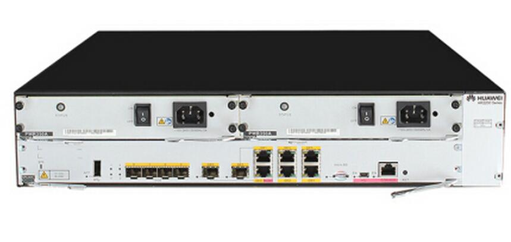

路由器相关协议
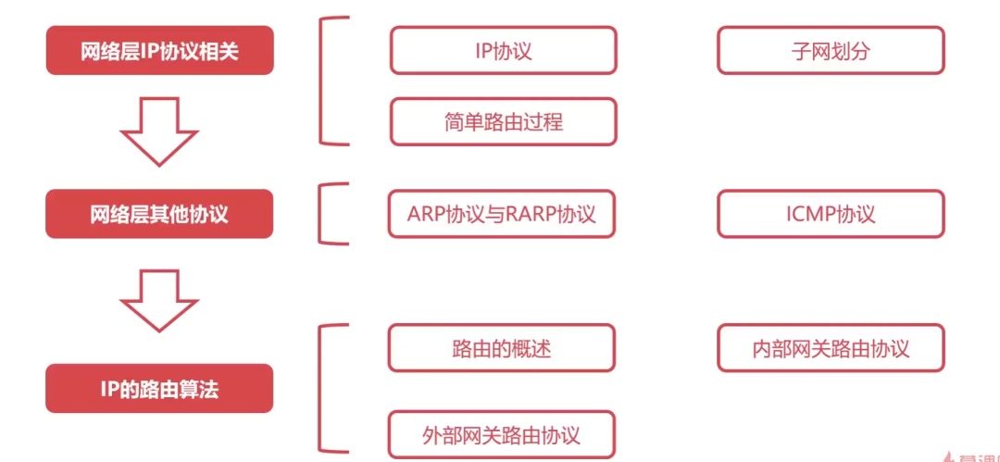

## 4.1 网络层概述

>网络层是作为法律标准的OSI体系结构自下而上的第三层，其主要任务是将`分组`从源主机`经过多个网络`和`多段链路`传输到目的主机. 
>网络层核心功能: `分组转发`和 `路由选择`.
>提供的服务: 面向连接的虚电路服务, 面向无连接的数据报服务

关于路由算法的要求：正确的完整的、在计算上应该尽可能是简单的、可以适应网络中的变化、稳定的公平的。

### 4.1.1 分组转发和路由选择

网络层的主要任务就是将分组从源主机经过多个网络和多段链路传输到目的主机，可以将该任务划分为分组转发和路由选择两种重要的功能。

1. 分组转发

当`路由器`从自己的某个`接口`所`连接的链路(或网络)` 上收到一个分组后, 将该分组 从自己其他适当的接口`转发`给下一跳`路由器`或者`目的主机`, 这就是所谓的`分组转发`.

为此, 每个`路由器`都需要维护自己的一个`转发表(Forwarding Table)`, 路由器根据分组首部中的`转发标识`在转发表中进行查询, 根据查询结果锁指示的接口进行分组转发. 

> 交换机的工作原理是网桥, 工作在数据链路层, 负责根据数据帧的MAC查找对应接口进行转发.
> 路由器的工作原理是IP, 工作在网络层, 负责将某一个网络中的数据分组转发到另一个网络中.

- 转发表中, **`转发标识`** 和 `接口` 是一一对应的. 上图路由器R1从接口1收到了一个分组, R1根据分组首部的转发标识A, 在自己的转发表中查询, 结果指示应该从R1的接口2 转发. 
- 需要说明的是, 首部中的转发标识`取决于具体的网络层`, 有可能是分组的目的地址. 也有可能是分组所属的连接的指示.

2. 路由选择

源主机和目的主机之间`可能存在多条路径`, 网络层需要`决定选择`哪一条路径来传送分组, 这就是所谓的路由选择(Routing).

上图中, A到B有两条路径.

路由选择方式主要有以下三种: 

- 集中式路由选择: 由某个网络控制中心执行路由选择, 并向每个路由器下载路由信息.
- 分布式路由选择: 在每个路由器上运行路由选择协议, 各路由器相互交换路由信息并各自计算路由.
- 人工路由选择: 由网络运维人员配置路由.

> 注意: `路由选择`生成的是`路由表(Routing Table)`, 路由表一般仅包含从`目的网络`到`下一跳`的`映射`, 路由表需要对网络拓扑变化的计算最优化. 
> 而`转发表`是从路由表得出的, 转发表的结构应该使查找过程最优化. 

### 4.1.2 网络层向其上层提供的两种服务

1. 面向连接的虚电路服务

- 通信结束后，需要释放之前所建立的虚电路。
- 跟采用电路交换的电话通信不同的, 电话通信是先建立真正的物理连接. 虚连接只是与之类似, 实际完全不同.
- 分组的首部仅需在`建立连接阶段`使用完整的目的主机地址, 之后每个分组的首部只需要携带一条`虚电路编号`即可.
- 这种通信方式 如果再使用可靠传输的网络协议, 就可以使所发送的分组最终正确(无差错按序到达, 不丢失, 不重复)到达接收方.
- 很多`广域分组交换网`都使用面向连接的虚电路服务. 而`因特网`的先驱者并没有采用这种设计思路, 而是选择了`无连接的数据报服务`.

2. 无连接的数据报服务

- 这种方式传送的分组可能会误码, 丢失, 重复, 失序.
- 将相对简单的尽最大努力(即不可靠)的分组交付功能置于因特网核心. 将复杂的网络处理功能置于因特网的边缘(即用户主机和其内部的运输层).
- 网络自身不提供端到端的可靠传输服务, 所以网络中的路由器就可以比较简单, 成本也低.

| 对比方面| 虚电路服务 | 数据报服务 |
|:-: | :-:| :-:|
|思路| 可靠通信又网路自身保证|可靠通信由用户主机保证 |
|连接|必须建立网络层连接 |不需要建立网络层连接 |
|目的地址 |仅在建立连接阶段使用,之后分组用虚电路号 |各分组必须携带完整目的地址 |
|分组转发 |属于同一条虚电路的分组均按同一条路由转发 |每个分组可以走不通路由 |
|节点故障 |所有通过出故障的节点的虚电路都不能工作 |出故障的节点可能会丢失分组,一些路由可能会变 |
|分组顺序 |总是按发送顺序到达目的主机 |不一定按发送顺序到达目的主机 |
|服务质量 |可将通信资源提前分配给每个虚电路 |很难实现 |

## 4.2 网际协议IP

网际协议(Internet Protocol)是TCP/IP体系结构网际层中的核心协议, 也是 Internet 网络层最核心的协议。

网际协议IP、传输控制协议TCP、TCP/IP体系结构是由“因特网之父”Robert Kalm和Vint Cerf二人共同研发的，1974年5月发布了TCP/IP的第一个版本。这两位学者在2005年获得图灵奖（相当于计算机科学领域的诺贝尔奖）。

- 与IP配套使用的协议:
- 地址解析协议(Address Resolution Protocol, ARP)
- 网际控制报文协议(Internet Control Message Protocol, ICMP)
- 网际组管理协议(Internet Group Management Protocol, IGMP)
- 逆地址解析协议(淘汰)

### 4.2.1 异构网络互连

- 需要解决的问题
	- 

- IP网的概念
	- 因为这些异构网络的网络层都用一样的网际协议IP 所以在网络层看来, 他们好像是一个统一的网络, 即IP网.
	- 

### 4.2.2 IPv4 地址及其编址方法

IPv4地址是给因特网上的每一个主机（或路由器）的每一个接口分配的一个在`全球范围内唯一`的32比特的标识符。

IPv4地址由因特网名字和数字分配机构ICANN进行分配。
2011年2月3日，因特网号码分配管理局IANA（由ICANN行使职能）宣布，IPv4地址已经分配完毕。
我国在2014至2015年也逐步停止了向新用户和应用分配IPv4地址，同时全面开展商用部署IPv6。

- IPv4地址的编址方法经历了三个历史阶段
	

1. IPv4地址的表示方法

- 点分十进制
	- 由于IPv4地址由32比特构成，不方便阅读、记录以及输入等，因此IPv4地址采用点分十进制表示方法以方便用户使用。
	- 

2. 分类编制

- 分类编址将32位IPv4地址分为两个部分
	- 

	- 举例:
	- 

- 分类编制的IPv4地址分为A~E五类
	
	- 

	- 注意事项
	- 

	- A类地址的细节:
	- 
	- 本地软件环回测试地址用于笨猪机内的进程间通信, 若主机发送一个目的地址为环回地址(如127.0.0.1)的IP数据报, 则本主机中的协议软件就会处理数据报中的数据, 而不是把它发送出去
	 
	- B类地址的细节:
	- 
	 
	- C类地址的细节:
	- 

- 各类地址范围
	- 

	- 

- 一般不使用的特殊IPv4地址
	- 

- 分类编址方法的缺点
	- 

3. 划分子网编址方法

随着更多中小网络加入因特网, IPv4分类编址不够灵活, 浪费地址的缺点就暴露了.

- 三级结构的IPv4地址
- 用`主机号`中的一部分bit位作为子网号.
	- 

- 子网掩码
	- 子网掩码可以表明分类IPv4地址的`主机号`部分被借用了几个比特作为子网号。
	- 与IPv4地址类似，子网掩码也是由32比特构成的。
	- 用`左起`多个`连续的比特1`对应IPv4地址中的`网络号`和`子网号`，之后的多个`连续的比特0`对应IPv4地址中的`主机号`。
	- 
	- 将划分子网的IPv4地址与相应的子网掩码进行逐比特的`逻辑与`运算，就可得到该IPv4地址所在子网的网络地址。
	- 

- 根据IP地址和子网掩码得出子网划分`全部细节`
	- 
	- 划分细节
	- 
	
 - 默认子网掩码
	 - 在未划分子网的情况下使用的子网掩码
	 - 

4. 无分类编制方法

- 无分类编址方法的诞生背景
	- 
	- 重新回到两级结构的IPv4地址
	- 

- 地址掩码
	- 与子网掩码类似，用`左起`多个`连续的比特1`对应IPv4地址中的`网络前缀`，`之后`的多个`连续的比特0`对应IPv4地址中的`主机号`。
	- 

- CIDR的斜线记法
	- 为了简便起见，可以不明确给出配套的地址掩码的点分十进制形式，而是在无分类编址的IPv4地址后面加上`斜线“/”`，在斜线之后写上网络前缀所占的比特数量（也就是地址掩码中左起连续比特1的数量），这种记法称为`斜线记法`。
	- 

- CIDR地址块
- `无分类域间路由选择`CIDR是将`网络前缀都相同的`、`连续的`多个无分类IPv4地址，组成一个CIDR地址块，只要知道CIDR地址块中的任何一个地址，就可以知道该地址块的全部细节。
	- 地址块中的最小地址
	- 地址块中的最大地址
	- 地址块中的地址数量
	- 地址块中聚合某类网络（某分类网络）的数量
	- 地址掩码
	

CIDR的好处:
- 使用CIDR地址块可以有效地分配IPv4地址空间
- 根据客户的需要分配适当大小的CIDR地址块，因此可以更加有效地分配IPv4的地址空间。
	- 

- 路由聚合（构造超网）
	- 
	- 网络前缀越长，地址块越小，路由越具体。
	- 若路由器查表转发分组时发现有多条路由条目匹配，则选择网络前缀最长的那条路由条目，这称为`最长前缀匹配`，因为这样的路由更具体。

### 4.2.3 IPv4地址的应用规划

IPv4地址的应用规划是指将给定的IPv4地址块（或分类网络）`划分成若干个更小的地址块`（或子网），并将这些地址块（或子网）分配给互联网中的不同网络，进而可以给各网络中的主机和路由器的接口分配IPv4地址。

- 定长子网掩码和变长子网掩码
	- 

1. 采用定长的子网掩码进行子网划分

- 举例:
	- 
- 需求分析
	- 两个路由器之间可以看做是没有主机的网络, 只需要给路由器的接口分配地址就可以.
	- 

- 根据需求分析找出一个 用于子网划分的子网掩码
	- 
- 根据网络地址和子网掩码 得出子网划分细节
	- 
- 子网分配
	- 从子网1~子网8中任选5个子网分配给应用需求中的5个子网
	- 

2. 采用变长的子网掩码进行子网划分

- 举例:
	- 
- 需求分析:
	- 根据需求分析找出用于各子网的地址块前缀
	- 

- 从给定地址块中为各子网选择子块
	- 
	
- 分配:
	- 

### 4.2.4 IPv4地址与MAC地址

1. IPv4地址与MAC地址的封装位置
	- 

2. 数据包传送过程中IPv4地址与MAC地址的变化情况
	- 
	- 

3. IPv4地址与MAC地址的关系

- 如果仅使用MAC地址进行通信，则会出现以下主要问题
	- 因特网中的每台路由器的路由表中就必须记录因特网上`所有`主机和路由器各接口的`MAC地址`。
	- 手工给各路由器配置路由表几乎是不可能完成的任务，即使使用路由协议让路由器通过相互交换路由信息来自动构建路由表，也会因为路由信息需要包含海量的MAC地址信息而严重占用通信资源。
	- 包含海量MAC地址的路由信息需要路由器具备极大的存储空间，并且会给分组的查表转发带来非常大的时延。

- 因特网的网际层使用IP地址进行寻址，就可使因特网中各路由器的路由表中的路由记录的数量大大减少，因为只需记录部分网络的网络地址，而不是记录每个网络中各通信设备的各接口的MAC地址。
	- 路由器收到IP数据报后，根据其首部中的目的IP地址的网络号部分，基于自己的路由表进行查表转发。
	- 查表转发的结果可以指明IP数据报的下一跳路由器的IP地址，但无法指明该IP地址所对应的MAC地址。因此，在数据链路层封装该IP数据报成为帧时，帧首部中的目的MAC地址字段就无法填写，该问题需要使用网际层中的`地址解析协议ARP`来解决。

### 4.2.5 地址解析协议(ARP)

- ARP的作用
	- 

地址解析协议 ARP(Address Resolution Protocol)：为网卡(网络适配器)的IP地址到对应的硬件地址提供动态映射. 可以把网络层32位地址转化为数据链路层MAC48位地址.

ARP 是即插即用的，一个ARP表是自动建立的，不需要系统管理员来配置。

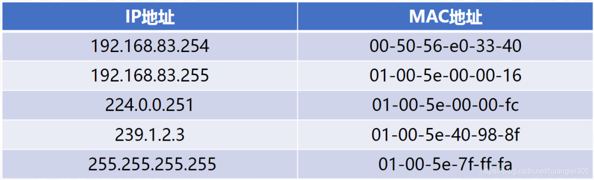

- ARP高速缓存表
	- 

- ARP广播请求
	- 

- ARP单播响应
	- 
	- 

- ARP高速缓存表中的记录类型和生命周期
	- 动态 和 静态: 
	- 

> ARP用来解决同一个局域网网中的主机或路由器的IP与MAC地址的映射问题, 不可以跨网络使用. 

- ARP相关注意事项
	- 
	- 由于ARP协议的主要用途是从网际层使用的IP地址解析出在数据链路层使用的MAC地址。因此，有的教材将ARP协议划归在网际层，而有的教材将ARP协议划归在数据链路层。这两种做法都是可以的。
	- 除了ARP请求报文和响应报文，ARP协议还有其他类型的报文，例如用于检查IP地址冲突的“无故ARP”。
	- 由于ARP协议很早就制定出来了（1982年11月），当时并没有考虑网络安全问题。因此，ARP协议没有安全验证机制，存在ARP欺骗和攻击等问题。

### 4.2.6 IP数据报的发送和转发过程

IP数据报的发送和转发过程包含以下两个过程:
- 主机发送IP数据报
- 路由器转发IP数据报

>为了将重点放在TCP/IP体系结构的网际层发送和转发IP数据报的过程上, 本节后续介绍中, 将忽略以下过程:
> 1. 使用ARP协议来获取目的主机或路由器接口的MAC地址的过程
> 2. 以太网交换机自学习和转发帧的过程.

1. 主机发送IP数据报

- 直接交付和间接交付的概念
	- 直接交付: 同一网络中的主机之间直接通信.
	- 间接交付: 不同网络中的主机之间的通信, 需要通过`默认网关(路由器)`来中转. 
	- 

- 源主机判断目标主机是否与源主机在同一网络中的方法
	- 

- 默认网关
	- 给网络中的各主机设置默认网关 
	- 路由器R即是以太网1的默认网关, 也是以太网2的默认网关, 其中路由器R的接口0在以太网1中, 所以接口0是以太网1中的IP地址, 接口1是以太网2的默认网关, 所以接口2是以太网2中的IP地址.
	- 
	- 
	- 两个网络的默认网关不同

2. 路由器转发IP数据报
	- 
	- 查表转发
	- 
	- 
	- 

- 路由器隔离广播域
	- 

### 4.2.7 IPv4 数据报的首部格式

- IPv4数据报的首部格式及其内容是实现IPv4协议各种功能的基础。
- 在TCP/IP标准中, 各种数据格式常常以32比特(即4字节)为单位来描述。
	- 
- IPv4数据报首部是由20字节的固定部分, 和最大40字节的可变部分组成.
- 固定部分是指每个IPv4数据报都必须要包含的部分。
- 某些IPv4数据报的首部，除了包含20字节的固定部分，还包含一些可选的字段来增加IPv4数据报的功能。

1. 版本

- 长度为4个比特，用来表示IP协议的版本。
- 通信双方使用的IP协议的版本必须一致。目前广泛使用的IP协议的版本号为4（即IPv4）。

2. 首部长度、可选字段和填充

- 首部长度
	- 长度为4个比特，该字段的取值`以4字节为单位`，用来表示IPv4数据报的首部长度。
	- 最小取值为二进制的0101，即十进制的5，再乘以4字节单位，表示IPv4数据报首部只有20字节固定部分。
	- 最大取值为二进制的1111，即十进制的15，再乘以4字节单位，表示IPv4数据报首部包含20字节固定部分和最大40字节可变部分。

- 可选字段
	- 长度从1字节到40字节不等，用来支持排错、测量以及安全措施等功能。
	- 虽然可选字段增加了IPv4数据报的功能，但这同时也使得IPv4数据报的首部长度成为可变的，这就增加了因特网中每一个路由器处理IPv4数据报的开销。
	- 实际上, `可选字段很少用`.

- 填充字段
	- 用来确保IPv4数据报的首部长度是4字节的整数倍，使用全0进行填充。
	- 
	- 举例
		- 

3. 区分服务

- 长度为8个比特，用来获得更好的服务。
- 该字段在旧标准中叫作服务类型，但实际上一直没有被使用过。
- 1998年，因特网工程任务组IETF把这个字段改名为区分服务。
- 利用该字段的不同取值可提供不同等级的服务质量。
- 只有在使用区分服务时才用, 一般情况下都不用这个字段.

4. 总长度

- 长度为16个比特，该字段的取值以字节为单位，用来表示IPv4数据报的长度（首部长度+数据载荷长度）。
- 最大取值为二进制的16个比特1，即十进制的65535（很少传输这么长的IPv4数据报）。
- 举例说明: 
	- 

5. 标识、标志和片偏移

> 标识 标志 和 片偏移 三个字段共同用于IPv4数据报分片.

- 将IPv4数据报分片的原因
	- 数据链路层的数据载荷 是有限制的(MTU):
	- 

- 标识
	- 长度为16个比特，属于`同一个IPv4数据报`的`各分片数据报`应该`具有相同的标识`。
	- IP软件会维持一个`计数器`，每产生一个IPv4数据报，计数器值就加1，并将此值赋给标识字段。

- 标志
	- 最低位（More Fragment，MF）
		- MF=1表示本分片后面还有分片
		- MF=0表示本分片后面没有分片
	- 中间位（Don’t Fragment，DF）
		- DF=1表示不允许分片
		- DF=0表示允许分片
	- 最高位为保留位，必须设置为0

- 片偏移
	- 长度为13个比特，该字段的取值`以8字节为单位`，用来指出分片IPv4数据报的数据载荷偏移其在原IPv4数据报的位置有多远。

- 分片过程:
	- 
	- 假设现在首部2 的那个分片 仍需再 分片
	- 

6. 生成时间TTL(Time To Live)

- 长度为8个比特, 最大取值为二进制的11111111, 即十进制的255. 该字段的取值最初以秒为单位. 因此, IPv4数据报的最大生存时间最初为255秒. 路由器转发IPv4数据报时, 将其首部中该字段的值减去该数据报在路由器上所耗费的时间, 若结果不为0就转发, 否则就丢弃. 
- 生存时间字段后来改为`以“跳数”为单位`, 路由器收到待转发的IPv4数据报时, 将其首部中的该字段的值减1, 若结果不为0就转发, 否则就丢弃. 
- 作用: 防止被错误路由的IPv4数据报无限制地在因特网中兜圈.
	- 

7. 协议

- 长度为8个比特，用来指明IPv4数据报的数据载荷是`何种协议数据单元PDU`。
- 举例
	- 

- 应用层常用协议相应的协议字段的取值
	- 

8. 首部检验和

- 长度为16个比特，用于检测IPv4数据报在传输过程中其`首部是否出现了差错`。
- IPv4数据报每经过一个路由器，其首部中的某些字段的值（例如生存时间TTL、标志以及片偏移等）都可能发生变化，因此路由器都要重新计算一下首部检验和。
- 计算方法
	- 发送方
		- 把IPv4数据报首部划分为n个16bit.  `首部检验和` 字段置为全0. 
		- 
	
	- 接收方 
		- 
	- 该计算方法不仅用于IP协议, 还用于运输层的用户数据报协议(UDP)和TCP协议, 常被称为 因特网校验和(Internet Checksum). 性能虽不如CRC, 但是易用软件实现.

- 计算方法的重点在于二进制反码求和运算
	- 两个数进行二进制`反码求和`的运算规则是从低位到高位逐列进行计算
		- 0和0相加是0
		- 0和1相加是1
		- 1和1相加是0，但要产生一个进位1，加到下一列
		- 若最高位相加后产生进位，则最后得到的结果要加1
		 

> 网际层并不向高层提供可靠传输服务, 计算首部检验和也比较费时, 所以IPv6协议里, 路由器不算了. 转发就更快了.

9. 源IP地址和目的IP地址

- 源IP地址字段
	- 长度为32个比特，用来填写发送IPv4数据报的源主机的IPv4地址。
- 目的IP地址字段
	- 长度为32个比特，用来填写接收IPv4数据报的目的主机的IPv4地址。

## 4.3 静态路由配置

静态路由配置是指用户或网络运维人员使用路由器的相关命令给路由器人工配置路由表。 
人工配置方式`简单`、`开销小`、但`不能及时适应网络状态`（流量、拓扑等）的变化，一般只在小规模网络中采用。

### 4.3.1 直连路由和非直连路由

- 直连路由

当网络运维人员给路由器的各接口配置了IP地址和地址掩码后，路由器就可自行得出自己的各接口分别`与哪些网络是直连`的（即中间没有其他路由器）。路由器将这些直连路由条目记录在自己的路由表中。

- 非直连路由

路由器到`其他非直连网络的路由`可由网络运维人员进行人工配置（即所谓的静态路由配置），也可通过路由选择协议由路由器自动获取。

### 4.3.2 默认路由和特定主机路由

除了路由器自行得出的直连路由, 和网络运维人员配置的非直连路由, 网络运维人员还可以给路由器配置两种特殊的路由, 默认路由和特定主机路由.

- 默认路由

路由器正确接收到某个IP数据报后, 会基于其首部中的目的IP地址在自己的路由表里查找. 找到匹配, 就转发, 找不到就丢弃, 并向源主机发送差错报告. 

而如果网路运维人员, 先给路由器配置过默认路由条目, 则当路由器查不到匹配的路由条目时, 则按照默认路由条目中的下一跳的指示进行转发.

>路由器采用默认路由(default route) 可以减少路由表所占用的存储空间以及搜索路由表所耗费的时间.

目的网络地址: 0.0.0.0  地址掩码: 0.0.0.0

> 用一条默认路由, 替代了去往因特网中众多网络的海量路由条目, 极大减少了路由表占用的存储空间和搜索路由表用的时间.

- 特定主机路由

出于某种安全问题的考虑, 同时为了使网络运维人员更方便地控制网络和测试网络, 特别是在独一网络的连接或路由表进行排错, 指明到某一台主机的特定主机路由十分有用.

目的网络地址: 特定主机的IP地址      地址掩码: 255.255.255.255(即/32)

> 在查表转发去往192.168.2.1这台特定主机的IP数据报时, 两个静态路由都可以匹配, 但遵循"最长前缀匹配"原则, 按下面那个特定主机路由条目转发. 由R1接口2转发给R2接口0.

- 注意: 进行静态路由配置需要非常认真的考虑和谨慎, 不然:
	- 路由条目配置错误, 甚至导致出现路由环路
	- 聚合路由条目时可能引入不存在的网络

### 4.3.3 网络地址转换NAT技术

用于多个主机通过一个公有IP访问访问互联网的私有网络中，减缓了IP地址的消耗，但是增加了网络通信的复杂度。

- NAT 工作原理：

从内网出去的IP数据报，将其IP地址替换为NAT服务器拥有的合法的公共IP地址，并将替换关系记录到NAT转换表中；

从公共互联网返回的IP数据报，依据其目的的IP地址检索NAT转换表，并利用检索到的内部私有IP地址替换目的IP地址，然后将IP数据报转发到内部网络。

## 4.4 因特网的路由选择协议

### 4.4.1 路由选择分类

- 路由选择分两类:
	- 静态路由选择 和 动态路由选择
	- 

### 4.4.2 因特网采用分层次的路由选择协议

因特网是全球最大的互联网，它所采取的路由选择协议具有以下三个主要特点:

- 自适应 : 因特网采用动态路由选择，能较好地适应网络状态的变化。
- 分布式 : 因特网中的各路由器通过相互间的信息交互，共同完成路由信息的获取和更新。
- 分层次 : 将整个因特网划分为许多`较小的自治系统` (Autonomous System，AS)。在自治系统内部和外部采用不同类别的路由选择协议，分别进行路由选择。(如一个ISP就可划分为一个自治系统)

举例说明因特网采用的分层次的路由选择协议:

- 域间路由选择和域内路由选择
	- 

- 外部网关协议EGP和内部网关协议IGP
	- 

>每个自治系统内使用的内部网关协议与其他自治系统无关.

接下来介绍三种Internet路由选择协议:
- 路由信息协议
- 开放最短路径优先
- 边界网关协议

先介绍两个内部网关协议: RIP 和 OSPF

### 4.4.3 路由信息协议RIP

1. RIP的相关基本概念

路由信息协议 (Routing Information Protocol, RIP) 是`内部网关协议`中最先得到广泛使用的协议之一, 其相关标准文档为[RFC 1058]。

路由信息协议 RIP(Routing Information Protocol)【**应用层**】，基于距离-向量的路由选择算法，较小的**AS（自治系统）**，适合小型网络；RIP报文，封装进UDP数据报。

1. RIP在度量路径时采用的是跳数（每个路由器维护自身到其他每个路由器的距离记录）；
2. RIP的费用定义在源路由器和目的子网之间；
3. RIP被限制的网络直径不超过15跳；
4. 和隔壁交换所有的信息，30主动一次（广播）。

- RIP距离向量
	- RIP要求自治系统AS内的每一个路由器，都要维护从它自己到AS内其他每一个网络的距离记录。这是一组距离，称为距离向量(Distance-Vector, D-V). 
	- RIP使用`跳数`（Hop Count）作为度量（Metric）来衡量到达目的网络的距离。
		- RIP将`路由器到直连网络的距离`定义为1。
		- RIP将`路由器到非直连网络的距离`定义为`所经过的路由器数加1`。
		- RIP允许`一条路径`最多`只能包含15个路由器`, `距离等于16`时相当于`不可达`. 因此RIP`只适用`于`小型`互联网. 

- 举例说明:
	- 

- RIP判断好路由的标准
	- RIP认为好的路由就是“距离短”的路由，也就是所通过`路由器数量最少`的路由。
	- 
	- 等价负载均衡
		- 当到达同一目的网络有多条RIP距离相等的路由时, 可以进行`等价负载均衡`, 也就是将`通信量`均衡地分布到多条等价的路径上. 
		- 

- RIP的三个重要特点
	- 

6. RIP的基本工作过程

- (1) 路由器刚开始工作时, 只知道自己到直连网络的RIP距离为1. 
- (2) 每个路由器`仅和相邻路由器`**周期性**地交换并`更新路由信息`. 
- (3) 若干次交换和更新后, 每个路由器都知道到达本自治系统AS内各网络的`最短距离`和`下一跳路由器`, 称为`收敛`. 

3. RIP的距离向量算法

- （1）运行RIP的路由器周期性地给所有相邻路由器发送封装有`自己所知`路由信息的`RIP更新报文`
- （2）路由器收到相邻路由器发来的RIP更新报文后, 修改来自邻居路由器的路由信息
- （3）基于修改好的来自邻居路由器的路由信息更新自己的路由表

- 举例说明 RIP路由条目更新规则, 它是RIP距离向量算法的核心:
	- 刚开始路由器C的路由表下一跳都是? ,即路由器D不关心这些.
	- 
	- 现在封装有路由信息的RIP更新报文 发送给路由器D
	- 路由器D收到路由器C发来的路由表后, 修改这个路由表:
	- 
	- 因为D和C相邻, RIP距离加1, D即可到达C能到达的网络. D下一条显然是C.
	- 
	- D用这张修改后的路由表来更新自己的路由表:
	- 
	- 因为D的路由表到N2的距离还是2, 但是C到N2的距离是4, 所以事实上网络拓扑有变了.
	- 
	- 
	- 
	- 
	- 而`到达N9` 网络, 现在路由表中的路由条目更有优势, 不应该更新, 就不更新了.

- 时间参数
	- 除了上述RIP路由条目更新规则，在RIP的距离向量算法中还包含以下一些`时间参数`
		- 路由器每隔大约30秒向其所有相邻路由器发送路由更新报文。
		- 若180秒（默认）没有收到某条路由条目的更新报文，则把该路由条目标记为无效（即把RIP距离设置为16，表示不可达），若再过一段时间（如120秒），还没有收到该路由条目的更新报文，则将该路由条目从路由表中删除。

4. RIP存在的问题

- “坏消息传得慢”
	- 
	- (1) 假设R1到N1的链路出现故障, R1检测到后会把路由条目中R1到N1的RIP距离修改为16. 表示N1不可达. 
	- 
	- (2) 假设R1的路由器更新报文的发送周期为30s才到时, 而此时R2的路由更新报文的发送周期到了. 于是R2给R1发送路由更新报文, 其中到达N1的路由条目中的RIP距离为2, 下跳为R1.这是之前R2从R1获取的.
	- (3) R1收到R2发来的路由更新报文后, 就会被该谣言误导, `误以为可以通过R2到达N1`. RIP距离为3. R1更新自己的路由表, 等发送周期到时, 把自己的路由表 N1, 3, R2发送给R2.
	- (4) R2收到R1的路由表, 也被谣言误导. 误认为可以通过R1到达N1. RIP距离为4. R2更新自己的路由表, 并把它发送给R1.
	- (5) 如此反复被谣言误导, 直到R1和R2到N1的距离都是16时, 才知道N1不可达. 才收敛. 
	- 这就是RIP存在的 “坏消息传得慢” .
	- 
	- 坏消息传的慢 的问题又称为 路由环路, 或RIP距离无穷计数问题. 这是距离向量算法的一个固有问题。可以采取以下多种措施减少出现该问题的概率或减小该问题带来的危害:
		- 限制最大RIP距离为15（16表示不可达）。
		- 当`路由表发生变化`时就`立即发送路由更新报文`（即“触发更新”），而不仅是周期性发送。
		- 让路由器记录收到某个特定路由信息的接口，而不让同一路由信息再通过此接口向反方向传送（即“水平分割”）。

> 注意, 使用上述改善措施, 仍然无法彻底解决`坏消息传得慢`问题. 因为在距离向量算法中, 每个路由器都缺少到目的网络的整个路径的完整信息, 无法判断所选的路由是否出现了环路.

5. RIP版本和相关报文的封装

现在较新的RIP版本是1998年11月公布的RIP2[RFC 2453]，已经成为因特网标准协议。与RIP1相比，RIP2可以支持变长子网掩码和CIDR。另外，RIP2还提供简单的鉴别过程并支持多播。

`RIP相关报文使用运输层`的`用户数据报协议UDP`进行`封装`，使用的`UDP端口号为520`。

- 从RIP报文封装的角度看，RIP属于TCP/IP体系结构的应用层。
- 但RIP的核心功能是路由选择，这属于TCP/IP体系结构的网际层。

6. RIP的优缺点

### 4.4.4 开放最短路径优先协议

1. OSPF 相关基本概念

开放最短路径优先 (Open Shortest Path First, OSPF) 协议是为了克服路由信息协议RIP的缺点在1989年开发出来的. 

> 开放最短路径优先协议 OSPF(Open Shortest Path First)【网络层】，基于链路状态的路由选择算法（即Dijkstra算法），较大规模的AS ，适合大型网络，直接封装在IP数据报传输。

- “开放”表明OSPF协议不是受某一厂商控制，而是公开发表的。
- “最短路径优先”是因为使用了`Dijkstra`提出的最短路径算法(Shortest Path First, SPF)。
- OSPF是`基于链路状态`的，而不像RIP是基于`距离向量`的。
- OSPF基于链路状态并采用最短路径算法计算路由，从`算法上保证了不会产生路由环路`。
- OSPF不限制网络规模，更新效率高，收敛速度快。

> 注意, "开放最短路由优先"只是一个路由选择协议的名字, 不表示其他协议不是"最短路径优先". 实际上, 用于AS内部的内部网关协议这个类别所包含的全部协议(包括RIP), 都要寻找一条`最短`的路径.

- 链路状态
	- 链路状态是指, 本路由器都和哪些路由器`相邻`, 以及相应链路的`"代价"(cost)`. "代价"用来表示费用, 距离, 时延和带宽等. 这些都由网管来决定.
	- OSPF协议计算代价的方法:
	- 
	- 

- 邻居关系的建立和维护(邻居表)
	- 
	- IP数据报的数据载荷就是OSPF分组, OSPF分组包括 `OSPF首部` 和 `OSPF分组的数据载荷`..

> !!注意: OSPF分组使用网际层的IP数据报进行封装, 因此用网络体系结构的角度来说, OSPF协议属于网际层协议. 而RIP使用运输层的UDP协议进行封装, 从网络体系来看, RIP属于应用层协议, 但其核心是路由选择, 属于网际层. 

- 举例说明: 
	- 
	- 上图中, 给出了R1的邻居表, 其中的每一个条目对应记录其邻居路由器的相关信息, 包括邻居iD, 接口和"判活倒计时". 
	- 判活倒计时结束之前, 必须收到邻居的问候, 否则就认为邻居路由器不可达.

- 链路状态通告LSA
	- 
	- 举例说明
	- 

- 链路状态更新分组LSU
	- 
	- 举例说明:
	- 

- 链路状态数据库LSDB
	- 
	- 举例:
	- 

- 基于LSDB进行最短路径优先计算
	- 使用OSPF的各路由器，基于链路状态数据库LSDB进行最短路径优先计算，构建出各自到达其他各路由器的最短路径，即`构建各自的路由表`。
	- 举例说明:
	- 

2. OSPF的五种分组类型

- 问候(Hello)分组
- 数据库描述(Database Description)分组
- 链路状态请求(Link State Request)分组
- 链路状态更新(Link State Update)分组
- 链路状态确认(LInk State ACK)分组
	- 

3. OSPF的基本工作过程

- (1) 相邻路由器R1与R2之间`每隔10秒` 要交换一次`问候分组`, 以便`建立和维护邻居关系`.
- (2) 建立邻居关系之后, 给邻居路由器发送`数据库描述分组`. 将自己的`链路状态数据库`中的所有`链路状态项目`的`摘要信息`发送给邻居路由器.
- (3) 假设路由器R1收到R2的数据库描述分组后, 发现自己缺少其中的某些链路状态项目, 于是就给R2 `链路状态请求分组`. 
- (4) R2收到R1发来的链路状态请求分组后, 将R1缺的链路状态项目的详细信息, 封装在`链路状态更新分组`中, 发送给R1.
- (5) R1收到R2发来的链路状态更新分组后, 将这些自己缺少的链路状态项目的详细信息, 添加到自己的`链路状态数据库`中. 并给R2发送 `链路状态确认分组`.
- (6) R2也可以向R1请求自己缺的链路状态项目的详细信息. 一样的
- (7) R1和R2的链路状态数据库最终将达到一致, 即`同步`. 两个同步的路由器称为`"完全临接"的`路由器.
- 每30分钟或链路状态发生变化时, 路由器都会`洪泛`发送`链路状态更新分组`. 收到该分组的其他路由器会根据分组的内容更新自己的链路状态数据库, 然后`洪泛转发`该分组, 并给该路由器`发回链路状态确认分组`. 这又称为新情况下的`链路状态数据库同步`.

4. 多点接入网络中的OSPF路由器

>在多点接入网络中, 如果不采取其它机制, OSPF路由器将会产生大量的多播分组(即问候分组和链路状态更新分组)

- 举例
	- 邻居关系数量为n(n-1)/2
	- 
	- 现在假设我们选举两个路由器作为DR, BDR.
	- 
	- 现在邻居关系数量为2(n-2)+1 减少了很多.

- 普通路由器之间不能直接交换信息, 必须经过DR和BDR进行交换. 若DR出问题, 由BDR顶替DR.
- 实现DR BDR选举并不复杂, 无非就是各路由器之间交换一些选举参数(例如路由器优先级, 路由器ID和接口IP地址等), 然后根据选举规则选出DR和BDR即可. 和以太网交换机生成树协议(STP)选举根交换机类似. 

5. OSPF划分区域

为了使OSPF协议能够`用于规模很大`的网络, OSPF把一个`自治系统AS`再划分为`若干个更小`的范围, 称为`区域(area)`. 

每个区域都有一个32位的区域标识符, 可以用点分十进制表示.  

主干区域标识符必为0, 也可以表示成0.0.0.0. 主干区域通于其它区域.  其它区域的标识符不能为0且互不相同.

每个区域的规模不应太大，一般所包含的路由器不应超过200个。

划分区域的好处就是把利用洪泛法交换链路状态信息的范围局限于每一个区域，而不是整个自治系统AS，这样就减少了整个网络上的通信量。

采用划分区域的方法，虽然使交换信息的种类增多了，同时也使OSPF协议更加复杂了，但这样做能使每一个区域内部交换路由信息的通信量大大减小，因而使OSPF协议能够用于规模更大的自治系统AS。

如果路由器的所有接口都在同一个区域内, 则该路由器称为 `区域内路由器(internal router)`.

为了本区域可以喝自治系统内的其他区域连通, 每个区域都会有一个`区域边界路由器(area border router)`. 区域边界路由器的一个接口用于连接自身所在区域, 另一个接口用于连接主干区域.

主干区域内的路由器 称为 `主干路由器(backbone router)`, 也可以把区域边界路由器看做主干路由器.

在主线区域内还要有一个路由器专门和本自治系统外的其他自治系统交换路由信息, 这样的路由器称为 `自治系统边界路由器`.

- 区域边界路由器 负责发送区域内的链路状态通告, 和其他所有区域的链路状态通告.

- OSPF协议优点：

1. 安全；
2. 支持多条相同费用路径；
3. 支持区别化费用度量；
4. 支持单播路由和多播路由；
5. 分层路由。

- RIP与OSPF的对比（路由算法决定其性质）：
	- -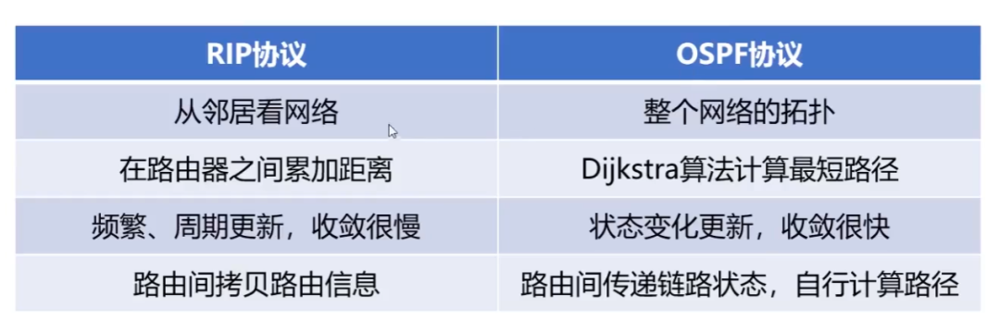

### 4.4.5 边界网关协议BGP

>前面4.4.3 4.4.4两节都是内部网关协议. 现在该外部的了.. 

边界网关协议(Border Gateway Protocol, BGP)属于`外部网关协议EGP`这个类别, 用于自治系统AS之间的路由选择协议。

1. BGP的相关基本概念

- 使用BGP寻找最佳路由是无意义的
	- 由于在不同AS内度量路由的“代价”（距离、带宽、费用等）可能不同，因此对于AS之间的路由选择，使用统一的“代价”作为度量来寻找最佳路由是不行的。
	- 

- AS之间的路由选择还必须考虑相关策略(政治、经济、安全等)
	- 
	- 

- BGP的边界路由器

	- 在配置BGP时，每个AS的管理员要`选择至少一个路由器`作为该AS的“`BGP发言人`”。
	- 一般来说，两个BGP发言人都是通过一个共享网络连接在一起的，而BGP发言人往往就是BGP边界路由器。
		- 
	- 使用`TCP连接`交换路由信息的两个BGP发言人，彼此称为对方的邻站（neighbor）或对等站（peer）。
	- BGP发言人除了运行BGP协议外，还必须运行自己所在AS所使用的内部网关协议IGP，例如RIP或OSPF。
	- BGP发言人交换网络可达性的信息, 也就是要到达某个网络所要经过的一系列自治系统.
	- 当BGP发言人相互交换了网络可达性的信息后，各BGP发言人就根据所采用的策略，从收到的路由信息中找出到达各自治系统的较好的路由，也就是构造出`树形结构`且`不存在环路`的自治系统`连通图`。
		- 

- BGP适用于多级结构的因特网
	- 

2. BGP-4的四种报文

- 打开报文
- 更新报文
- 保活报文
- 通知报文
	- 

### 4.4.6 路由器的基本工作原理

路由器是一种具有多个输入端口和输出端口的`专用计算机`，其任务是`转发分组`。

- 路由器的组成:
	-  
	- 路由选择部分：核心构件是`路由选择处理机`，其任务是根据所使用的路由选择协议，周期性地与其他路由器进行路由信息的交换，以便构建和更新路由表。
	- 分组转发部分：由一组输入端口、交换结构以及一组输出端口。

信号从路由器的某个输入端口进入路由器. 物理层将信号转换成比特流后向上交付给数据链路层. 数据链路层从比特流中识别帧, 去掉帧头和尾部向上交付给网络层. 分两种情况:

- 若交给网络层处理的是普通待转发的分组, 则根据分组首部中的目的地址进行查表转发. 找不到匹配的转发条目, 就丢弃. 否则按匹配条目转发. 网络层更新数据分组首部中的某些字段的值.(如TTL减1), 然后交给下一层进行封装, 由物理层转换信号发送.
- 若交付给网络层处理的是携带有路由报文的路由分组, 则把路由报文送交路由选择处理机. 路由选择处理机根据路由报文的内容来更新自己的路由表. 路由表一般仅包含从目的网络到下一条的映射. 路由表需要对网络拓扑变化的计算最优化. 转发表是从路由表而来, 转发表的结构应该使查找过程最优化.    路由选择处理机除了处理收到的路由报文, 还会周期性的给其他路由器发送自己所知道的路由信息.

路由器的各端口还应该有输入缓冲区和输出缓冲区. 输入缓冲区用来暂存新进入路由 但还来不及处理的分组.  输出缓冲区用来暂存已经处理完毕还来不及发送的分组. 
需要说明的是, 路由器的端口一般都具有输入和输出的功能. 

路由器的交换结构是路由器的关键构件, 它将某个输入端口进入的分组根据查表的结果从一个合适的输出端口转发出去. 交换结构的速率对于路由器的性能至关重要. 

因此, 人们对交换结构进行了大量研究, 以提供路由器转发效率. 实现交换结构的三种基本方式: 通过存储器, 通过总线, 通过互连网络. 这三种交换结构可实现的路由器转发速率依次提高. 

## 4.5 网际控制报文协议ICMP

> 网际控制报文协议，可以报告错误信息或者异常情况，ICMP报文封装在IP数据报当中。

为了更有效地转发IP数据报以及提高IP数据报交付成功的机会，TCP/IP体系结构的网际层使用了网际控制报文协议（Internet Control Message Protocol，ICMP）[RFC 792]。

`主机`或`路由器`使用ICMP来发送差错报告报文和询问报文。

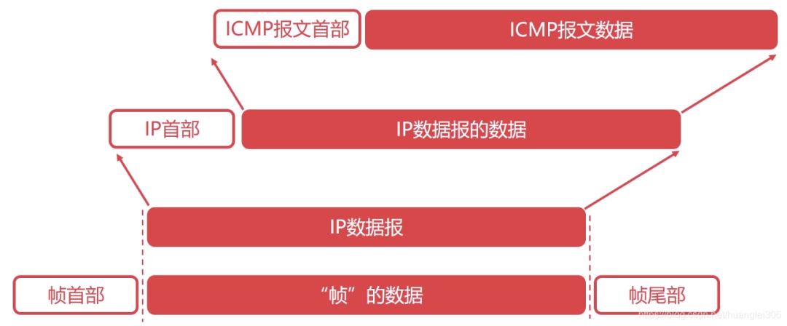

- ICMP报文被封装在`IP数据报`中发送
	- 

### 4.5.1 ICMP报文的种类

1. ICMP差错报告报文

常见的ICMP差错报告报文有以下五种:

终点不可达 源点抑制  时间超过(超时) 参数问题 改变路由(重定向)

- 终点不可达
	- 

- 源点抑制
	- 
	- 

- 时间超过（超时）
	- 

- 参数问题
	- 

- 改变路由（重定向）
	- 
	- 

- 不应发送ICMP差错报告报文的情况:
	- 

2. ICMP询问报文

常用的ICMP询问报文有两种: 回送请求和回答  时间戳请求和回答

- 回送请求和回答
	- 由主机或路由器向一个特定的目的主机或路由器发出。
	- 收到此报文的主机或路由器必须给发送该报文的源主机或路由器发送ICMP回送回答报文。
	- 这种询问报文用来测试目的站是否可达以及了解其有关状态。

- 时间戳请求和回答
	- 用来请求某个主机或路由器回答当前的日期和时间。
	- 在ICMP时间戳回答报文中有一个32比特的字段，其中写入的整数代表从1900年1月1日起到当前时刻一共有多少秒。
	- 这种询问报文用来进行时钟同步和测量时间。

### 4.5.2 ICMP的典型应用

1. 分组网间探测PING(Packet InterNet Groper)

- 用于测试主机或路由器之间的连通性。
	- PING是TCP/IP体系结构的应用层直接使用网际层ICMP的一个例子，它并不使用运输层的TCP或UDP。
	- PING应用所使用的ICMP报文类型为回送请求和回答。
	- 

2. 跟踪路由

- traceroute 和 tracert
	- traceroute 用于探测IP数据报从源主机到达目的主机要经过哪些路由器。
		- 
	- 在不同操作系统中，traceroute应用的命令和实现机制有所不同
		- 在UNIX版本中，具体命令为“traceroute”，其在运输层使用UDP协议，在网络层使用ICMP报文类型只有差错报告报文。
		- 在Windows版本中，具体命令为“tracert”，其应用层直接使用网际层的ICMP协议，所使用的ICMP报文类型有回送请求和回答报文以及差错报告报文。

- Windows版实现原理
	- 在Windows版本中，具体命令为“tracert”，其应用层直接使用网际层的ICMP协议，所使用的ICMP报文类型有回送请求和回答报文以及差错报告报文。
	- (1)
	- 
	- (2)
	- 
	- (3) 
	- 

## 4.6 虚拟专用网VPN和网络地址转换NAT

### 4.6.1 虚拟专用网VPN

- 虚拟专用网VPN的作用
	- 
	- 

- 专用地址（私有地址）
	- 给专用网内各主机配置的IP地址应该是该专用网所在机构可以自行分配的IP地址，这类IP地址仅在机构内部有效，称为专用地址（Private Address），不需要向因特网的管理机构申请。
	- [RFC 1918]规定了以下三个CIDR地址块中的地址作为专用地址
		- 
		- 
		- 举例:
		- 

- 基本原理
	- （1）
	- 
	- (2) 
	- 
	- (3)
	- 

- VPN的类型
	- 内联网VPN : 同一机构内不同部门的内部网络所构成的VPN，又称为内联网VPN。
	- 外联网VPN : 有时，一个机构的虚拟专用网VPN需要某些外部机构（通常是合作伙伴）参加进来，这样的VPN就称为外联网VPN。
	- 远程接入VPN: 在外地工作的员工需要访问公司内部的专用网时，只要在任何地点接入因特网，运行驻留在员工PC中的VPN软件，在员工的PC和公司的主机之间建立VPN隧道，就可以访问专用网中的资源，这种虚拟专用网又称为远程接入VPN。

### 4.6.2 网络地址转换NAT

- NAT的诞生背景
	- 尽管因特网采用了无分类编址方法来减缓IPv4地址空间耗尽的速度，但由于因特网用户数量的急剧增长，特别是大量小型办公室和家庭网络接入因特网的需求不断增加，IPv4地址空间即将耗尽的危险然仍没有解除（实际上，因特网号码分配管理局IANN于2011年2月3日宣布，IPv4地址已经分配完毕）。
	- 网络地址转换（Network Address Translation，NAT）技术于1994年被提出，用来缓解IPv4地址空间即将耗尽的问题。
		- NAT能使大量使用内部专用地址的专用网络用户共享少量外部全球地址来访问因特网上的主机和资源。
		- 这种方法需要在专用网络连接到因特网的路由器上安装NAT软件。装有NAT软件的路由器称为NAT路由器，它至少要有一个有效的外部全球地址IPG。这样，所有使用内部专用地址的主机在和外部因特网通信时，都要在NAT路由器上将其内部专用地址转换成IPG。

1. 最基本的NAT方法

- （1）专用网到因特网
	- 
	- 

- （2）再从因特网到专用网
	- 
	- 

2. 网络地址与端口号转换NAPT

- 由于目前绝大多数基于TCP/IP协议栈的网络应用，都使用运输层的传输控制协议TCP或用户数据报协议UDP，为了更加有效地利用NAT路由器中的全球IP地址，现在常将NAT转换和运输层端口号结合使用。
	- 这样就可以使内部专用网中使用专用地址的大量主机，共用NAT路由器上的1个全球IP地址，因而可以同时与因特网中的不同主机进行通信。 
- 将NAT和运输层端口号结合使用，称为网络地址与端口号转换（Network Address and Port Translation，NAPT）。
	- 现在很多家用路由器将家中各种智能设备（手机、平板、笔记本电脑、台式电脑、物联网设备等）接入因特网，这种路由器实际上就是一个NAPT路由器，但往往并不运行路由选择协议。

- （1）专用网到因特网
	- 
	- 

- （2）再从因特网到专用网
	- 

- 注意:
	- 

## 4.7 IP多播(组播)

> 业务具有数据量大, 时延敏感的特点. 需要采用最短时间, 最小空间来传输数据. 
> IP组播(多播) 由此产生.

### 4.7.1 IP多播技术的相关基本概念

多播（Multicast，也称为组播）是一种实现“一对多”通信的技术，与传统单播“一对一”通信相比，多播可以极大地节省网络资源。

- 举例
	- 
	- 当多播组的成员数量很大时，采用多播方式可以显著地减少网络中各种资源的消耗。

- 在因特网上进行的多播，称为IP多播。

路由器要支持多播, 就要解决IP多播数据报的寻址, 多播路由选择协议的问题.

### 4.7.2 IP多播地址和多播组

- 多播地址和多播组
	- IP多播通信必须依赖于IP多播地址. 在IPv4中，D类地址被作为多播地址。
	- 
	- 多播地址只能用作目的地址，而不能用作源地址。
	- 用每一个D类地址来标识一个多播组，使用同一个IP多播地址接收IP多播数据报的所有主机就构成了一个多播组。
		- 每个多播组的成员是可以随时变动的，一台主机可以随时加入或离开多播组。
		- 多播组成员的数量和所在的地理位置也不受限制，一台主机可以属于几个多播组。
	- 非多播组成员也可以向多播组发送IP多播数据报。
	- 与IP数据报相同，IP多播数据报也是“尽最大努力交付”，不保证一定能够交付给多播组内的所有成员。

- IP多播地址分类
	- 预留的多播地址（永久多播地址）
	- 全球范围可用的多播地址
	- 本地管理的多播地址
		- 

- IP多播分两种:
	- 

### 4.7.3 在局域网上进行硬件多播

由于MAC地址（也称为硬件地址）有多播MAC地址这种类型，因此`只要把IPv4多播地址映射成多播MAC地址`，即可将IP多播数据报封装在局域网的MAC帧中，而MAC帧首部中的目的MAC地址字段的值，就设置为由IPv4多播地址映射成的多播MAC地址。这样，可以很方便地利用硬件多播来实现局域网内的IP多播。

- 

当给某个多播组的成员主机配置其所属多播组的IP多播地址时，系统就会根据映射规则从该IP多播地址生成相应的局域网多播MAC地址。

- 以太网多播MAC地址
	- 因特网号码指派管理局IANA，将自己从IEEE注册管理机构申请到的以太网MAC地址块中从01-00-5E-00-00-00到01-00-5E-7F-FF-FF的多播MAC地址，用于映射IPv4多播地址。
	- 这些多播MAC地址的左起前25个比特都是相同的，剩余23个比特可以任意变化，因此共有2^23个。
	- 

- IP多播地址到以太网多播MAC地址的映射
	- 
	- 映射关系并不唯一
		- 
		- 
	- 对收到的IP数据报在网际层进行软件过滤
		- 
		- MAC先接受, 到网际层再过滤.

### 4.7.4 在因特网上进行IP多播需要的两种协议

要在因特网上进行IP多播，就必须要考虑IP多播数据报经过多个多播路由器进行转发的问题。 多播路由器必须根据IP多播数据报首部中的IP多播地址，将其转发到有该多播组成员的局域网。

- 网际组管理协议IGMP

	- 网际组管理协议（Internet Group Management Protocol，IGMP）是TCP/IP体系结构网际层中的协议，其作用是让连接在本地局域网上的多播路由器知道本局域网上是否有主机（实际上是主机中的某个进程）加入或退出了某个多播组。
	- 
	- 注意: IGMP仅在本网络有效，使用IGMP并不能知道多播组所包含的成员数量，也不能知道多播组的成员都分布在哪些网络中。
	- 

- 多播路由选择协议
	- 多播路由选择协议的主要任务是：在多播路由器之间为每个多播组建立一个`多播转发树`。
		- 多播转发树连接多播源和所有拥有该多播组成员的路由器。
		- IP多播数据报只要沿着多播转发树进行洪泛，就能被传送到所有拥有该多播组成员的多播路由器。
		- 之后，在多播路由器所直连的局域网内，多播路由器通过硬件多播，将IP多播数据报发送给该多播组的所有成员。
		- 针对不同的多播组需要维护不同的多播转发树，而且必须动态地适应多播组成员的变化，但此时网络拓扑并不一定发生变化，因此多播路由选择协议要比单播路由选择协议（例如RIP、OSPF等）复杂得多。
		- 即使某个主机不是任何多播组的成员，它也可以向任何多播组发送多播数据报。
		- 为了覆盖多播组的所有成员，多播转发树可能要经过一些没有多播组成员的路由器（例如右图中的R2）。
		- 

### 4.7.5 网际组管理协议IGMP

1. IGMP的相关基本概念

- IGMP的三种报文类型
	- 成员报告报文
	- 成员查询报文
	- 离开组报文
- IGMP报文的封装
	- IGMP报文被封装在IP数据报中传送
		- 

2. IGMP的基本工作原理

- （1）加入多播组
- 当一个主机的某个进程(简称主机)要加入某个多播组时, 该主机会向其所在的网络发送一个封装有IGMP成员报告报文的IP多播数据报.
	- IGMP成员报告报文中包含要加入的IP多播组的地址.
	- IP多播组数据报的目的地址也是要加入的IP多播组的地址.
	- 该IP多播数据报实际上会被本网络中所有该多播组的成员以及多播路由器接收.
	- 举例:
	- A B希望加入IP多播组226.0.9.26, B先发IGMP成员报告报文
	- 
		- 如果本网络中还有同组其他成员要发送IGMP成员报告加入该多播组, 则监听到该IP多播数据报后就取消发送, 因为每个网络中的每个多播组仅需要一个成员IGMP成员报告报文.
		- 多播路由器会维护一个多播组列表, 在该表中记录有该路由器所知的与其直连的各网络中有多播组成员的多播组地址. 
		- 如果多播路由器收到一个未知多播组(即该路由器的多播组列表中没有该多播组的地址记录)的IGMP成员报告, 就添加该多播组地址.  不会记录发送的主机的IP地址, 只是多播组地址.

- （2）监视多播组的成员变化
- 多播路由器默认每隔125秒就向其直连的的网络发送一个封装有IGMP成员查询报文的IP多播数据报.
	- IGMP成员查询报文中包含要查询的特定多播组的地址或表示全部多播组的地址(32bit 全0)
	- IP多播数据报的目的地址为224.0.0.1, 这是一个特殊的IP多播地址, 在本网络中的所有参加多播的主机和路由器都会收到该多播数据报.
	- 收到该多播数据报的任意多播组的成员将会发送一个封装有IGMP成员报告报文的IP多播数据报作为应答. 
	- 为了减少重复应答, 每个多播组只需要一个成员应答. 因此采用一种延迟应答策略: 收到IGMP成员查询报文的主机, 不立即应答, 而是1到10秒范围内 等待随机的一段时间后再响应. 若在这段等待期间收到同组其他成员发送的IGMP成员报告报文, 就取消响应.
	- 多播路由器若长时间没有收到某个多播组的成员报告, 则将该多播组从自己的多播组列表中删除.
	- 举例1 正常查询  正常应答
		- 过程1 
		- 
		
		- 过程2
		- 
	- 举例2 查询 不应答.
		- 
	- 注意:
	- 

- (3）退出多播组
	- IGMPv2在IGMPv1的基础上增加了一个可选项：当主机要退出某个多播组时，可主动发送一个离开组报文而不必等待多播路由器的查询。这样可使多播路由器能够更快地发现某个组有成员离开。
		- 离开组报文的内容包含主机要退出的多播组的地址.
		- IP多播数据报的目的地址224.0.0.2, 这是一个特殊的IP多播地址, 在本网络中的所有多播路由器都会收到该多播数据报.
	- 多播路由器在收到离开组报文时不能立即将多播组从自己的多播组列表中删除, 因为本网络中可能还有该多播组的其他成员. 因此多播路由器收到离开组报文后, 会立即针对该多播组发送一个IGMP成员查询报文. 若在预定时间内仍然没有收到该多播组的IGMP成员报告报文, 才从自己的多播组列表 中删除这个多播组.
	- 

### 4.7.6 多播路由选择协议

多播路由选择协议的主要任务是：在多播路由器之间为每个多播组建立一个多播转发树。 多播转发树连接多播源和所拥有该多播组成员的路由器。
目前有两种方法构建多播转发树:
- 基于源树(Source-Base Tree) 多播路由选择.
- 组共享树(Group-Shared Tree) 多播路由选择. 

1. 基于源树的多播路由选择

- 基于源树的多播路由选择的最典型算法是反向路径多播（Reverse Path Multicasting，RPM）算法。
- RPM算法包含以下两个步骤: 
	- (1) 利用反向路径广播(Reverse Path Broadcasting, RPB)算法建立一个广播转发树.
	- (2) 利用剪枝(Pruning)算法, 剪除广播转发树中的下游非成员路由器, 获得一个多播转发树.

- （1）建立广播转发树
	- 可以使用洪泛法. 即源节点要向它的所有邻居节点发送广播分组的一个副本. 在一个结点收到一个广播分组后, 它复制该广播分组并向自己的所有邻居节点(除了发给自己的那个结点)转发. 那么, 如果网络是连通的, 这种方法最终可以将广播分组的副本传送到网络中的所有节点.
	- 普通洪泛法建立广播转发树及其带来的问题
	- 
	- 如果网络有环路就糟了. 无限转圈, 最终导致该网络的带宽被完全占用.

	- 反向路径广播RPB算法建立广播转发树
	- 利用反向路径广播RPB算法生成的广播转发树，不会存在环路，因此可以避免广播分组在环路中兜圈。
	- RPB算法的要点是：每一台路由器在收到一个广播分组时，先检查该广播分组是否是从源点经最短路径传送来的。方法就是: 从本路由器开始寻找, 到源点的最短路径的第一个路由器, 是否就是刚才把该广播分组发送来的路由器.
		- 若是，本路由器就从自己除刚才接收该广播分组的接口的所有其他接口转发该广播分组。
		- 否则，丢弃该广播分组。
		- 如果本路由器有好几个邻居路由器都处在到源点的最短路径上，也就是存在好几条同样长度的最短路径，那么只能选取一条最短路径。选取的规则是这几条最短路径中的邻居路由器的IP地址最小的那条最短路径。
	- RPB中“反向路径”的意思是：在计算最短路径时把源点当作终点。
	- 举例说明:
		- 

- （2）在广播树上剪枝和嫁接以建立多播转发树
	- 剪枝举例
	- 
	- 
	- 
		

2. 组共享树多播路由选择

- 组共享树多播路由选择采用基于核心的分布式生成树算法来建立共享树。
	- 该方法在每个多播组中指定一个核心（core）路由器，以该路由器为根，建立一棵连接多播组的所有成员路由器的生成树，作为多播转发树。
- 每个多播组中除了核心路由器，其他所有成员路由器都会向自己多播组中的核心路由器单播加入报文。
	- 加入报文通过单播朝着核心路由器转发，直到它到达已经属于该多播生成树的某个节点或者直接到达该核心路由器。
	- 加入报文所经过的路径，就确定了一条从单播该报文的边缘节点到核心路由器之间的分支，而这个新分支就被嫁接到现有的多播转发树上。
- 基于核心的生成树的建立过程
	- 

- 多播分组的发送和转发
	- 

3. 因特网的多播路由选择协议

- 目前还没有在整个因特网范围使用的多播路由选择协议。一些建议使用的多播路由选择协议
	- 距离向量多播路由选择协议（Distance Vector Multicast Routing Protocol，DVMRP）[RFC 1075]。
	- 开放最短路径优先的多播扩展（Multicast Extensions to OSPF，MOSPF）[RFC 1585]。
	- 协议无关多播-稀疏方式（Protocol Independent Multicast-Sparse Mode，PIM-SM）[RFC 2362]。
	- 协议无关多播-密集方式（Protocol Independent Multicast-Dense Mode，PIM-DM）[RFC 3973]。
	- 基于核心的转发树（Core Based Tree，CBT）[RFC 2189，RFC 2201]。

- 尽管因特网工程任务组IETF努力推动着因特网上的全球多播主干网（Multicast Backbone On the Internet，MBONE）的建设，但至今在因特网上的IP多播还没有得到大规模的应用。
	- 主要原因是：改变一个已成功运行且广泛部署的网络层协议是一件及其困难的事情。
	- 目前IP多播主要应用在一些局部的园区网络、专用网络或者虚拟专用网中。

## 4.8 移动IP技术

### 4.8.1 移动性对因特网应用的影响

> 为了解决上面第三个应用场景而出现了移动IP技术

### 4.8.2 移动IP技术的相关基本概念

- 移动IP的工作过程:
	- 当移动主机漫游到外地网络时:
		- (1) 归属代理会为该移动主机代收所有发给该移动主机的数据报.
		- (2) 归属代理将这些代收的数据报, 利用转交地址通过IP-in-IP隧道, 转发给移动主机所在外地网络的外地代理.
		- (3) 外地代理将这些数据报转发给移动主机.

### 4.8.3 移动IP技术的基本工作原理

1. 代理发现与注册

- 举例
- 过程1
	- 
	- 过程2
		- 

2. 固定主机向移动主机发送IP数据报

- 举例
	- 
	- 当外地代理和移动主机不是同一台设备时，转交地址实际上是外地代理的地址而不是移动主机的地址，转交地址既不会作为移动主机发送IP数据报的源地址，也不会作为移动主机所接收的IP数据报的目的地址。
	- 转交地址仅仅是归属代理到外地代理的IP隧道的出口地址。
	- 所有使用同一外地代理的移动主机都可以共享同一个转交地址。
	- 当外地代理从IP隧道中收到并解封出原IP数据报时，会在自己的代理注册表中查找移动主机的永久地址所对应的MAC地址，并将该数据报封装到目的地址为该MAC地址的帧中发送给移动主机。这与我们之前在4.2.6节中介绍的IP数据报的正常转发流程是不同的，否则会造成该数据报又被发回移动主机的归属网络。

3. 移动主机向固定主机发送IP数据报

- 举例
	- 
		- IP数据报被移动主机A按照正常的发送流程发送出去即可。
		- 由于IP路由器并不关心IP数据报的源地址，因此该IP数据报被直接路由到固定主机B，而无须再通过归属代理进行转发。
		- 为此，移动主机可以将外地代理作为自己的默认路由器，也可以通过代理发现协议从外地代理获取外地网络中其他路由器的地址，并将其设置为自己的默认路由器。

4. 同址转交地址

- 举例
	- 

5. 三角形路由问题

- 举例
	- 
	- 解决三角形路由问题的一种方法
		- 给固定主机配置一个通信代理，固定主机发送给移动主机的IP数据报，都要通过该通信代理转发。
		- 通信代理先从归属代理获取移动主机的转交地址，之后所有发送给移动主机的IP数据报，都利用转交地址直接通过IP隧道发送给移动主机的外地代理，而无须再通过移动主机的归属代理进行转发。
		- 这种方法以增加复杂性为代价，并要求固定主机也要配置通信代理，也就是对固定主机不再透明。

## 4.9 下一代网际协议IPv6

- IPv6的诞生背景
- IPv4是在20世纪70年代末期设计的，其IPv4地址的设计存在以下缺陷
	- IPv4的设计者最初并没有想到该协议会在全球范围内广泛使用，因此将IPv4地址的长度规定为他们认为足够长的32比特。
	- IPv4地址早期的编址方法（分类的IPv4地址和划分子网的IPv4地址）也不够合理，造成IPv4地址资源的浪费。
- 因特网经过几十年的飞速发展，到2011年2月3日，因特网号码分配管理局IANA宣布IPv4地址已经分配完毕，因特网服务提供者ISP已经不能再申请到新的IPv4地址块。
	- 我国在2014至2015年也逐步停止向新用户和应用分配IPv4地址，同时全面开展商用部署IPv6。
- 如果没有网络地址转换NAT技术的广泛应用，IPv4早已停止发展。
- 然而，NAT仅仅是为了延长IPv4使用寿命而采取的权宜之计，解决IPv4地址耗尽的根本措施就是采用具有更大地址空间（IP地址的长度为128比特）的新版本IP，即IPv6。
- 因特网工程任务组IETF早在1992年6月就提出要制定下一代的IP，即IPng（IP Next Generation）。IPng现在正式称为IPv6。
- 直接将因特网的核心协议从IPv4更换成IPv6是不可行的。
	- 世界上许多团体都从因特网的发展中看到了机遇，因此在IPv6标准的制定过程中出于自身经济利益而产生了激烈的争论。
- 到目前为止，IPv6还只是草案标准阶段[RFC 2460，RFC 4862，RFC 4443]。
- 尽早开始过渡到IPv6有以下好处
	- 

### 4.9.1 IPv6引进的主要变化

### 4.9.2 IPv6数据报的基本首部

IPv6基本首部中的各字段

- 版本(Version): 长度为4比特，用来表示IP协议的版本。对于IPv6该字段的值是6。
- 通信量类(Traffic Class): 长度为8比特，该字段用来区分不同的IPv6数据报的类别或优先级。目前正在进行不同的通信量类性能的实验。
- 流标号(Flow Label): 长度为20比特。
	- IPv6提出了流的抽象概念。
		- “流”就是因特网上从特定源点到特定终点（单播或多播）的一系列IPv6数据报（如实时音视频数据的传送），而在这个“流”所经过的路径上的所有路由器都保证指明的服务质量。
		- 所有属于同一个流的IPv6数据报都具有同样的流标号。换句话说，流标号用于资源分配。
		- 流标号对于实时音视频数据的传送特别有用，但对于传统的非实时数据，流标号则没有用处，把流标号字段的值置为0即可。

- 有效载荷长度(Payload Length)
	- 长度为16比特，它指明IPv6数据报基本首部后面的有效载荷（包括扩展首部和数据部分）的字节数量。
	- 该字段以字节为单位，最大取值为65535，因此IPv6数据报基本首部后面的有效载荷的最大长度为65535字节。
- 下一个首部(Next Header)
	- 长度为8比特。该字段相当于IPv4数据报首部中的协议字段或可选字段。
	- 当IPv6数据报没有扩展首部时，该字段的作用与IPv4的协议字段一样，它的值指出了IPv6数据报基本首部后面的数据是何种协议数据单元PDU。
		- 
	- 当IPv6数据报基本首部后面带有扩展首部时，该字段的值就标识后面第一个扩展首部的类型。
		- 
- 跳数限制(Hop Limit)
	- 长度为8比特。该字段用来防止IPv6数据报在因特网中永久兜圈。
		- 源点在每个IPv6数据报发出时即设定某个跳数限制（最大255跳）。
		- 每个路由器在转发IPv6数据报时，要先把跳数限制字段中的值减1。当跳数限制的值为0时，就把这个IPv6数据报丢弃（即不转发）。
- 源地址
- 目的地址

- IPv4首部与IPv6基本首部的对比 
	- 
	- IPv6将IPv4数据报首部中不必要的功能取消了，这使得IPv6数据报基本首部中的字段数量减少到只有8个。
		- 但由于IPv6地址的长度扩展到了128比特，因此使得IPv6数据报基本首部的长度反而增大到了40字节，比IPv4数据报首部固定部分的长度（20字节）增大了20字节。
	- 取消了首部长度字段，因为IPv6数据报的首部长度是固定的40字节。
	- 取消了区分服务（服务类型）字段，因为IPv6数据报首部中的通信量类和流标号字段实现了区分服务字段的功能。
	- 取消了总长度字段，改用有效载荷长度字段。这是因为IPv6数据报的首部长度是固定的40字节，只有其后面的有效载荷长度是可变的。
	- 把生存时间TTL字段改称为跳数限制字段，这样名称与作用更加一致。
	- 取消了协议字段，改用下一个首部字段。
	- 取消了首部检验和字段，这样可以加快路由器处理IPv6数据报的速度。
	- 取消了选项字段，改用扩展首部来实现选项功能。

### 4.9.3 IPv6数据报的扩展首部

- IPv4数据报如果在其首部中使用了选项字段，则在数据报的整个传送路径中的全部路由器，都要对选项字段进行检查，这就降低了路由器处理数据报的速度。
- 实际上，在路径中的路由器对很多选项是不需要检查的。因此，为了提高路由器对数据包的处理效率，IPv6把原来IPv4首部中的选项字段都放在了扩展首部中，由路径两端的源点和终点的主机来处理，而数据报传送路径中的所有路由器都不处理这些扩展首部（除逐跳选项扩展首部）。
- 在[RFC 2460]中定义了六种扩展首部
	- （1）逐跳选项
	- （2）路由选择
	- （3）分片
	- （4）鉴别
	- （5）封装安全有效载荷
	- （6）目的站选项

- 每一个扩展首部都由若干个字段组成，它们的长度也各不相同。
- 所有扩展首部中的第一个字段都是8比特的下一个首部字段。该字段的值指出在该扩展首部后面是何种扩展首部。
- 当使用多个扩展首部时，应按以上的先后顺序出现。

### 4.9.4 IPv6地址

1. IPv6地址空间大小

2. IPv6地址的表示方法

- 冒号十六进制表示法
	- 
- “左侧零”省略和“连续零”压缩
	- 
	- 
	- 

- 冒号十六进制结合点分十进制
	- 
- 冒号十六进制结合CIDR斜线记法
	- 

3. IPv6地址分类

（1）IPv6数据报的目的地址有三种基本类型

- 单播（unicast）: 传统的点对点通信
- 多播（multicast）: 一点对多点的通信。数据报发送到一组计算机中的每一个。IPv6没有采用广播的术语，而将广播看作多播的一个特例。
- 任播（anycast）: 这是IPv6新增的一种类型。任播的终点是一组计算机，但数据报只交付其中的一个，通常是按照路由算法得出的距离最近的一个。

（2）IPv6地址分类

- 未指明地址
	- 128个比特为“全0”的地址，可缩写为两个冒号“::”。
	- 该地址不能用作目的地址，只能用于还没有配置到一个标准IPv6地址的主机用作源地址。
	- 未指明地址仅此一个.
- 环回地址
	- 最低比特为1，其余127个比特为“全0”，即0:0:0:0:0:0:0:1，可缩写为::1。
	- 该地址的作用与IPv4的环回地址相同。
	- 但IPv6的还回地址只有一个.
- 多播地址
	- 最高8比特为“全1”的地址，可记为FF00::/8。
	- IPv6多播地址的功能与IPv4多播地址相同。
	- 这类地址栈IPv6地址空间的1/256.
- 本地链路单播地址
	- 最高10比特为1111111010的地址，可记为FE80::/10。
	- 即使用户网络没有连接到因特网，但仍然可以使用TCP/IP协议。连接在这种网络上的主机都可以使用本地链路单播地址进行通信，但不能和因特网上的其他主机通信。
	- 这类地址栈IPv6地址空间的1/1024.
- 全球单播地址
	- 全球单播地址是使用得最多的一类地址。
	- IPv6全球单播地址采用三级结构，这是为了使路由器可以更快地查找路由。
		- 

### 4.9.5 从IPv4向IPv6过渡

>两种策略: 使用双协议栈 使用隧道技术

- 因特网上使用IPv4的路由器的数量太大，要让所有路由器都改用IPv6并不能一蹴而就。因此，从IPv4转变到IPv6只能采用逐步演进的办法。
- 另外，新部署的IPv6系统必须能够向后兼容，也就是IPv6系统必须能够接收和转发IPv4数据报，并且能够为IPv4数据报选择路由。

1. 使用双协议栈

- 双协议栈（Dual Stack）是指在完全过渡到IPv6之前，使一部分主机或路由器装有IPv4和IPv6两套协议栈。
- 双协议栈主机或路由器既可以和IPv6系统通信，又可以和IPv4系统通信。
- 双协议栈主机或路由器记为IPv6/IPv4，表明它具有一个IPv6地址和一个IPv4地址。
	- 双协议栈主机在与IPv6主机通信时采用IPv6地址，而与IPv4主机通信时采用IPv4地址。
	- 双协议栈主机通过域名系统DNS查询目的主机采用的IP地址
		- 若DNS返回的是IPv4地址，则双协议栈的源主机就使用IPv4地址；
		- 若DNS返回的是IPv6地址，则双协议栈的源主机就使用IPv6地址。
- 

2. 使用隧道技术

- 隧道技术（Tunneling）的核心思想
	- （1）当IPv6数据报要进入IPv4网络时，将IPv6数据报重新封装成IPv4数据报，即整个IPv6数据报成为IPv4数据报的数据载荷。
	- （2）封装有IPv6数据报的IPv4数据报在IPv4网络中传输。
	- （3）当IPv4数据报要离开IPv4网络时，再将其数据载荷（即原来的IPv6数据报）取出并转发到IPv6网络。
- 

### 4.9.6 网际控制报文协议ICMPv6

- ICMPv6概述
	- 由于IPv6与IPv4一样，都不确保数据报的可靠交付，因此IPv6也需要使用网际控制报文协议ICMP来向发送IPv6数据报的源主机反馈一些差错信息，相应的ICMP版本为ICMPv6。
	- ICMPv6比ICMPv4要复杂得多，它合并了原来的地址解析协议ARP和网际组管理协议IGMP的功能。因此与IPv6配套使用的网际层协议就只有ICMPv6这一个协议。
		- 

- ICMPv6报文的封装
	- ICMPv6报文需要封装成IPv6数据报进行发送
	- 
	- 

- ICMPv6报文的分类
	- ICMPv6报文可被用来报告差错、获取信息、探测邻站或管理多播通信。
	- 在对ICMPv6报文进行分类时，不同的RFC文档使用了不同的策略
		- 在[RFC 2463]中定义了六种类型的ICMPv6报文
		- 在[RFC 2461]中定义了五种类型的ICMPv6报文
		- 在[RFC 2710]中定义了三种类型的ICMPv6报文
	- 常用的几种ICMPv6报文
		- 

## 4.10 软件定义网络SDN

- 软件定义网络（Software Defined Network，SDN）的概念最早由斯坦福大学的Nick McKeown教授于2009年提出。
- SDN最初只是学术界讨论的一种新型网络体系结构。
- SDN是当前网络领域最热门和最具发展前途的技术之一，成为近年来的研究热点。

### 4.10.1 网络层的数据层面和控制层面

- 回顾路由器的功能:
	- 
- 路由器之间传送的信息:
	- 主机间的分组
	- 路由信息

- 路由器网络层抽象划分两层:
	- 

- 在SDN体系结构中，路由器中的路由软件都不存在了。因此，路由器之间不再交换路由信息。
- 在控制层面中，有一个在`逻辑上集中的远程控制器`。
- 逻辑上集中的远程控制器在物理上可由不同地点的多个服务器组成。
	- 远程控制器掌握各主机和整个网络的状态。
	- 远程控制器能够为每一个分组计算出最佳的路由。
	- 远程控制器为每一个路由器生成其正确的转发表。
- SDN这种新型网络体系结构的核心思想：把网络的控制层面和数据层面分离，而让控制层面利用软件来控制数据层面中的许多设备。
	- 

### 4.10.2 OpenFlow协议

- OpenFlow协议是一个得到高度认可的标准，在讨论SDN时往往与OpenFlow一起讨论。
- OpenFlow协议可被看成是`SDN体系结构中控制层面与数据层面之间的通信接口`。
	- 
- OpenFlow协议使得控制层面的控制器可以对数据层面中的物理设备进行直接访问和控制。
- OpenFlow协议的技术规范由非营利性的产业联盟开放网络基金会(Open Networking Foundation, ONF)负责制定. 
	- ONF的任务是致力于SDN的发展和标准化。
	- SDN并未规定必须使用OpenFlow，只不过大部分SDN产品采用了OpenFlow作为其控制层面与数据层面的通信接口。
	- OpenFlow从2009年底发表的1.0版开始，每年都被更新，历经12次更新，到2015年3月发布了1.5.1版，目前较为成熟的是1.3版本。

1. 传统意义上的数据层面的任务

- 根据转发表转发分组
	- 转发分组分为两个步骤
		- （1）进行“匹配”：查找转发表中的网络前缀，进行最长前缀匹配。
		- （2）执行“动作”：把分组从匹配结果指明的接口转发出去。
- 

> 这种"匹配+转发"的转发方式 在SDN中得到了扩充, 增加了新内容, 变为广义的转发.

2. SDN中的广义转发
	- SDN的广义转发分为两个步骤
		- （1）进行“匹配”：能够对网络体系结构中各层（数据链路层、网络层、运输层）首部中的字段进行匹配。
		- （2）执行“动作”：不仅转发分组，还可以负载均衡、重写IP首部（类似NAT路由器中的地址转换）、人为地阻挡或丢弃一些分组（类似防火墙一样）。

3. OpenFlow交换机和流表

- 在SDN的广义转发中，完成“匹配+动作”的设备并不局限在网络层工作，因此不再称为路由器，而称为“OpenFlow交换机”或“分组交换机”，或更简单地称为“交换机”。
- 相应的，在SDN中取代传统路由器中转发表的是“流表（Flow Table）”。
	- 一个流就是穿过网络的一种分组序列，而在此序列中的每个分组都共享分组首部某些字段的值。例如，某个流可以是具有相同源IP地址和目的IP地址的一连串分组。
	- OpenFlow交换机中的流表是由SDN远程控制器来管理的。SDN远程控制器通过一个安全信道，使用OpenFlow协议来管理OpenFlow交换机中的流表。
	- 
- 每个OpenFlow交换机必须有一个或多个流表。每一个流表可以包含多个流表项。每个流表项包含三个字段：首部字段值（或称匹配字段）、计数器、动作。
- 
	- 首部字段值字段
		- 包含有一组字段，用来使入分组（Incoming Packet）的对应首部与之匹配，因此又称为匹配字段。匹配不上的分组就被丢弃，或被发送到SDN远程控制器做更多的处理。
		- 在OpenFlow交换机中，既可以`处理数据链路层的帧`，也可以`处理网际层的IP数据报`，还可以`处理运输层的TCP或UDP报文`。
	- 计数器字段
		- 计数器字段是一组计数器
			- 记录已经与该流表项匹配的分组数量的计数器；
			- 记录该流表项上次更新到现在经历时间的计数器。
	- 动作字段
		- 动作字段是一组动作，当分组匹配某个流表项时，执行该流表项中动作字段指明的以下某个或多个动作
			- 把分组转发到指明的端口
			- 丢弃分组
			- 把分组进行复制后再从多个端口转发出去
			- 重写分组的首部字段（包括数据链路层、网际层以及运输层的首部）

- 举例1 简单转发
	- 
	- 

- 举例2 负载均衡
	- 均衡链路S2-S3 和链路S1-S3的通信量
	- 

- 举例3 防火墙
	- 

### 4.10.3 SDN体系结构和四个关键特征

1. SDN体系结构的四个关键特征

- 基于流的转发
- 数据层面与控制层面分离
- 位于数据层面分组交换机之外的网络控制功能
- 可编程的网络

2. SDN控制器

# 五、传输层

## 5.1 运输层概述

第一个端到端，即主机到主机的层次。传输层负责将上层数据分段并提供端到端的、可靠的或不可靠的传输。此外，传输层还要处理端到端的差错控制和流量控制问题。

传输层的任务是根据通信子网的特性，最佳的利用网络资源，为两个端系统的会话层之间，提供建立、维护和取消传输连接的功能，负责端到端的可靠数据传输。在这一层，信息传送的协议数据单元称为段或报文。

网络层只是根据网络地址将源结点发出的数据包传送到目的结点，而传输层则负责将数据可靠地传送到相应的`端口`。

- 有关网络层的重点：

1. 传输层负责将上层数据分段并提供端到端的、可靠的或不可靠的传输以及端到端的差错控制和流量控制问题；
2. 包含的主要协议：TCP协议（Transmission Control Protocol，传输控制协议）、UDP协议（User Datagram Protocol，用户数据报协议）；
3. 重要设备：网关。

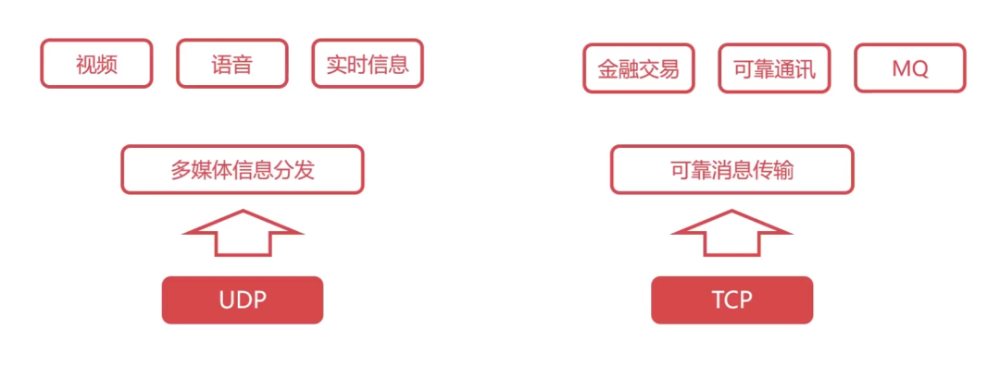

### 5.1.1 进程间基于网络的通信

- 第2~4章依次介绍了计算机网络体系结构中的物理层、数据链路层和网络层，它们共同解决了将主机通过异构网络互联起来所面临的问题，实现了`主机到主机的通信`。
- 然而在计算机网络中实际进行`通信的真正实体`，是位于`通信两端主机`中的`进程`。
- 如何`为运行在不同主机上的应用进程提供直接的逻辑通信服务`，就是`运输层的主要任务`。运输层协议又称为`端到端协议`。
- 从计算机网络体系结构的角度看运输层
	- 
	- 这里的 端口 并不是看得见, 摸得着的物理端口, 能插线的那种. 而是用来区分不同应用进程的标识符. 
- 运输层向应用层实体屏蔽了这么网络核心的细节(例如网络拓扑, 采用的路由选择协议等), 它使应用进程看见的就好像在两个运输层实体直接有一条端到端的逻辑通信信道.
- 运输层为应用层提供了两种不同的运输层协议:
	- TCP 面向连接的传输控制协议
	- UDP 无连接的用户数据报协议

> 注意, 两个进程要基于网络进行通信, 必须有一个进程要主动发起通信, 而另一个进程要事先准备好介绍通信请求, 这就是客户/服务器模式. 

### 5.1.2 TCP/IP体系结构运输层中的两个重要协议

>网际层为主机之间提供的逻辑通信服务, 是一种尽最大努力交付的数据报服务. 换言之, IP数据报在传送过程中有可能出现误码, 丢失, 重复或失序等传输错误. 而有的应用要求必须使用可靠传输服务, 而有些应用则不必使用可靠传输服务.

- TCP UDP
	- 
	

### 5.1.3 运输层端口号、复用与分用的概念

1. 运输层端口号

- 运行在计算机上的进程是使用进程标识符PID(Process Identification, IPD)来标识的
	- 然而，因特网上的计算机并不是使用统一的操作系统，而不同操作系统（Windows、Linux、MacOS）又使用不同格式的进程标识符。
	- 为了使运行不同操作系统的计算机的应用进程之间能够基于网络进行通信，就必须使用统一的方法对TCP/IP体系的应用进程进行标识。

- TCP/IP体系结构的运输层使用端口号来标识和区分应用层的不同应用进程。
	- 端口号的长度为16比特，取值范围是0~65535。
	- 

2. 发送方的复用和接收方的分用

- (1) 发送方的某些应用进程所发送的不同的应用报文, 在运输层使用UDP协议进行封装, 称为UDP复用.  而另一些应用进程所发送的不同的应用报文, 在运输层使用TCP协议进行封装, 称为TCP复用. 运输层使用不同端口号来区分不同的应用进程. 
	- 

- (2) 不管是使用运输层的UDP协议封装成的UDP用户数据报, 还是用TCP协议封装成的TCP报文段, 在网际层都需要使用IP协议封装成IP数据报, 这称为IP复用. IP数据报首部中协议字段的值用来表明, IP数据报的数据载荷部分封装的是哪种PDU. 取值6 = TCP报文段, 17 = UDP用户数据报. 
- (3) 接收方的网际层收到IP数据报后进行IP分用. 若IP数据报首部中协议字段的值为17, 则把IP数据报的数据载荷部分所封装的UDP用户数据报向上交给运输层的UDP. 若值为6, 交给运输层的TCP.
- (4) 运输层对UDP用户数据报进行UDP分用, 对TCP报文段进行TCP分用. 即根据首部中的目的端口号, 将它们向上交付给应用层的相应应用进程.

- 
- 注意: OSPF报文不使用运输层的协议进行封装, 而是直接使用网际层的IP进行封装. 协议字段值为89. 

3. 运输层端口号应用举例

- 
	- 先查询DNS服务器找web服务器地址. 
	- 
	- 找到web地址就发送HTTP请求.
	- 

## 5.2 UDP和TCP的对比

### 5.2.1 无连接的UDP和面向连接的TCP

>“连接”是指逻辑连接关系，而不是物理连接。

- 

### 5.2.2 UDP和TCP对单播、多播和广播的支持情况
 
- 
	- TCP仅仅支持单播

### 5.2.3 UDP和TCP对应用层报文的处理

- 
	- UDP对应用进程交付下来的报文既不合并也不拆分, 而是保留报文的边界. 即UDP是面向报文的.
	- TCP把应用进程交付下来的报文, 仅仅看做一串, 无结构的字节流. TCP 不知道这些字节流的含义, 仅将他们编号并存储在自己id发送缓存中.
	- TCP不保证接收方应用进程所收到的数据块与发送方应用进程所发出的应用层报文之间具有对应大小的关系.(如, 发送方应用进程交给发送方TCP共10个应用层报文, 但接收方的TCP可能只用了4个数据块就把收到的字节流交付给了上层). 但接收方应用进程必须有能力识别收到的字节流, 把它还原成有意义的应用层报文.

综上, TCP是面向字节流的, 这正是TCP实现可靠传输, 流量控制以及拥塞控制的基础. 
实际中, TCP是全双工的.

### 5.2.4 UDP和TCP对数据传输可靠性的支持

> 网际层向其上层提供无连接不可靠的数据传输服务.

- 

### 5.2.5 UDP首部和TCP首部的对比

 

## 5.3 UDP协议详解

UDP(User Datagram Protocol: 用户数据报协议)，是一个非常简单的协议，

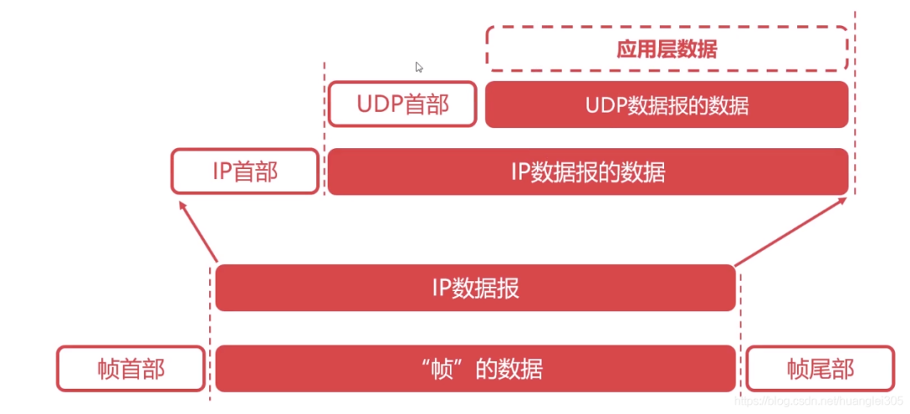

UDP协议的特点：

- UDP是无连接协议；
- UDP不能保证可靠的交付数据；
- UDP是面向报文传输的；
- UDP没有拥塞控制；
- UDP首部开销很小。

UDP数据报结构：

- 首部:8B，四字段/2B【源端口 | 目的端口 | UDP长度 | 校验和】 数据字段：应用数据

	- 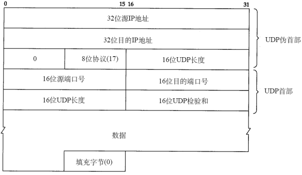
	- 计算检验和要在UDP首部前加上12个字节的UDP伪首部

## 5.4 TCP协议详解

TCP(Transmission Control Protocol: 传输控制协议)，是计算机网络中非常复杂的一个协议。

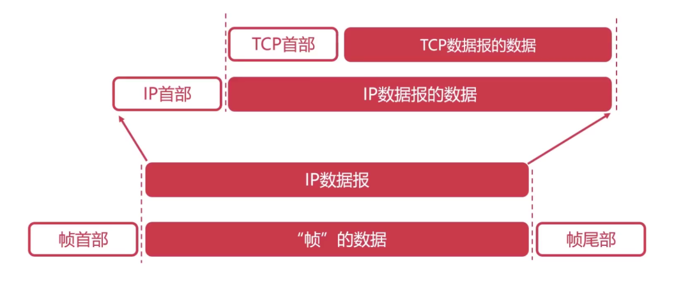

TCP协议的功能：

1. 对应用层报文进行分段和重组；
2. 面向应用层实现复用与分解；
3. 实现端到端的流量控制；
4. 拥塞控制；
5. 传输层寻址；
6. 对收到的报文进行差错检测（首部和数据部分都检错）；
7. 实现进程间的端到端可靠数据传输控制。

TCP协议的特点：

- TCP是面向连接的协议；
- TCP是面向字节流的协议；
- TCP的一个连接有两端，即点对点通信；
- TCP提供可靠的传输服务；
- TCP协议提供全双工通信（每条TCP连接只能一对一）；

### 5.4.1 TCP报文段的首部格式：

>TCP为实现可靠传输而采用面向字节流的方式. 但TCP在发送数据时, 是根据发送策略从发送缓存中取出一定数据的字节, 并给其添加一个首部使之成为TCP报文段后进行发送.

- 源端口 目的端口 : 看之前那节
- TCP实现可靠传输的相关字段:
	- 
	- 序(列)号 确认号 ACK的使用: 
		- 
		- 
		- 
		- 
- 数据偏移字段
	- 
	
 - 保留字段: 占6bit, 保留为今后使用, 目前置0
 - 窗口字段: 
	 - 
 - 检验和字段: 占16bit, 用来检查整个TCP报文段在传输过程中是否出现了误码
	 - 发送方检验和计算方法
		 - 
		 - 计算检验和, 需要先在TCP报文段的前面, 加上12字节的伪首部. 伪首部的第四个字段为6.
	- 接收方通过检验和字段的值判断TCP报文段在传输过程中是否误码的方法
		- 
	- TCP伪首部与UDP伪首部的对比
		- 

 - 同步标志位SYN
	 - 
 - 终止标志位FIN
	 - 
 - 复位标志位RST
	 - 
 - 推送标志位PSH
	 - 
	 - 
 - 紧急指针字段和紧急标志位URG
	 - 
	 - URG = 1, 紧急指针有效; URG = 0, 紧急指针无效.
 - 选项字段
	 - 
 - 填充字段
	 - 

- TCP标记的作用：
	- 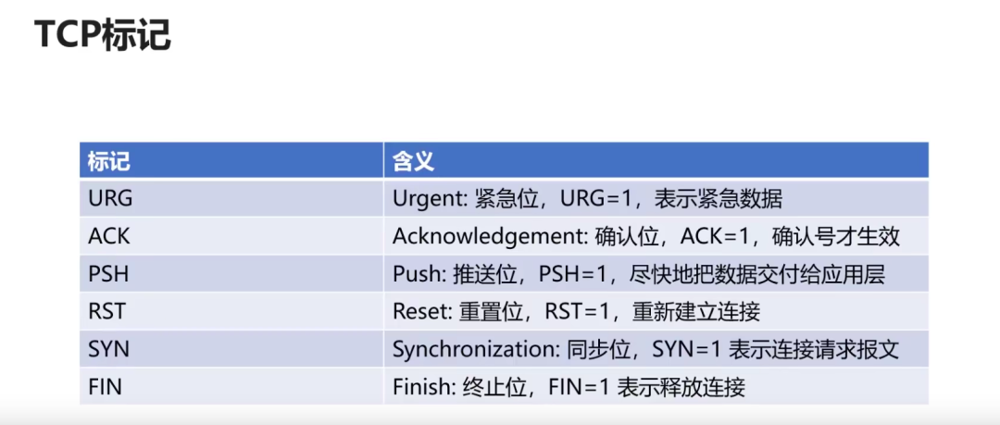

- 可靠传输的基本原理回顾

基本原理：

- 不可靠传输信道在数据传输中可能发生的情况：比特差错、乱序、重传、丢失
- 基于不可靠信道实现可靠数据传输采取的措施：

> 差错检测：利用编码实现数据包传输过程中的比特差错检测 确认：接收方向发送方反馈接收状态 重传：发送方重新发送接收方没有正确接收的数据 序号：确保数据按序提交 计时器：解决数据丢失问题；

停止等待协议：是最简单的可靠传输协议，但是该协议对信道的利用率不高。

连续ARQ(Automatic Repeat reQuest：自动重传请求)协议：滑动窗口+累计确认，大幅提高了信道的利用率。

基于连续ARQ协议，在某些情况下，重传的效率并不高，会重复传输部分已经成功接收的字节。

### 5.4.2 TCP的运输连接管理

- TCP是面向连接的协议，它基于运输连接来传送TCP报文段。
	- TCP运输连接的建立和释放，是每一次面向连接的通信中必不可少的过程。

- TCP运输连接有以下三个阶段
	- （1）通过“三报文握手”来建立TCP连接。
	- （2）基于已建立的TCP连接进行可靠的数据传输。
	- （3）在数据传输结束后，还要通过“四报文挥手”来释放TCP连接。
		- 

1. “三报文握手”建立TCP连接

> TCP规定:
> SYN字段 = 1 报文段不能携带数据, 但会消耗序号seq.
> TCP确认报文段 可以携带数据, 若不携带, 不消耗序号Seq.
> FIN字段 = 1 不管报文段带不带数据, 都要消耗序号seq

- “三报文握手”建立TCP连接的目的在于解决以下三个主要问题
	- 使TCP双方能够确知对方的存在。
	- 使TCP双方能够协商一些参数（例如最大报文段长度、最大窗口大小、时间戳选项等）。
	- 使TCP双方能够对运输实体资源进行分配和初始化。运输实体资源包括缓存大小、各状态变量、连接表中的项目等。

- “三报文握手”建立TCP连接的过程
- 最初, 两端的TCP进程都是关闭(CLOSED)状态.
	- (1) TCP服务器进程`首先创建传输控制块(TCB)`, 用来存储TCP连接中的一些重要信息. 之后TCP服务器就`进入监听(LISTEN)状态`, 等待客户端的连接请求. 由于TCP服务器进程是被动等待来自客户端进程的连接请求, 而不是主动发起的, 所以称为`被动打开连接`. 
		- 
	- (2) 客户端也要`首先创建TCB`, 之后在打算建立TCP连接时, `向服务器`发`送TCP连接请求报文段`, 并`进入同步已发送(SYN-SENT)状态`. TCP连接请求报文段`首部的同步标志位`置为1, 表面这是一个TCP连接请求报文段. `序号字段seq`被置为x. 注意, TCP规定SYN被置为1的报文段不能携带数据, 但要消耗掉一个序号.(`TCP请求报文段没有数据载荷`, 但会消耗掉序号x). 因此, TCP客户端下一次发送的TCP报文段的数据载荷的第一个字节的序号为x+1. 由于客户端主动发起TCP连接, 因此称为`主动打开连接`.
		- 
		- 
	- (3) 服务器接收到`TCP连接请求报文段`后, 如果同意连接, 则向客户端发送`TCP连接请求确认报文段`, 并`进入同步已接收(SYN-RCVD)状态`. 该报文段首部中的`SYN`和`ACK`都置`为1`, 表明这是一个TCP连接请求确认报文段; `序号字段seq`置为初始值y, 这是服务器端选择的`初始序号`. `确认号字段ack`的值被置为`x+1`, 这是对客户端选择的初始序号x的确认.  `注意: SYN被置为1的时候, 不能有数据载荷, 但这个序号会被消耗`.
		- 
		- 
		-  
	- (4) TCP客户端收到`TCP连接请求确认报文段`后, 还要向服务器端发送一个`普通的TCP确认报文段`, 并`进入连接已建立(ESTABLISHED)状态`. 该报文段首部中`ACK被置为1`, 表示这是一个普通的TCP确认报文段; `序号字段seq`被置为`x+1`, 因为初始值x被客户端消耗掉了, 且服务器端发过来请求确认报文段中的确认号也是x+1. `注意, TCP规定普通TCP确认报文段可以携带数据, 但若不携带数据, 则不消耗序号seq.`(那下一次服务器端发过来的确认号字段还是x+1) 该普通确认报文段中的确认号字段被置为y+1, 以确认服务器端发送的报文段y.
		- 
		- 
		- 
	- (5) TCP服务器端进程收到针对TCP连接请求确认报文段的`普通确认报文段`后, 也进入`连接已建立(ESTABLISHED)状态`. 此时, TCP双方都进入了ESTABLISHED状态, 他们可以基于建立的TCP连接进行可靠通信了.
		- 

- 能否改为“两报文握手”？
	- 

面试常客：为什么需要三次握手？

1. 第一次握手：客户发送请求，此时服务器知道客户能发；
2. 第二次握手：服务器发送确认，此时客户知道服务器能发能收；
3. 第三次握手：客户发送确认，此时服务器知道客户能收。

建立连接（三次握手）：

`第一次`：客户向服务器发送连接请求段，建立连接请求控制段（SYN=1），表示传输的报文段的第一个数据字节的序列号是x，此序列号代表整个报文段的序号（seq=x）；客户端进入 SYN_SEND （同步发送状态）；

`第二次`：服务器发回确认报文段，同意建立新连接的确认段（SYN=1），确认序号字段有效（ACK=1），服务器告诉客户端报文段序号是y（seq=y），表示服务器已经收到客户端序号为x的报文段，准备接受客户端序列号为x+1的报文段（ack_seq=x+1）；服务器由LISTEN进入SYN_RCVD （同步收到状态）;

`第三次`:客户对服务器的同一连接进行确认.确认序号字段有效(ACK=1),客户此次的报文段的序列号是x+1(seq=x+1),客户期望接受服务器序列号为y+1的报文段(ack_seq=y+1);当客户发送ack时，客户端进入ESTABLISHED 状态;当服务收到客户发送的ack后，也进入ESTABLISHED状态;第三次握手可携带数据;

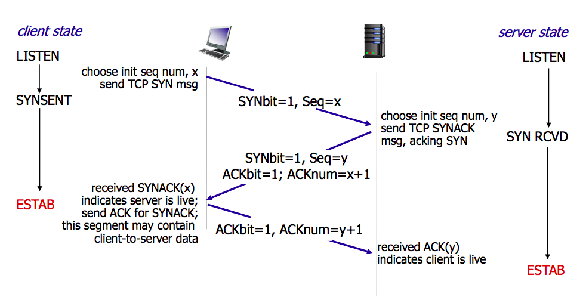

2. “四报文挥手”释放TCP连接

- “四报文挥手”释放TCP连接的过程
	- (1) 数据传输结束后, TCP通信双方都可以释放TCP连接. 现在TCP客户端和服务器端都处在ESTABLISHED状态.
	- (2) 假设使用TCP客户进程的应用进程通知其主动关闭TCP连接, TCP客户端会发送`TCP连接释放报文段`, 并`进入终止等待1(FIN-WAIT-1)状态`. 该报文段首部中的`终止标志位(FIN)`和`ACK`的值都被置为1, 表明这是一个TCP连接释放报文段, 同时也对之前收到的报文段进行确认; 序号字段seq 的值设置为u, 它等于TCP客户端之前已经传送过的数据的最后一个字节的序号加1. `注意: TCP规定FIN等于1的TCP报文段即使不携带数据, 也要消耗一个序号`. 确认号字段`ack`的值设置为v, 它等于客户端之前已收到的数据的`最后一个字节的序号加1`.
		- 
	- (3) TCP服务器进程收到客户端的`TCP连接释放报文段`后, 会发送一个普通的`TCP确认报文段`, 并进入`关闭等待(CLOSE-WAIT)状态`. 该报文段首部中的`ACK`的值被置为1, 表明这是一个普通的TCP确认报文段; `序号字段seq` 设置为v. `确认号字段ack`设置为 u+1, 对TCP连接释放报文段的确认. TCP服务器端这时`应该通知高层应用进程`:"TCP客户端要断开与自己的TCP连接". 此时, `从TCP客户端到服务器端这个方向的连接就释放了`. 这是的TCP连接属于`半关闭状态`, 就是客户端没数据发了, 但服务器端还有数据要发. 客户端还是要继续接收. 服务器端到客户端这个方向的TCP连接还没关闭. 半关闭状态可能会持续一段时间. 
		- 
		- 
	- (4) TCP客户进程收到该 普通`TCP确认报文段`后就进入`终止等待2(FIN-WAIT-2) 状态`, `等待`TCP服务器端发出的`TCP连接释放报文段`. 若使用TCP服务器进程的应用进程已经没有数据要发了, 应用进程就通知其TCP服务器进程释放连接. 由于TCP连接释放是由TCP客户端主动发起的, 因此TCP服务器端进程对TCP连接的释放称为`被动关闭连接`.
		- 
	- (5) TCP`服务器`进程发送`TCP连接释放报文段`并进入`最后确认(LAST-ACK)状态`. 该报文段首部中的`FIN和ACK`的值都被置为1, 表明这是一个TCP连接释放报文段, 同时也对之前收到的报文段进行确认. 现在假定`序号字段seq`的值为w, 因为半关闭状态下, 服务器端可能又发送了一些数据. `确认号字段ack`的值为 u+1, 对之前收到的TCP连接释放报文段的`重复确认`.
		- 
		- 
	- (6) TCP客户端进程收到`TCP连接释放报文段`后, 必须针对该报文段发送普通的`TCP确认报文段`, 之后进入`时间等待(TIME-WAIT)状态`. 该报文段首部中`ACK`值为1, 表明是一个普通的TCP确认报文段. `序号字段seq` 设置为 u+1, 因为之前客户端发送的TCP连接释放报文段一定要消耗掉一个序号. `确认号字段ack`的值设置为w+1, 对服务器端的TCP连接释放报文段的确认.
		- 
		- 
		- 
	- (7) TCP服务器进程`收到`客户端的普通`TCP确认报文段`之后, 就进入`关闭(CLOSED)状态`. TCP服务器`端撤销相应的TCB`(传输控制块). 而`客户端`还要`经过2MSL后`才能进入关闭(CLOSED)状态. MSL的意思是最长报文段寿命(Maximum Segment Lifetime), 建议为2分钟.  换言之, TCP客户进程进入TIME-WAIT状态后, 还要经过4分钟才能进入CLOSED状态.  这完全是从工程上来考虑的. 对于现在的网络, MSL取2分钟可能太长. 因此TCP允许不同的实现根据具体情况用更小的MSL值. 经过2MSL时间后, 客户端撤销相关TCB后, 就结束了这次TCP连接.
		- 

- 为什么要在时间等待(TIME-WAIT)状态必须等待2MSL的时间?
	- 
	- 

释放连接（四次挥手）

`第一次`：客户向服务器发送释放连接报文段，发送端数据发送完毕，请求释放连接（FIN=1），传输的第一个数据字节的序号是x（seq=x）；客户端状态由ESTABLISHED进入FIN_WAIT_1（终止等待1状态）；

`第二次`：服务器向客户发送确认段，确认字号段有效（ACK=1），服务器传输的数据序号是y（seq=y），服务器期望接收客户数据序号为x+1（ack_seq=x+1）;服务器状态由ESTABLISHED进入CLOSE_WAIT（关闭等待）；客户端收到ACK段后，由FIN_WAIT_1进入FIN_WAIT_2；

`第三次`:服务器向客户发送释放连接报文段，请求释放连接（FIN=1），确认字号段有效（ACK=1），表示服务器期望接收客户数据序号为x+1（ack_seq=x+1）;表示自己传输的第一个字节序号是y+1（seq=y+1）；服务器状态由CLOSE_WAIT 进入 LAST_ACK （最后确认状态）；

`第四次`：客户向服务器发送确认段，确认字号段有效（ACK=1），表示客户传输的数据序号是x+1（seq=x+1），表示客户期望接收服务器数据序号为y+1+1（ack_seq=y+1+1）；客户端状态由FIN_WAIT_2进入TIME_WAIT，等待2MSL时间，进入CLOSED状态；服务器在收到最后一次ACK后，由LAST_ACK进入CLOSED；

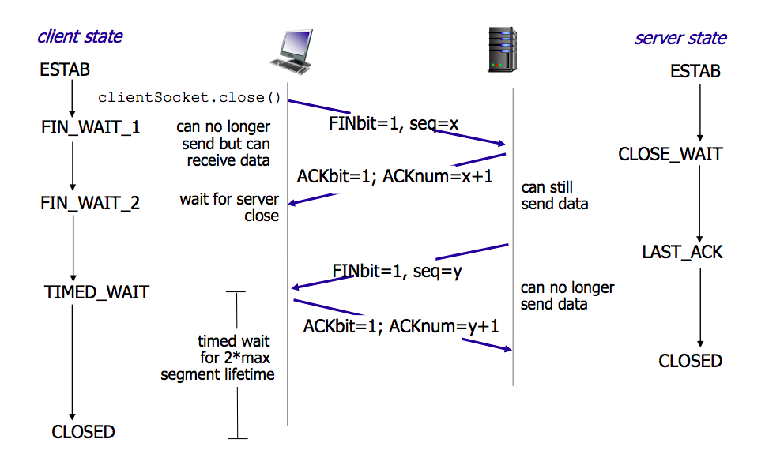

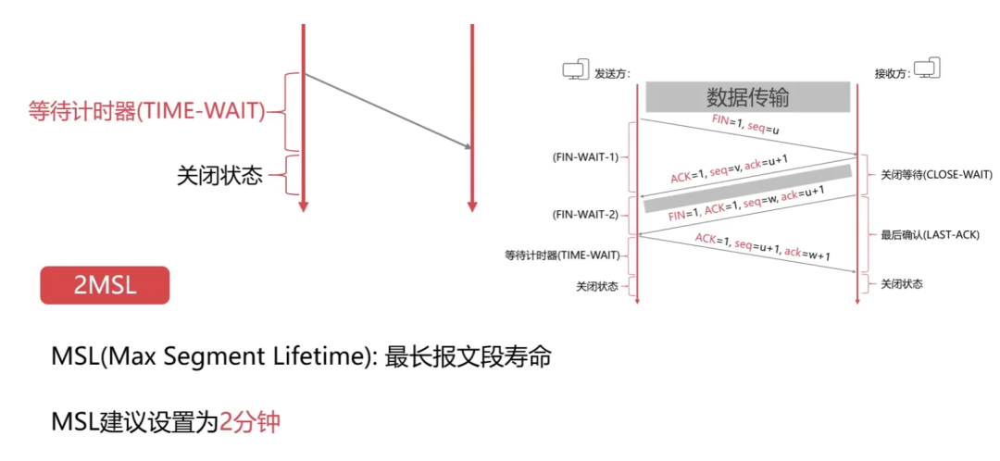

**为什么需要等待2MSL?**

-  最后一个报文没有确认；
-  确保发送方的ACK可以到达接收方；
-  2MSL时间内没有收到，则接收方会重发；
-  确保当前连接的所有报文都已经过期。

3. TCP保活计时器的作用

除了时间等待计时器(2MSL计时器), TCP还设有一个保活计时器(Keepalive Timer).

- TCP服务器进程每收到一次TCP客户端的数据, 就重新设置并启动保活计时器.(通常为2h),
- 若保活计时器在定时周期内未收到客户端发来的数据, 则当保活计时器到时候, TCP服务器就像客户端发送一个探测报文段, 以后每隔75秒发送一次. 若一连发送10个探测报文段后仍无客户端响应. 服务器端就认为客户端出了故障, 于是关闭这个连接.

流量控制：让发送方发送速率不要太快，TCP协议使用滑动窗口实现流量控制。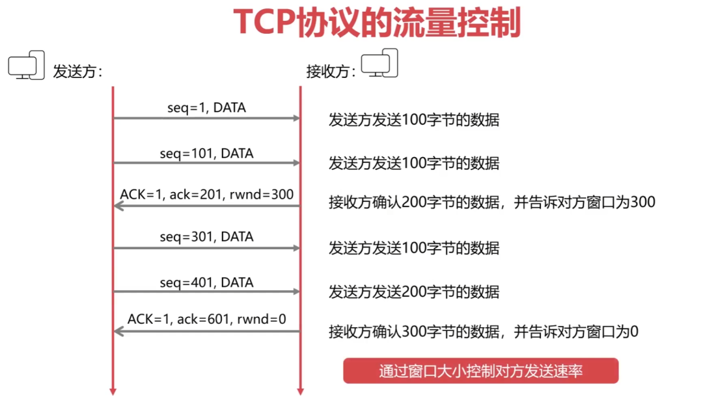

## 5.4 TCP协议的拥塞控制

拥塞控制与流量控制的区别：流量控制考虑点对点的通信量的控制，而拥塞控制考虑整个网络，是全局性的考虑。拥塞控制的方法：慢启动算法+拥塞避免算法。

慢开始和拥塞避免：

1. 【慢开始】拥塞窗口从1指数增长；
2. 到达阈值时进入【拥塞避免】，变成+1增长；
3. 【超时】，阈值变为当前cwnd的一半（不能<2）；
4. 再从【慢开始】，拥塞窗口从1指数增长。

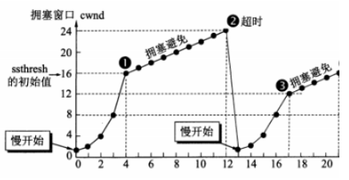

快重传和快恢复：

1. 发送方连续收到3个冗余ACK，执行【快重传】，不必等计时器超时；
2. 执行【快恢复】，阈值变为当前cwnd的一半（不能<2），并从此新的ssthresh点进入【拥塞避免】。

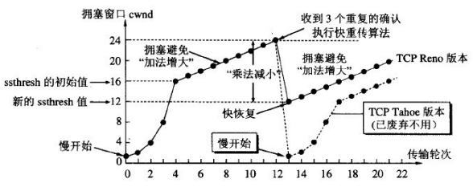

# 六、应用层

为操作系统或网络应用程序提供访问网络服务的接口。**应用层重点：**

1. 数据传输基本单位为报文；
2. 包含的主要协议：FTP（文件传送协议）、Telnet（远程登录协议）、DNS（域名解析协议）、SMTP（邮件传送协议），POP3协议（邮局协议），HTTP协议（Hyper Text Transfer Protocol）。

## 6.1 DNS详解

DNS（Domain Name System:域名系统）【C/S，UDP，端口53】：解决IP地址复杂难以记忆的问题,存储并完成自己所管辖范围内主机的 域名 到 IP 地址的映射。

域名解析的顺序：

- 【1】浏览器缓存，
- 【2】找本机的hosts文件，
- 【3】路由缓存，
- 【4】找DNS服务器（本地域名、顶级域名、根域名）->迭代解析、递归查询。

1. IP—>DNS服务—>便于记忆的域名
2. 域名由点、字母和数字组成，分为顶级域（com，cn，net，gov，org）、二级域（baidu,taobao,qq,alibaba）、三级域（www）(12-2-0852)

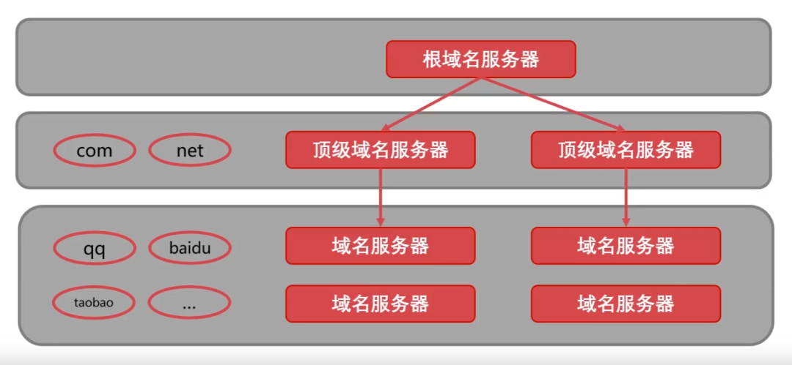

## 6.2 DHCP协议详解

DHCP（Dynamic Configuration Protocol:动态主机设置协议）：是一个局域网协议，是应用UDP协议的应用层协议。作用：为临时接入局域网的用户自动分配IP地址。

## 6.3 HTTP协议详解

文件传输协议（FTP）：控制连接（端口21）：传输控制信息（连接、传输请求），以7位ASCII码的格式。整个会话期间一直打开。

HTTP（HyperText Transfer Protocol:超文本传输协议）【TCP，端口80】：是可靠的数据传输协议，浏览器向服务器发收报文前，先建立TCP连接，HTTP使用TCP连接方式（HTTP自身无连接）。

HTTP请求报文方式：

1. GET：请求指定的页面信息，并返回实体主体；
2. POST：向指定资源提交数据进行处理请求；
3. DELETE：请求服务器删除指定的页面；
4. HEAD：请求读取URL标识的信息的首部，只返回报文头；
5. OPETION：请求一些选项的信息；
6. PUT：在指明的URL下存储一个文档。

### 6.3.1 HTTP工作的结构

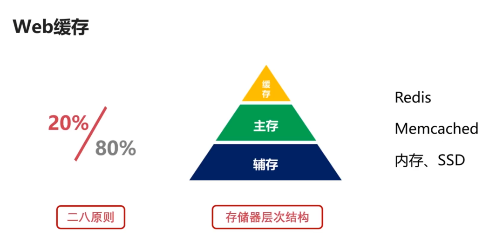

### 6.3.2 HTTPS协议详解

HTTPS(Secure)是安全的HTTP协议，端口号443。基于HTTP协议，通过SSL或TLS提供加密处理数据、验证对方身份以及数据完整性保护。