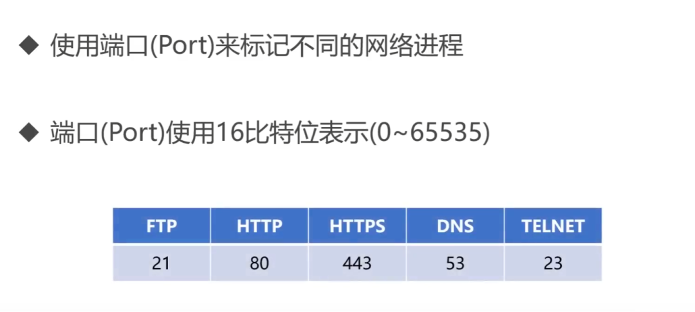
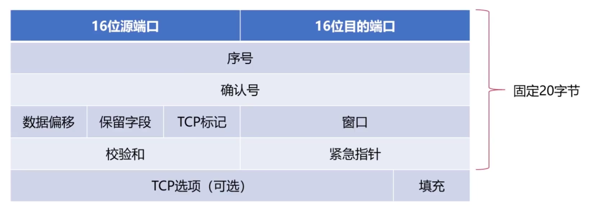
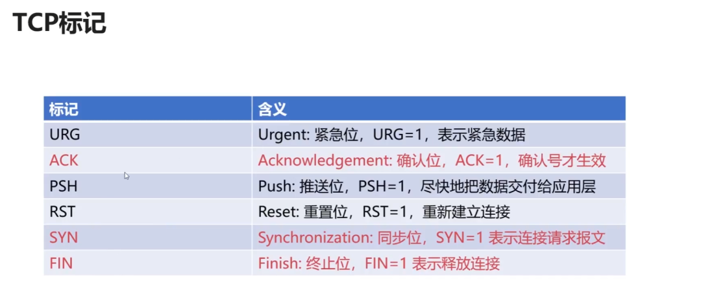

# 四、网络层

>网络层重点:
>1. 网络层向上提供的服务: 虚电路服务 数据报服务
>2. IPv4地址与MAC地址的关系
>3. IPv4地址的无分类编址方法
>4. IP数据报的发送和转发过程
>5. 因特网的路由选择协议

网络层的目的是实现两个端系统之间的数据透明传送，具体功能包括寻址和路由选择、连接的建立、保持和终止等。数据交换技术是报文交换（基本上被分组所替代）：采用储存转发方式，数据交换单位是报文。

网络层中涉及众多的协议，其中包括最重要的协议，也是TCP/IP的核心协议——IP协议。IP协议非常简单，仅仅提供不可靠、无连接的传送服务。IP协议的主要功能有：无连接数据报传输、数据报路由选择和差错控制。

与IP协议配套使用实现其功能的还有地址解析协议ARP、逆地址解析协议RARP、因特网报文协议ICMP、因特网组管理协议IGMP。具体的协议我们会在接下来的部分进行总结，有关网络层的重点为：
1. 网络层负责对子网间的数据包进行路由选择。此外，网络层还可以实现拥塞控制、网际互连等功能；
2. 基本数据单位为IP数据报；
3. 包含的主要协议：
- IP协议（Internet Protocol，因特网互联协议）;
- ICMP协议（Internet Control Message Protocol，因特网控制报文协议）;
- ARP协议（Address Resolution Protocol，地址解析协议）;
- RARP协议（Reverse Address Resolution Protocol，逆地址解析协议）。
4. 重要的设备：路由器。

路由器相关协议

## 4.1 网络层概述

>网络层是作为法律标准的OSI体系结构自下而上的第三层，其主要任务是将分组从源主机经过多个网络和多段链路传输到目的主机. 
>网络层核心功能: 分组转发和路由选择.
>提供的服务: 面向连接的虚电路服务, 面向无连接的数据报服务

### 4.1.1 分组转发和路由选择

网络层的主要任务就是将分组从源主机经过多个网络和多段链路传输到目的主机，可以将该任务划分为分组转发和路由选择两种重要的功能。

1. 分组转发
当路由器从自己的某个接口所连接的链路(或网络) 上收到一个分组后, 将该分组 从自己其他适当的接口转发给下一跳路由器或者目的主机, 这就是所谓的`分组转发`.

为此, 每个路由器都需要维护自己的一个`转发表(Forwarding Table)`, 路由器根据分组首部中的`转发标识`在转发表中进行查询, 根据查询结果锁指示的接口进行分组转发. 

> 交换机的工作原理是网桥, 工作在数据链路层, 负责根据数据帧的MAC查找对应接口进行转发.
> 路由器的工作原理是IP, 工作在网络层, 负责将某一个网络中的数据分组转发到另一个网络中.

- 转发表中, **`转发标识`** 和 `接口` 是一一对应的. 上图路由器R1从接口1收到了一个分组, R1根据分组首部的转发标识A, 在自己的转发表中查询, 结果指示应该从R1的接口2 转发. 
- 需要说明的是, 首部中的转发标识`取决于具体的网络层`, 有可能是分组的目的地址. 也有可能是分组所属的连接的指示.

2. 路由选择
源主机和目的主机之间可能存在多条路径, 网络层需要决定选择哪一条路径来传送分组, 这就是所谓的路由选择(Routing).

上图中, A到B有两条路径.

路由选择方式主要有以下三种: 

- 集中式路由选择: 由某个网络控制中心执行路由选择, 并向每个路由器下载路由信息.
- 分布式路由选择: 在每个路由器上运行路由选择协议, 各路由器相互交换路由信息并各自计算路由.
- 人工路由选择: 由网络运维人员配置路由.

> 注意: `路由选择`生成的是`路由表(Routing Table)`, 路由表一般仅包含从目的网络到下一条的映射, 路由表需要对网络拓扑变化的计算最优化. 
> 而转发表是从路由表得出的, 转发表的结构应该使查找过程最优化. 

### 4.1.2 网络层向其上层提供的两种服务

1. 面向连接的虚电路服务

- 通信结束后，需要释放之前所建立的虚电路。
- 跟采用电路交换的电话通信不同的, 电话通信是先建立真正的物理连接. 虚连接只是与之类似, 实际完全不同.
- 分组的首部仅需在建立连接阶段使用完整的目的主机地址, 之后每个分组的首部只需要携带一条虚电路编号即可.
- 这种通信方式 如果再使用可靠传输的网络协议, 就可以使所发送的分组最终正确(无差错按序到达, 不丢失, 不重复)到达接收方.
- 很多`广域分组交换网`都使用面向连接的虚电路服务. 而`因特网`的先驱者并没有采用这种设计思路, 而是选择了无连接的数据报服务.

2. 无连接的数据报服务

- 这种方式传送的分组可能会误码, 丢失, 重复, 失序.
- 将相对简单的尽最大努力(即不可靠)的分组交付功能置于因特网核心. 将复杂的网络处理功能置于因特网的边缘(即用户主机和其内部的运输层).
- 网络自身不提供端到端的可靠传输服务, 所以网络中的路由器就可以比较简单, 成本也低.

| 对比方面| 虚电路服务 | 数据报服务 |
|:-: | :-:| :-:|
|思路| 可靠通信又网路自身保证|可靠通信由用户主机保证 |
|连接|必须建立网络层连接 |不需要建立网络层连接 |
|目的地址 |仅在建立连接阶段使用,之后分组用虚电路号 |各分组必须携带完整目的地址 |
|分组转发 |属于同一条虚电路的分组均按同一条路由转发 |每个分组可以走不通路由 |
|节点故障 |所有通过出故障的节点的虚电路都不能工作 |出故障的节点可能会丢失分组,一些路由可能会变 |
|分组顺序 |总是按发送顺序到达目的主机 |不一定按发送顺序到达目的主机 |
|服务质量 |可将通信资源提前分配给每个虚电路 |很难实现 |

## 4.2 网际协议IP

网际协议(Internet Protocol)是TCP/IP体系结构网际层中的核心协议, 也是 Internet 网络层最核心的协议。

网际协议IP、传输控制协议TCP、TCP/IP体系结构是由“因特网之父”Robert Kalm和Vint Cerf二人共同研发的，1974年5月发布了TCP/IP的第一个版本。这两位学者在2005年获得图灵奖（相当于计算机科学领域的诺贝尔奖）。

- 与IP配套使用的协议:
- 地址解析协议(Address Resolution Protocol, ARP)
- 网际控制报文协议(Internet Control Message Protocol, ICMP)
- 网际组管理协议(Internet Group Management Protocol, IGMP)
- 逆地址解析协议(淘汰)

### 4.2.1 异构网络互连

- 需要解决的问题
	- 

- IP网的概念
	- 因为这些异构网络的网络层都用一样的网际协议IP 所以在网络层看来, 他们好像是一个统一的网络, 即IP网.
	- 

### 4.2.2 IPv4 地址及其编址方法

IPv4地址是给因特网上的每一个主机（或路由器）的每一个接口分配的一个在`全球范围内唯一`的32比特的标识符。

IPv4地址由因特网名字和数字分配机构ICANN进行分配。
2011年2月3日，因特网号码分配管理局IANA（由ICANN行使职能）宣布，IPv4地址已经分配完毕。
我国在2014至2015年也逐步停止了向新用户和应用分配IPv4地址，同时全面开展商用部署IPv6。

- IPv4地址的编址方法经历了三个历史阶段
	

1. IPv4地址的表示方法

- 点分十进制
由于IPv4地址由32比特构成，不方便阅读、记录以及输入等，因此IPv4地址采用点分十进制表示方法以方便用户使用。

2. 分类编制

- 分类编址将32位IPv4地址分为两个部分
	- 

	- 举例:
	- 

- 分类编制的IPv4地址分为A~E五类
	
	- 

	- 注意事项
	
	- 

	- A类地址的细节:
	- 
	- 本地软件环回测试地址用于笨猪机内的进程间通信, 若主机发送一个目的地址为环回地址(如127.0.0.1)的IP数据报, 则本主机中的协议软件就会处理数据报中的数据, 而不是把它发送出去
	 
	- B类地址的细节:
	- 
	 
	- C类地址的细节:
	- 

- 各类地址范围
- 

- 一般不使用的特殊IPv4地址
	- 

- 分类编址方法的缺点
	- 

3. 划分子网编址方法
随着更多中小网络加入因特网, IPv4分类编址不够灵活, 浪费地址的缺点就暴露了.

- 三级结构的IPv4地址
- 用主机号中的一部分bit位作为子网号.
	- 

- 子网掩码
- 子网掩码可以表明分类IPv4地址的主机号部分被借用了几个比特作为子网号。
- 与IPv4地址类似，子网掩码也是由32比特构成的。
- 用左起多个连续的比特1对应IPv4地址中的网络号和子网号，之后的多个连续的比特0对应IPv4地址中的主机号。
	- 
- 将划分子网的IPv4地址与相应的子网掩码进行逐比特的`逻辑与`运算，就可得到该IPv4地址所在子网的网络地址。
	- 

- 根据IP地址和子网掩码得出子网划分`全部细节`
	- 
	- 划分细节
	- 
	
 - 默认子网掩码
	 - 在未划分子网的情况下使用的子网掩码
	 - 

4. 无分类编制方法

- 无分类编址方法的诞生背景
	- 
	- 重新回到两级结构的IPv4地址
	- 

- 地址掩码
- 与子网掩码类似，用左起多个连续的比特1对应IPv4地址中的网络前缀，之后的多个连续的比特0对应IPv4地址中的主机号。
	- 

- CIDR的斜线记法
- 为了简便起见，可以不明确给出配套的地址掩码的点分十进制形式，而是在无分类编址的IPv4地址后面加上斜线“/”，在斜线之后写上网络前缀所占的比特数量（也就是地址掩码中左起连续比特1的数量），这种记法称为斜线记法。
	- 

- CIDR地址块
- 无分类域间路由选择CIDR是将`网络前缀都相同的`、`连续的`多个无分类IPv4地址，组成一个CIDR地址块，只要知道CIDR地址块中的任何一个地址，就可以知道该地址块的全部细节。
	- 地址块中的最小地址
	- 地址块中的最大地址
	- 地址块中的地址数量
	- 地址块中聚合某类网络（某分类网络）的数量
	- 地址掩码
	

CIDR的好处:
- 使用CIDR地址块可以有效地分配IPv4地址空间
- 根据客户的需要分配适当大小的CIDR地址块，因此可以更加有效地分配IPv4的地址空间。
	- 

- 路由聚合（构造超网）
	- 
	- 网络前缀越长，地址块越小，路由越具体。
	- 若路由器查表转发分组时发现有多条路由条目匹配，则选择网络前缀最长的那条路由条目，这称为`最长前缀匹配`，因为这样的路由更具体。

### 4.2.3 IPv4地址的应用规划

IPv4地址的应用规划是指将给定的IPv4地址块（或分类网络）划分成若干个更小的地址块（或子网），并将这些地址块（或子网）分配给互联网中的不同网络，进而可以给各网络中的主机和路由器的接口分配IPv4地址。

- 定长子网掩码和变长子网掩码
	- 

1. 采用定长的子网掩码进行子网划分

- 举例:
	- 
- 需求分析
	- 

- 根据需求分析找出一个 用于子网划分的子网掩码
	- 
- 根据网络地址和子网掩码 得出子网划分细节
	- 
- 子网分配
- 从子网1~子网8中任选5个子网分配给应用需求中的5个子网
	- 

2. 采用变长的子网掩码进行子网划分

- 举例:
	- 
- 需求分析:
	- 根据需求分析找出用于各子网的地址块前缀
	- 

- 从给定地址块中为各子网选择子块
	- 
	
- 分配:
	- 

### 4.2.4 IPv4地址与MAC地址

1. IPv4地址与MAC地址的封装位置
	- 

2. 数据包传送过程中IPv4地址与MAC地址的变化情况
	- 
	- 

3. IPv4地址与MAC地址的关系

- 如果仅使用MAC地址进行通信，则会出现以下主要问题
	- 因特网中的每台路由器的路由表中就必须记录因特网上`所有`主机和路由器各接口的`MAC地址`。
	- 手工给各路由器配置路由表几乎是不可能完成的任务，即使使用路由协议让路由器通过相互交换路由信息来自动构建路由表，也会因为路由信息需要包含海量的MAC地址信息而严重占用通信资源。
	- 包含海量MAC地址的路由信息需要路由器具备极大的存储空间，并且会给分组的查表转发带来非常大的时延。

- 因特网的网际层使用IP地址进行寻址，就可使因特网中各路由器的路由表中的路由记录的数量大大减少，因为只需记录部分网络的网络地址，而不是记录每个网络中各通信设备的各接口的MAC地址。
	- 路由器收到IP数据报后，根据其首部中的目的IP地址的网络号部分，基于自己的路由表进行查表转发。
	- 查表转发的结果可以指明IP数据报的下一跳路由器的IP地址，但无法指明该IP地址所对应的MAC地址。因此，在数据链路层封装该IP数据报成为帧时，帧首部中的目的MAC地址字段就无法填写，该问题需要使用网际层中的`地址解析协议ARP`来解决。

### 4.2.5 地址解析协议(ARP)

- ARP的作用
	- 

地址解析协议 ARP(Address Resolution Protocol)：为网卡(网络适配器)的IP地址到对应的硬件地址提供动态映射. 可以把网络层32位地址转化为数据链路层MAC48位地址.

ARP 是即插即用的，一个ARP表是自动建立的，不需要系统管理员来配置。

- ARP高速缓存表
	- 

- ARP广播请求
	- 

- ARP单播响应
	- 
	- 

- ARP高速缓存表中的记录类型和生命周期
	- 动态 和 静态: 
	- 

> ARP用来解决同一个局域网网中的主机或路由器的IP与MAC地址的映射问题, 不可以跨网络使用. 

- ARP相关注意事项
	- 
	- 由于ARP协议的主要用途是从网际层使用的IP地址解析出在数据链路层使用的MAC地址。因此，有的教材将ARP协议划归在网际层，而有的教材将ARP协议划归在数据链路层。这两种做法都是可以的。
	- 除了ARP请求报文和响应报文，ARP协议还有其他类型的报文，例如用于检查IP地址冲突的“无故ARP”。
	- 由于ARP协议很早就制定出来了（1982年11月），当时并没有考虑网络安全问题。因此，ARP协议没有安全验证机制，存在ARP欺骗和攻击等问题。

### 4.2.6 IP数据报的发送和转发过程

IP数据报的发送和转发过程包含以下两个过程:
- 主机发送IP数据报
- 路由器转发IP数据报

>为了将重点放在TCP/IP体系结构的网际层发送和转发IP数据报的过程上, 本节后续介绍中, 将忽略以下过程:
> 1. 使用ARP协议来获取目的主机或路由器接口的MAC地址的过程
> 2. 以太网交换机自学习和转发帧的过程.

1. 主机发送IP数据报

- 直接交付和间接交付的概念
	- 直接交付: 同一网络中的主机之间直接通信.
	- 间接交付: 不同网络中的主机之间的通信, 需要通过`默认网关(路由器)`来中转. 
	- 

- 源主机判断目标主机是否与源主机在同一网络中的方法
	- 

- 默认网关
	- 给网络中的各主机设置默认网关
	- 
	- 
	- 两个网络的默认网关不同

2. 路由器转发IP数据报
	- 
	- 查表转发
	- 
	- 
	- 

- 路由器隔离广播域
	- 

### 4.2.7 IPv4 数据报的首部格式

- IPv4数据报的首部格式及其内容是实现IPv4协议各种功能的基础。
- 在TCP/IP标准中, 各种数据格式常常以32比特(即4字节)为单位来描述。
	- 
- IPv4数据报首部是由20字节的固定部分, 和最大40字节的可变部分组成.
- 固定部分是指每个IPv4数据报都必须要包含的部分。
- 某些IPv4数据报的首部，除了包含20字节的固定部分，还包含一些可选的字段来增加IPv4数据报的功能。

1. 版本

- 长度为4个比特，用来表示IP协议的版本。
- 通信双方使用的IP协议的版本必须一致。目前广泛使用的IP协议的版本号为4（即IPv4）。

2. 首部长度、可选字段和填充

- 首部长度
	- 长度为4个比特，该字段的取值`以4字节为单位`，用来表示IPv4数据报的首部长度。
	- 最小取值为二进制的0101，即十进制的5，再乘以4字节单位，表示IPv4数据报首部只有20字节固定部分。
	- 最大取值为二进制的1111，即十进制的15，再乘以4字节单位，表示IPv4数据报首部包含20字节固定部分和最大40字节可变部分。

- 可选字段
	- 长度从1字节到40字节不等，用来支持排错、测量以及安全措施等功能。
	- 虽然可选字段增加了IPv4数据报的功能，但这同时也使得IPv4数据报的首部长度成为可变的，这就增加了因特网中每一个路由器处理IPv4数据报的开销。
	- 实际上, `可选字段很少用`.

- 填充字段
	- 用来确保IPv4数据报的首部长度是4字节的整数倍，使用全0进行填充。
	- 
	- 举例
		- 

3. 区分服务

- 长度为8个比特，用来获得更好的服务。
- 该字段在旧标准中叫作服务类型，但实际上一直没有被使用过。
- 1998年，因特网工程任务组IETF把这个字段改名为区分服务。
- 利用该字段的不同取值可提供不同等级的服务质量。
- 只有在使用区分服务时才用, 一般情况下都不用这个字段.

4. 总长度

- 长度为16个比特，该字段的取值以字节为单位，用来表示IPv4数据报的长度（首部长度+数据载荷长度）。
- 最大取值为二进制的16个比特1，即十进制的65535（很少传输这么长的IPv4数据报）。
- 举例说明: 
	- 

5. 标识、标志和片偏移

> 标识 标志 和 片偏移 三个字段共同用于IPv4数据报分片.

- 将IPv4数据报分片的原因
	- 数据链路层的数据载荷 是有限制的(MTU):
	- 

- 标识
	- 长度为16个比特，属于`同一个IPv4数据报`的`各分片数据报`应该`具有相同的标识`。
	- IP软件会维持一个`计数器`，每产生一个IPv4数据报，计数器值就加1，并将此值赋给标识字段。

- 标志
	- 最低位（More Fragment，MF）
		- MF=1表示本分片后面还有分片
		- MF=0表示本分片后面没有分片
	- 中间位（Don’t Fragment，DF）
		- DF=1表示不允许分片
		- DF=0表示允许分片
	- 最高位为保留位，必须设置为0

- 片偏移
	- 长度为13个比特，该字段的取值`以8字节为单位`，用来指出分片IPv4数据报的数据载荷偏移其在原IPv4数据报的位置有多远。

- 分片过程:
	- 
	- 假设现在首部2 的那个分片 仍需再 分片
	- 

6. 生成时间TTL(Time To Live)

- 长度为8个比特, 最大取值为二进制的11111111, 即十进制的255. 该字段的取值最初以秒为单位. 因此, IPv4数据报的最大生存时间最初为255秒. 路由器转发IPv4数据报时, 将其首部中该字段的值减去该数据报在路由器上所耗费的时间, 若结果不为0就转发, 否则就丢弃. 
- 生存时间字段后来改为`以“跳数”为单位`, 路由器收到待转发的IPv4数据报时, 将其首部中的该字段的值减1, 若结果不为0就转发, 否则就丢弃. 
- 作用: 防止被错误路由的IPv4数据报无限制地在因特网中兜圈.
	- 

7. 协议

- 长度为8个比特，用来指明IPv4数据报的数据载荷是`何种协议数据单元PDU`。
- 举例
	- 

- 应用层常用协议相应的协议字段的取值
	- 

8. 首部检验和

- 长度为16个比特，用于检测IPv4数据报在传输过程中其`首部是否出现了差错`。
- IPv4数据报每经过一个路由器，其首部中的某些字段的值（例如生存时间TTL、标志以及片偏移等）都可能发生变化，因此路由器都要重新计算一下首部检验和。
- 计算方法
	- 发送方
		- 把IPv4数据报首部划分为n个16bit.  `首部检验和` 字段置为全0. 
		- 
	
	- 接收方 
		- 
	- 该计算方法不仅用于IP协议, 还用于运输层的用户数据报协议(UDP)和TCP协议, 常被称为 因特网校验和(Internet Checksum). 性能虽不如CRC, 但是易用软件实现.

- 计算方法的重点在于二进制反码求和运算
	- 两个数进行二进制`反码求和`的运算规则是从低位到高位逐列进行计算
		- 0和0相加是0
		- 0和1相加是1
		- 1和1相加是0，但要产生一个进位1，加到下一列
		- 若最高位相加后产生进位，则最后得到的结果要加1
		 

> 网际层并不向高层提供可靠传输服务, 计算首部检验和也比较费时, 所以IPv6协议里, 路由器不算了. 转发就更快了.

9. 源IP地址和目的IP地址

- 源IP地址字段
	- 长度为32个比特，用来填写发送IPv4数据报的源主机的IPv4地址。
- 目的IP地址字段
	- 长度为32个比特，用来填写接收IPv4数据报的目的主机的IPv4地址。

## 4.4 网络地址转换NAT技术

用于多个主机通过一个公有IP访问访问互联网的私有网络中，减缓了IP地址的消耗，但是增加了网络通信的复杂度。

### NAT 工作原理：

从内网出去的IP数据报，将其IP地址替换为NAT服务器拥有的合法的公共IP地址，并将替换关系记录到NAT转换表中；

从公共互联网返回的IP数据报，依据其目的的IP地址检索NAT转换表，并利用检索到的内部私有IP地址替换目的IP地址，然后将IP数据报转发到内部网络。

## 4.6 ICMP协议详解

网际控制报文协议（Internet Control Message Protocol），可以报告错误信息或者异常情况，ICMP报文封装在IP数据报当中。

### ICMP协议的应用：

- Ping应用：网络故障的排查；
- Traceroute应用：可以探测IP数据报在网络中走过的路径。

## 4.7网络层的路由概述

关于路由算法的要求：正确的完整的、在计算上应该尽可能是简单的、可以适应网络中的变化、稳定的公平的。

**自治系统AS**：指处于一个管理机构下的网络设备群，AS内部网络自治管理，对外提供一个或多个出入口，其中自治系统内部的路由协议为内部网关协议，如RIP、OSPF等；自治系统外部的路由协议为外部网关协议，如BGP。

**静态路由**：人工配置，难度和复杂度高；

动态路由：

1. 链路状态路由选择算法LS：向所有隔壁路由发送信息收敛快；全局式路由选择算法，每个路由器计算路由时，需构建整个网络拓扑图；利用Dijkstra算法求源端到目的端网络的最短路径；Dijkstra(迪杰斯特拉)算法
2. 距离-向量路由选择算法DV：向所有隔壁路由发送信息收敛慢、会存在回路；基础是Bellman-Ford方程（简称B-F方程）；

## 4.8 内部网关路由协议之RIP协议

路由信息协议 RIP(Routing Information Protocol)【**应用层**】，基于距离-向量的路由选择算法，较小的**AS（自治系统）**，适合小型网络；RIP报文，封装进UDP数据报。

### RIP协议特性：

1. RIP在度量路径时采用的是跳数（每个路由器维护自身到其他每个路由器的距离记录）；
2. RIP的费用定义在源路由器和目的子网之间；
3. RIP被限制的网络直径不超过15跳；
4. 和隔壁交换所有的信息，30主动一次（广播）。

## 4.9 内部网关路由协议之OSPF协议

开放最短路径优先协议 OSPF(Open Shortest Path First)【网络层】，基于链路状态的路由选择算法（即Dijkstra算法），较大规模的AS ，适合大型网络，直接封装在IP数据报传输。

### OSPF协议优点：

1. 安全；
2. 支持多条相同费用路径；
3. 支持区别化费用度量；
4. 支持单播路由和多播路由；
5. 分层路由。

RIP与OSPF的对比（路由算法决定其性质）：

## 4.10外部网关路由协议之BGP协议

BGP（Border Gateway Protocol）边际网关协议【应用层】：是运行在AS之间的一种协议,寻找一条好路由：首次交换全部信息，以后只交换变化的部分,BGP封装进TCP报文段.

# 五、传输层

第一个端到端，即主机到主机的层次。传输层负责将上层数据分段并提供端到端的、可靠的或不可靠的传输。此外，传输层还要处理端到端的差错控制和流量控制问题。

传输层的任务是根据通信子网的特性，最佳的利用网络资源，为两个端系统的会话层之间，提供建立、维护和取消传输连接的功能，负责端到端的可靠数据传输。在这一层，信息传送的协议数据单元称为段或报文。

网络层只是根据网络地址将源结点发出的数据包传送到目的结点，而传输层则负责将数据可靠地传送到相应的端口。

### **有关网络层的重点：**

1. 传输层负责将上层数据分段并提供端到端的、可靠的或不可靠的传输以及端到端的差错控制和流量控制问题；
2. 包含的主要协议：TCP协议（Transmission Control Protocol，传输控制协议）、UDP协议（User Datagram Protocol，用户数据报协议）；
3. 重要设备：网关。

## 5.1 UDP协议详解

UDP(User Datagram Protocol: 用户数据报协议)，是一个非常简单的协议，

UDP协议的特点：

- UDP是无连接协议；
- UDP不能保证可靠的交付数据；
- UDP是面向报文传输的；
- UDP没有拥塞控制；
- UDP首部开销很小。

#### UDP数据报结构：

首部:8B，四字段/2B【源端口 | 目的端口 | UDP长度 | 校验和】 数据字段：应用数据

## 5.2 TCP协议详解

TCP(Transmission Control Protocol: 传输控制协议)，是计算机网络中非常复杂的一个协议。

#### TCP协议的功能：

1. 对应用层报文进行分段和重组；
2. 面向应用层实现复用与分解；
3. 实现端到端的流量控制；
4. 拥塞控制；
5. 传输层寻址；
6. 对收到的报文进行差错检测（首部和数据部分都检错）；
7. 实现进程间的端到端可靠数据传输控制。

#### TCP协议的特点：

- TCP是面向连接的协议；
- TCP是面向字节流的协议；
- TCP的一个连接有两端，即点对点通信；
- TCP提供可靠的传输服务；
- TCP协议提供全双工通信（每条TCP连接只能一对一）；

### 5.2.1 TCP报文段结构：

最大报文段长度：报文段中封装的应用层数据的最大长度。

**TCP首部：**

- 序号字段：TCP的序号是对每个应用层数据的每个字节进行编号
- 确认序号字段：期望从对方接收数据的字节序号，即该序号对应的字节尚未收到。用ack_seq标识；
- TCP段的首部长度最短是20B ，最长为60字节。但是长度必须为4B的整数倍

#### TCP标记的作用：

### 5.3 可靠传输的基本原理

基本原理：

- 不可靠传输信道在数据传输中可能发生的情况：比特差错、乱序、重传、丢失
- 基于不可靠信道实现可靠数据传输采取的措施：

> 差错检测：利用编码实现数据包传输过程中的比特差错检测 确认：接收方向发送方反馈接收状态 重传：发送方重新发送接收方没有正确接收的数据 序号：确保数据按序提交 计时器：解决数据丢失问题；

停止等待协议：是最简单的可靠传输协议，但是该协议对信道的利用率不高。

连续ARQ(Automatic Repeat reQuest：自动重传请求)协议：滑动窗口+累计确认，大幅提高了信道的利用率。

### 5.3.1TCP协议的可靠传输

基于连续ARQ协议，在某些情况下，重传的效率并不高，会重复传输部分已经成功接收的字节。

### 5.3.2 TCP协议的流量控制

流量控制：让发送方发送速率不要太快，TCP协议使用滑动窗口实现流量控制。

### 5.4 TCP协议的拥塞控制

拥塞控制与流量控制的区别：流量控制考虑点对点的通信量的控制，而拥塞控制考虑整个网络，是全局性的考虑。拥塞控制的方法：慢启动算法+拥塞避免算法。

慢开始和拥塞避免：

1. 【慢开始】拥塞窗口从1指数增长；
2. 到达阈值时进入【拥塞避免】，变成+1增长；
3. 【超时】，阈值变为当前cwnd的一半（不能<2）；
4. 再从【慢开始】，拥塞窗口从1指数增长。

快重传和快恢复：

1. 发送方连续收到3个冗余ACK，执行【快重传】，不必等计时器超时；
2. 执行【快恢复】，阈值变为当前cwnd的一半（不能<2），并从此新的ssthresh点进入【拥塞避免】。

## 5.5 TCP连接的三次握手（重要）

TCP三次握手使用指令：

面试常客：为什么需要三次握手？

1. 第一次握手：客户发送请求，此时服务器知道客户能发；
2. 第二次握手：服务器发送确认，此时客户知道服务器能发能收；
3. 第三次握手：客户发送确认，此时服务器知道客户能收。

建立连接（三次握手）：

`第一次`：客户向服务器发送连接请求段，建立连接请求控制段（SYN=1），表示传输的报文段的第一个数据字节的序列号是x，此序列号代表整个报文段的序号（seq=x）；客户端进入 SYN_SEND （同步发送状态）；

`第二次`：服务器发回确认报文段，同意建立新连接的确认段（SYN=1），确认序号字段有效（ACK=1），服务器告诉客户端报文段序号是y（seq=y），表示服务器已经收到客户端序号为x的报文段，准备接受客户端序列号为x+1的报文段（ack_seq=x+1）；服务器由LISTEN进入SYN_RCVD （同步收到状态）;

`第三次`:客户对服务器的同一连接进行确认.确认序号字段有效(ACK=1),客户此次的报文段的序列号是x+1(seq=x+1),客户期望接受服务器序列号为y+1的报文段(ack_seq=y+1);当客户发送ack时，客户端进入ESTABLISHED 状态;当服务收到客户发送的ack后，也进入ESTABLISHED状态;第三次握手可携带数据;

## 5.6 TCP连接的四次挥手（重要）

释放连接（四次挥手）

`第一次`：客户向服务器发送释放连接报文段，发送端数据发送完毕，请求释放连接（FIN=1），传输的第一个数据字节的序号是x（seq=x）；客户端状态由ESTABLISHED进入FIN_WAIT_1（终止等待1状态）；

`第二次`：服务器向客户发送确认段，确认字号段有效（ACK=1），服务器传输的数据序号是y（seq=y），服务器期望接收客户数据序号为x+1（ack_seq=x+1）;服务器状态由ESTABLISHED进入CLOSE_WAIT（关闭等待）；客户端收到ACK段后，由FIN_WAIT_1进入FIN_WAIT_2；

`第三次`:服务器向客户发送释放连接报文段，请求释放连接（FIN=1），确认字号段有效（ACK=1），表示服务器期望接收客户数据序号为x+1（ack_seq=x+1）;表示自己传输的第一个字节序号是y+1（seq=y+1）；服务器状态由CLOSE_WAIT 进入 LAST_ACK （最后确认状态）；

`第四次`：客户向服务器发送确认段，确认字号段有效（ACK=1），表示客户传输的数据序号是x+1（seq=x+1），表示客户期望接收服务器数据序号为y+1+1（ack_seq=y+1+1）；客户端状态由FIN_WAIT_2进入TIME_WAIT，等待2MSL时间，进入CLOSED状态；服务器在收到最后一次ACK后，由LAST_ACK进入CLOSED；

**为什么需要等待2MSL?**

1. 最后一个报文没有确认；
2. 确保发送方的ACK可以到达接收方；
3. 2MSL时间内没有收到，则接收方会重发；
4. 确保当前连接的所有报文都已经过期。

# 六、应用层

为操作系统或网络应用程序提供访问网络服务的接口。**应用层重点：**

1. 数据传输基本单位为报文；
2. 包含的主要协议：FTP（文件传送协议）、Telnet（远程登录协议）、DNS（域名解析协议）、SMTP（邮件传送协议），POP3协议（邮局协议），HTTP协议（Hyper Text Transfer Protocol）。

## 6.1 DNS详解

DNS（Domain Name System:域名系统）【C/S，UDP，端口53】：解决IP地址复杂难以记忆的问题,存储并完成自己所管辖范围内主机的 域名 到 IP 地址的映射。

域名解析的顺序：

- 【1】浏览器缓存，
- 【2】找本机的hosts文件，
- 【3】路由缓存，
- 【4】找DNS服务器（本地域名、顶级域名、根域名）->迭代解析、递归查询。

1. IP—>DNS服务—>便于记忆的域名
2. 域名由点、字母和数字组成，分为顶级域（com，cn，net，gov，org）、二级域（baidu,taobao,qq,alibaba）、三级域（www）(12-2-0852)

## 6.2 DHCP协议详解

DHCP（Dynamic Configuration Protocol:动态主机设置协议）：是一个局域网协议，是应用UDP协议的应用层协议。作用：为临时接入局域网的用户自动分配IP地址。

## 6.3 HTTP协议详解

文件传输协议（FTP）：控制连接（端口21）：传输控制信息（连接、传输请求），以7位ASCII码的格式。整个会话期间一直打开。

HTTP（HyperText Transfer Protocol:超文本传输协议）【TCP，端口80】：是可靠的数据传输协议，浏览器向服务器发收报文前，先建立TCP连接，HTTP使用TCP连接方式（HTTP自身无连接）。

HTTP请求报文方式：

1. GET：请求指定的页面信息，并返回实体主体；
2. POST：向指定资源提交数据进行处理请求；
3. DELETE：请求服务器删除指定的页面；
4. HEAD：请求读取URL标识的信息的首部，只返回报文头；
5. OPETION：请求一些选项的信息；
6. PUT：在指明的URL下存储一个文档。

### 6.3.1 HTTP工作的结构

### 6.3.2 HTTPS协议详解

HTTPS(Secure)是安全的HTTP协议，端口号443。基于HTTP协议，通过SSL或TLS提供加密处理数据、验证对方身份以及数据完整性保护。