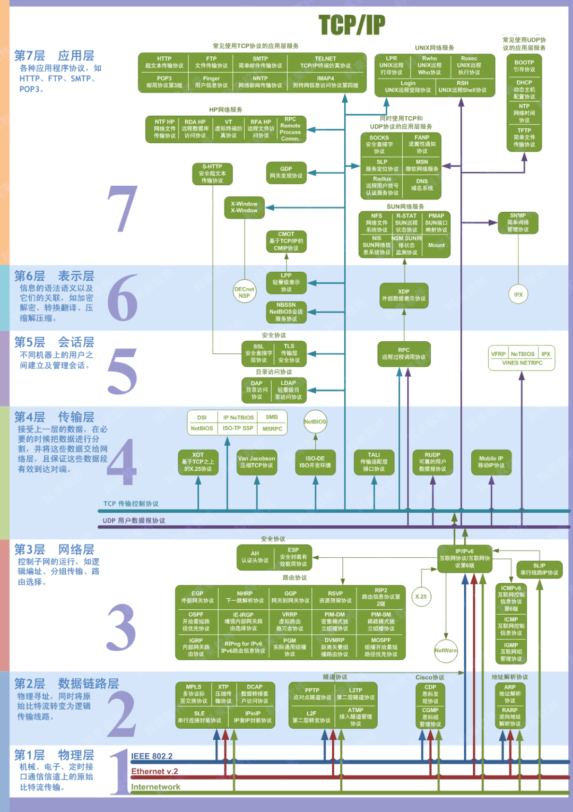
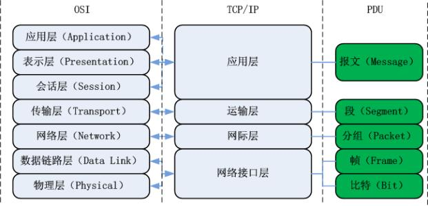
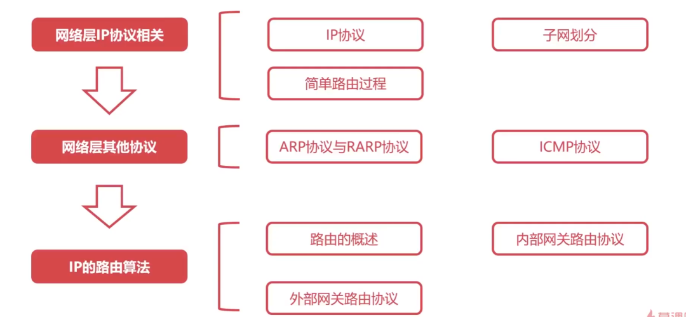
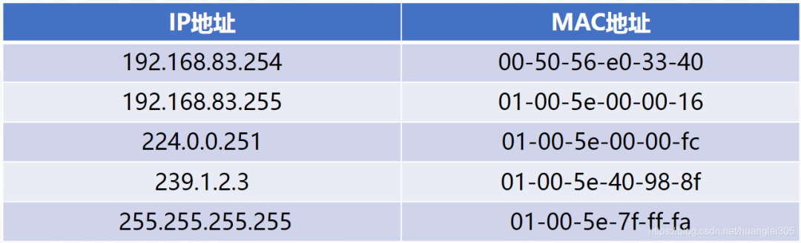
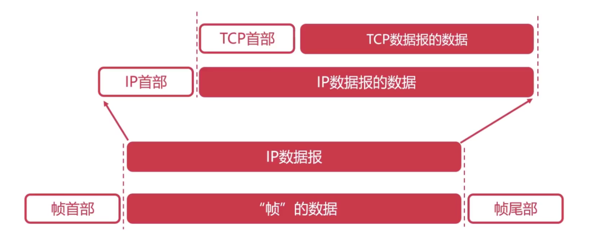
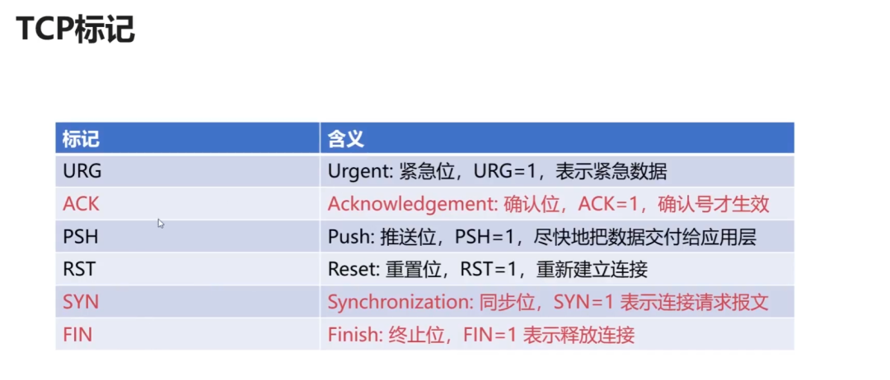
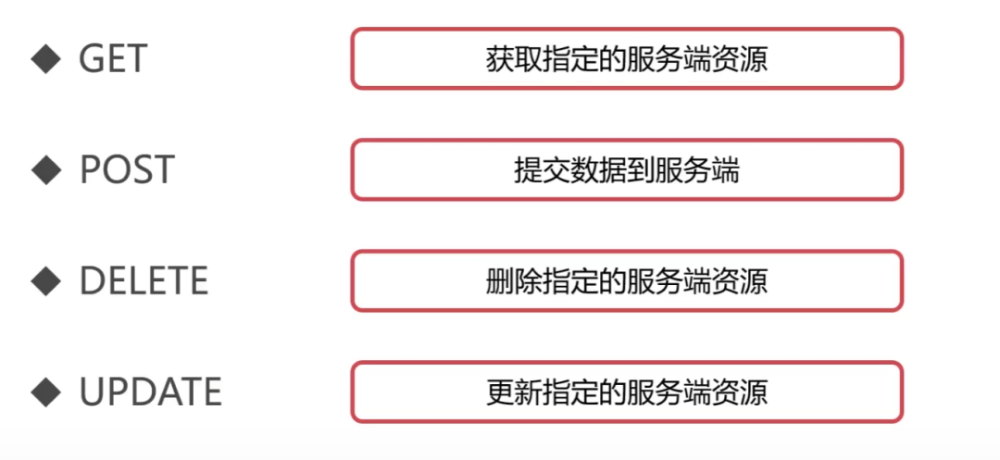

# 计算机网络知识点

# 一、计算机网络概述

`网络`由若干 `结点(node)`, 和连接这些结点的 `链路(Link)` 组成.  结点可以是各种 `终端设备`和 `网络互联设备`. 链路, 可以是有线, 和无线的.

我们可把这个网络作为一个整体, 跟外界互连时, 把它抽象成一个云.

## 1.1 计算机网络的分类

### 以太网 因特网  互联网

以太网（Ethernet），是当今现有局域网采用的最通用的通信协议标准. 是一个数据链路层协议, 它规定了包括物理层的连线、电子信号和介质访问层协议的内容. 以太网络使用CSMA/CD（载波监听多路访问及冲突检测）技术，并以10M/S的速率（仅指标准以太网的速率而已）运行在多种类型的电缆上。以太网与IEEE802.3系列标准相类似。

局域网是指在某一区域内由多台计算机互联成的计算机组.

以太网分为: 标准以太网(10Mbit/s), 快速以太网(100Mbit/s), 千兆以太网(10Gbit/s).

目前局域网基本上都是使用以太网标准. 以太网就是LAN的一种.

`互联网(internet)`, 由若干 `网络` 和 连接这些网络的`路由器` 组成. 互联网是由 `网络` 组成的网络.

因特网(Internet), 是世界上最大的, 由众多互联网互相连接而成的特定的计算机网络. 连接因特网的各种通信设备, 称为主机(Host).

> 网络 -> (+路由器)互联网 -> 因特网

因特网层级:

RFC (Request for comments)

因特网的核心部分 的关键, 在于其中的路由器(一类有芯片的专用计算机, 负责实现分组交换, 转发收到的分组). 核心部分为边缘部分提供连通性和数据交换等服务.

### 电路交换 分组交换 报文交换

电路交换:

这种交换不适合计算机那种`突发式数据传送`, 因为电路交换在这种场景下的线路传输效率会很低. 线路上真正在传数据的时间不到10%甚至只有1%. 所以计算机使用`分组交换`.

分组交换:

分组交换基于存储转发的技术. 源主机将待发送的整块数据构造成若干个分组并发送出去, 分组传送途中的各个交换节点(即路由器)对分组进行存储转发, 目的主机收到这些分组后将他们还原为原始数据块.

待发送的整块数据称为 `报文(Message)`. 较长的报文不适合直接传输. 若报文太长, 对交换节点的缓存容量也有要求, 处理错误也比较低效. 因此需把长报文, 划分为若干短小的`等长数据段`, 并在每个数据段前加上 由必要控制信息(如源地址, 目的地址等)组成的`首部(header)`. 这样一个个`分组(Packet)`就构造完毕了.

分组是在分组交换网上传送的`数据单元`.

`源主机`H1把分组发送到`分组交换网`中, 其中的`分组交换机`收到一个分组后, 先把它`缓存`下来, 然后从它的Header中`提取目的地址`, 按照目的地址`查找自己的转发表`, 找到相应的`转发接口`将分组`转发出去`. 经过多次这样的存储转发, 分组最后被转发到目的主机H3. H3获取全部分组后, 去掉各自首部, 还原数据. 

过程:

这只是演示H1到H3的分组交换, 然而实际上这个分组交换网中有许许多多的分组交换在进行中.
同时, 若R1到R2之间的通信量过大, 那R1可以把分组转发给R5, 再依次转发到H3.

报文交换:
它是分组交换的前身.

三种对比:

### 网络的定义

## 1.2 计算机网络的体系结构

### 三个参考模型

OSI参考模型: 

TCP/IP参考模型: 

IP: Internet Protocol 网际协议
TCP: Transmission Control Protocol 传输控制协议
UDP: 用户数据包协议 User Datagram Protocol

TCP/IP四层模型与OSI体系结构对比：

TCP/IP体系结构各层的主要协议:

原理参考模型:

### 分层的必要性

网络是个非常复杂的系统, "分层" 可以将庞大复杂的问题转为 若干较小的局部问题.

- 物理层

最简单的情况, 电脑连电脑.

1. 采用什么传输媒介(物理层之下)

2. 采用什么物理接口

3. 用什么信号表示0和1

高电平 为 1 低电平 为0 
严格说来 传输媒介不属于物理层范围, 传输的信号也不是简单的数字基带信号. 只为了好理解而作的简化.

- 数据链路层

实用的计算机网络往往由多台计算机互连而成. 下图三台主机通过总线互连成一个总线型网络.

1. 如何标识网络中的各个主机(主机编址, 如MAC)

2. 如何从比特流中区分出地址和数据(数据封装格式)

主机在发送数据时应该给数据附加上源地址和目的地址. 其他主机接收到后, 根据目的地址和自身地址是否匹配, 来决定是否接受此数据.

要把源地址跟目的地址附加到数据上, 需要收发双方约定好数据的封装格式. 

3. 如何协调各主机争用总线(媒体接入控制)

实际上, 总线型已经被淘汰. 现在用的是以太网交换机.

- 网络层

物理层跟数据链路层的问题解决之后, 就可以实现数据包在一个网络上传输了. 但是我们的网络应用往往不是仅限于一个单独的网络上.(如因特网) 
所以, 还有问题待解决.

1. 如何标识网络和和网络中的各主机(网络和主机共同编址, 如IP地址).

192.168.0.x 与 192.168.1.x 是不同的两个网络.

2. 路由器如何转发分组和进行路由选择(路由选择协议, 路由表和转发表)

互联网中, 源主机与目的主机之间的传输路径不止一条. 分组从源主机到目的主机可走不同的路径. 上图, 就有两条路径.

- 运输层

物理层, 数据链路层, 网络层问题解决后, 就可以实现分组在多个网络之间的传送了. 然后, 对于网络应用而言, 还有一些问题.

1. 如何标识主机中与网络通信有关的app进程.(进程的标识, 如端口号)

当主机收到网络数据包之后, 它怎么知道该发给哪个应用程序呢? 

2. 如何处理传输差错(可靠传输 不可靠传输)

假如分组因为各种原因(因误码而被抛弃, 或因路由器繁忙而主动丢弃分组) 被丢弃, 那么当出现这些传输差错, 应该如何处理.

- 应用层

解决了上面四层问题, 就可以实现进程间通信了.

## 1.3 层次结构设计的基本原则

- 各层之间是相互独立的；
- 每一层需要有足够的灵活性；
- 各层之间完全解耦。
- 

## 1.4 计算机网络的性能指标

8个指标: 速率 带宽 吞吐量 时延 时延带宽积 往返时间 利用率 丢包率

`速率`: 数据的传输速率(每秒传多少bit bps=bit/s), 也称数据率(Data Rate)或比特率(Bit Rate).  

`带宽`: 

`吞吐量`:

`时延`：数据(一个或多个分组, 甚至是一个bit构成) 从网络一端传送到另一端所耗费的时间. 也叫延迟或迟延.  分为发送时延、传播时延、排队时延、处理时延 .

发送时延: 是主机或路由器发送愤怒所耗费的时间, 就是从发送分组的第一个bit开始, 到该分组最后一个bit发送完毕为止所耗费的时间.

传播时延: 是电磁波在链路上(传输介质)传播一定距离所耗费的时间. 
光纤快, 是带宽大.

排队时延: 分组进入路由器后, 会在路由器的输入队列里排队缓存并且等待处理. 路由器确定分组的转发接口后, 分组会在输出队列中排队缓存并且等待转发. 分组在路由器的输入队列和输出队列里排队缓存所消耗的时间就是排队时延. 

排队时延长短, 取决于网络当时的通信量和各路由器自己的性能. 无法计算. 当网络通信量很大时, 可能会造成路由器的队列溢出, 使分组丢失, 相当于排队时延无穷大.

处理延时: 路由器从自己的输入队列中取出排队缓存并等待处理的分组后, 会进行一系列处理工作.(如检查分组的首部是否误码, 提取分组首部的目的地址, 为分组查找相应的转发接口等) 路由器对分组這一系列处理工作所耗费的时间, 就是处理时延.

`时延带宽积`: 

`往返时间RTT`：数据报文在端到端通信中的来回一次的时间. 

`利用率`: 

链路利用率: 某条链路被利用时间的百分比. 
网络利用率: 网络中所有链路的链路利用率的加权平均.

`丢包率`:

## 1.5 网络分层思想举例

应用层: 根据HTTP协议, 造一个HTTP请求报文. 然后把请求报文交给传输层.
运输层: 给HTTP请求报文 加一个TCP首部, 封装成TCP报文段. 区分应用进程和实现可靠传输.

网络层: 运输层把TCP报文段交给网络层, 网络层给它再加个IP首部. 封装成IP数据报. IP首部用于IP寻址和路由选择. IP数据报交给数据链路层.

数据链路层: 给IP数据报加个首部和尾部. 封装成帧. 帧首部跟尾部 作用: MAC寻址和帧校验. 帧 交给物理层.

物理层: 不认识帧结构, 将其视为比特流. 把它转化为电信号发出去. 
如果是以太网, 还会在比特流前加个 前导码, 目的是使接收方的时钟同步, 并做好接收准备.

路由器接收口 拿到比特流, 物理层去掉前导码交给链路层, 链路层去掉头部和尾部, IP数据包给网络层.
网络层从IP数据报首部提取目的IP地址, 查找自己的转发表, 决定从哪个接口发出去. 同时, 对首部中的某些字段进行修改. 然后将该IP数据报往下层传.

然后在目的主机层层解码.

## 1.6 网络体系结构中的专用术语

注意三类名称: 实体, 协议, 服务

### 1. 实体和对等实体

收发双方的网卡是对等实体, 它包括物理层和数据链路层. 双方的浏览器进程和web服务器进程也是对等实体.

### 2. 协议

注意, 将两个对等实体之间的通信称为"逻辑通信", 是因为这种通信其实并不存在, 是假想的一种通信. 方便研究某一层而不用管其他层.

网络协议三要素:
IPv4数据报格式: 

每个小格子称为字段, 或域.

同步: 定义通信双方的时序关系. 上图, 必须是主机先发HTTP GET请求报文给web服务器, 服务器在收到主机的get请求才能给主机发HTTP响应报文. 这就是HTTP协议的同步所定义的.

### 3. 服务

在协议的控制下, 两个对等实体在水平方向上的逻辑通信使得本层能够向上一层提供服务.
要实现本层协议, 还需要下面一层所提供的服务.

通信双方的数据包, 都有专门的术语.

例如: 物理层对等实体间逻辑通信的数据包称为比特流(bit stream)等等如上图.

小结:

# 二、物理层

## 2.1 物理层概述

### 2.1.1 物理层要实现的功能

物理层的作用：连接不同的物理设备，传输比特流。该层为上层协议提供了一个传输数据的可靠的物理媒体。简单的说，物理层确保原始的数据可在各种物理媒体上传输。

>在各种传输媒体上传输比特流, 给上一层提供透明传输比特流的服务.

可使用是传输媒体和相应的硬件设备种类众多, 可采取的通信手段也有多种不同的方式. 

物理层为数据链路层屏蔽掉了各种传输媒体和通信手段的差异. 让数据链路层只考虑本层如何实现协议和服务.

物理层设备：能隔离冲突域也不能隔离广播域。

- 中继器【Repeater，也叫放大器】：同一局域网的再生信号；两端口的网段必须同一协议；5-4-3规程：10BASE-5以太网中，最多串联4个中继器，5段中只能有3个连接主机；
- 集线器：同一局域网的再生、放大信号（多端口的中继器）；半双工，不

信道的基本概念：信道是往一个方向传输信息的媒体，一条通信电路包含一个发送信道和一个接受信道。

1. 单工通信信道：只能一个方向通信，没有反方向反馈的信道；
2. 半双工通信信道：双方都可以发送和接受信息，但不能同时发送也不能同时接收；
3. 全双工通信信道：双方都可以同时发送和接收。

### 2.1.2 物理层接口特性

为了实现物理层的功能, 物理层定义了与传输媒体的接口相关的一些特性. 按相同接口标准生产的不同厂家的网络设备接口可以相互连接和通信.

主要有, 机械特性, 电气特性, 功能特性, 过程特性

机械特性: 规定接口所用接线器的形状和尺寸, 引脚数目和排列, 固定锁定装置等.

电气特性: 规定了在接口电缆的各条线上传输比特流时, 信号电压范围, 阻抗匹配情况和传输速率与距离限制等.

功能特性: 规定了接口电缆的各条信号线的作用.

## 2.2 物理层下面的传输媒体

物理层规定了与传输媒体有关的接口特性, 但传输媒体自身不在物理层范围.

### 2.2.1 导向型传输媒体

1. 同轴电缆
有屏蔽层所以抗干扰性好, 常用于高速率数据传输.
 

2. 双绞线

将两根相互绝缘的铜导线按一定密度相互绞合(twist)起来就成了双绞线.
实际应用中, 往往把多对双绞线一起打包在一个绝缘保护套内, 称为双绞线电缆.
为了提高双绞线电缆的抗电磁干扰能力, 在绝缘保护套内, 在多对双绞线外, 在包裹一层用金属丝编织成的屏蔽层, 就成了 屏蔽双绞线电缆.(Shielded Twisted Pair, STP).
STP肯定要比UTP要贵.

信号在双绞线上的衰减, 会随着信号频率的升高而增大. 为了降低信号衰减, 可用更粗的导线. 但会增加导线重量和成本.

双绞线可用于模拟传输和数字传输. 使用双绞线的通信距离一般在几到十几千米.
对于模拟传输, 距离太长时要用放大设备, 将衰减的信号放大.
对于数字传输, 距离太长需要添加中继设备, 将失真了的数字信号进行整形.

双绞线电缆价格便宜且性能优良, 被广泛使用.

3. 光纤

### 2.2.2 非导向型传输媒体

当导向型传输媒体, 必须进行线路铺设. 难以施工的地区, 通信距离很远时, 铺设线路费时又费钱. 利用无线电波在自由空间的传播, 可以快速, 方便和灵活地实现多种无线通信.

自由空间就是无线通信所使用的非导向型传输媒体. 利用自由空间进行无线通信是在运动中进行通信的唯一手段.

无线通信可使用的频段很广: 

1. 无线电波
无线电波(LF, MF, HF, VHF频段) 很容易产生, 且传播的很远. 故此, 无线电波广泛应用于通信领域.

电离层的不稳定所产生的衰落现象和电离层反射所产生的多径效应, 会严重影响高频波的通信质量.

- 低频无线电波能轻易穿透障碍物, 但其能量随着与信号源距离的增大而急剧衰减.
- 高频无线电波趋于直线传播并会受到障碍物的阻挡, 还会被雨水吸收.

2. 微波

3. 红外线

电脑的后外接口已经基本没了, 手机还有.

4. 激光
5. 可见光

## 2.3 传输方式

### 2.3.1 串行和并行传输

并行传输成本高, 仅用于短距离传输. 远距离一般用串行传输.

计算机网卡, 同时具有串行和并行传输方式. 
- 当计算机通过内部网卡, 将数据发送到传输线路上, 网卡的作用就是并/串转换.
- 网卡从传输线路上接收数据时, 网卡进行串/并转换.

### 2.3.2 同步传输和异步传输

1. 同步传输方式

同步传输以`比特`为传输单位, 数据块以比特流的形式传输, 字节之间没有间隔, 也没有起始位和终止位. 这就要求收发双方, 对表示比特的信号的时间长度达成一致, 即所谓的同步. 
然而在不采取任何其它措施的情况下, 收发双方的时钟频率无法达到严格同步. 在传输过程中, 必然会产生接收方对信号采样时刻的误差积累. 当传输大量数据时, 误差积累会越来越严重, 最终会导致接收方对比特信号的误判. 

2. 异步传输方式

异步传输方式以字节单位传输, 但字节之间的时间间隔并不固定. 接收端只在每个字节的起始处对字节内的比特实现同步. 为此, 一般要给每个字节添加起始位和结束位.

3. 单向通信 双向交替通信 双向同时通信

半双工, 就是对于任何一方, 发送和接收不能同时进行. 
单工只需一条信道, 半双工和全双工需要两条信道.

## 2.4 编码与调制

计算机直接输出的数字信号不适合在信道上传输. 需将其编码或调制成适合在信道上传输的信号.

### 2.4.1 编码与调制的基本概念

网卡把bit 0和bit 1变换成相应的信号发送到传输媒体.

基带信号: 由信源发出的原始信号, 也就是基本频带信号. 如计算机输出的表示文字, 图像, 音视频的数字信号. 
基带信号往往包含较多的低频成分, 甚至包含(由连续个0或连续个1造成的)直流成分. 而许多信道不能传输这种低频分量或直流分量. 所以需要对基带信号进行调制后才能在信道上传输.

基带调制: 对数字基带信号的波形进行变换, 使其能够与信道特性相适应, 调制后的信号还是数字基带信号. 就是把数字信号转换成另一种形式的数字信号, 所以又叫 编码.

带通调制: 将数字基带信号的频率范围 搬移 到较高的频段, 并转换为模拟信号, 使其能够在模拟信道中传输.

码元: 信号的编码单元. 
- 对于模拟信号, 载波参数(振幅, 频率, 初相位)的变化就是一个码元.
- 对于数字信号, 一个数字脉冲就是一个码元.

如图, 一个码元所能携带的信息量(即构成离散数值的比特数量) 不是固定的, 取决于编码方式和调制方式.

### 2.4.2 常用编码方式

常用编码方式: 不归零制, 归零制, 曼彻斯特编码, 查分曼彻斯特编码.

曼彻斯特编码在`每个码元中间时刻`电平会跳变.  其信号属于自同步信号. 10Mb/s的传统以太网就是用曼彻斯特编码.

差分曼彻斯特编码 也在每个码元中间发生电平跳变.

### 2.4.3 基本的带通调制方法和混合调制方法
1. 基本的带通调制方法
有 调幅, 调频, 调相.
调幅: (Amplitude Modulation ,AM) 是让载波的振幅随基带数字信号的变化而变化.
调频: (Frequency Modulation, FM) 是让载波的频率随机带数字信号的变化而变化.
调相: (Phase Modulation, PM) 是让载波的初相位随基带数字信号的变化而变化.

2. 混合调制法
为了提高数据传输速率, 用混合调制.使一码元可表示多个比特的信息量.

## 2.5 信道极限容量

实际信道不是理想化的, 信号在信道上传输不可避免地会产生失真.

### 2.5.1 奈氏准则

上面四个失真因素, 码元的传输速率不好理解. 

每种信道 所能通过的信号的 频率范围 总是有限的. 如电话线允许通过的模拟信号的频率范围是300~3400Hz, 不在此范围的模拟信号都不能过. 即电话线的频率带宽为3.1KHz.(3400 - 300)
(1):

(2):

(3):

综上, 模拟信号在模拟信道传输时, 受信道频率带宽的限制, 而数字信号在数字信道传输时, 信号中的许多高频分量往往不能通过信道.

### 2.5.2 香农公式

## 2.6 信道复用技术

复用(Multiplexing) 是在一条传输媒体上同时传输多路用户的信号.
当一条传输媒体的传输容量 大于多条信道传输的总容量时, 就可以通过复用技术, 在这条传输媒体上建立多条通信信道, 以便充分利用传输媒体的带宽.

常用的信道复用技术: 频分复用FDM, 时分复用TDM, 波分复用WDM, 码分复用CDM 

### 2.6.1 频分复用

频分复用(Frequency Division Multiplexing) 是将传输媒体的总频带划分成多个子频带, 每个子频带作为一个通信子频道. 每对用户使用其中的一个子信道进行通信. 

### 2.6.2 时分复用

时分复用(Time Division Multiplexing) 是将时间划分为一段段等长的时隙, 每一个时分复用的用户, 在其相应时隙内独占传输媒体的资源进行通信.

时分复用的个用户所对应的时隙, 就构成时分复用帧(TDM帧).

时分复用的所有用户, 在不同的时间占用同样的信道资源发送数据. 在使用TDM技术传送计算机数据时, 由于计算机数据的突发性, 一般每个用户对所分配到的TDM帧中的时隙的利用率并不高. 
如, 某个用户正在输入一段文本或浏览一段信息, 此时段中, 没有信息要发送, 这就导致分配给该用户的若干时隙的信道资源就浪费掉了. 而且此时若其他用户有东西要发, 也无法在这些时隙使用到资源.  
这就会导致TDM后的信道利用率不高. 

统计时分复用(Statistic TDM, STDM) 是对TDM的改进, 能明显提高信道利用率.

### 2.6.3 波分复用

### 2.6.4 码分复用

## 三、数据链路层

### 3.1 数据链路层概述

数据链路层在物理层提供的服务的基础上向网络层提供服务，其最基本的服务是将源自网络层来的数据可靠地传输到相邻节点的目标机网络层。数据链路层在不可靠的物理介质上提供可靠的传输。

该层的作用包括：**物理地址寻址、数据的成帧、流量控制、数据的检错、重发**等。

有关数据链路层的重要知识点：

1. 数据链路层为网络层提供可靠的数据传输；
2. 基本数据单位为帧；
3. 主要的协议：以太网协议；
4. 两个重要设备名称：网桥和交换机。

封装成帧：“帧”是**数据链路层**数据的基本单位：

透明传输：“透明”是指即使控制字符在帧数据中，但是要当做不存在去处理。即在控制字符前加上转义字符ESC。

### 3.2 数据链路层的差错监测

差错检测：奇偶校验码、循环冗余校验码CRC

1. 奇偶校验码–局限性：当出错两位时，检测不到错误。
2. 循环冗余检验码：根据传输或保存的数据而产生固定位数校验码。

### 3.3 最大传输单元MTU

最大传输单元MTU(Maximum Transmission Unit)，数据链路层的数据帧不是无限大的，数据帧长度受MTU限制.

路径MTU：由链路中MTU的最小值决定。

### 3.4 以太网协议详解

MAC地址：每一个设备都拥有唯一的MAC地址，共48位，使用十六进制表示。

以太网协议：是一种使用广泛的局域网技术，是一种应用于数据链路层的协议，使用以太网可以完成相邻设备的数据帧传输：

#### 局域网分类：

Ethernet以太网IEEE802.3：

1. 以太网第一个广泛部署的高速局域网
2. 以太网数据速率快
3. 以太网硬件价格便宜，网络造价成本低

#### 以太网帧结构：

1. 类型：标识上层协议（2字节）
2. 目的地址和源地址：MAC地址（每个6字节）
3. 数据：封装的上层协议的分组（46~1500字节）
4. CRC：循环冗余码（4字节）
5. 以太网最短帧：以太网帧最短64字节；以太网帧除了数据部分18字节；数据最短46字节；

#### MAC地址（物理地址、局域网地址）

1. MAC地址长度为6字节，48位；
2. MAC地址具有唯一性，每个网络适配器对应一个MAC地址；
3. 通常采用十六进制表示法，每个字节表示一个十六进制数，用 - 或 : 连接起来；
4. MAC广播地址：FF-FF-FF-FF-FF-FF。

# 四、网络层

网络层的目的是实现两个端系统之间的数据透明传送，具体功能包括寻址和路由选择、连接的建立、保持和终止等。数据交换技术是报文交换（基本上被分组所替代）：采用储存转发方式，数据交换单位是报文。

网络层中涉及众多的协议，其中包括最重要的协议，也是TCP/IP的核心协议——IP协议。IP协议非常简单，仅仅提供不可靠、无连接的传送服务。IP协议的主要功能有：无连接数据报传输、数据报路由选择和差错控制。

与IP协议配套使用实现其功能的还有地址解析协议ARP、逆地址解析协议RARP、因特网报文协议ICMP、因特网组管理协议IGMP。具体的协议我们会在接下来的部分进行总结，有关网络层的重点为：

1. 网络层负责对子网间的数据包进行路由选择。此外，网络层还可以实现拥塞控制、网际互连等功能；

2. 基本数据单位为IP数据报；

3. 包含的主要协议：

- IP协议（Internet Protocol，因特网互联协议）;
- ICMP协议（Internet Control Message Protocol，因特网控制报文协议）;
- ARP协议（Address Resolution Protocol，地址解析协议）;
- RARP协议（Reverse Address Resolution Protocol，逆地址解析协议）。

4. 重要的设备：路由器。

路由器相关协议

### 4.1 IP协议详解

IP网际协议是 Internet 网络层最核心的协议。

虚拟互联网络的产生：实际的计算机网络错综复杂；

物理设备通过使用IP协议，屏蔽了物理网络之间的差异；

当网络中主机使用IP协议连接时，无需关注网络细节，于是形成了虚拟网络。

IP协议使得复杂的实际网络变为一个虚拟互联的网络；并且解决了在虚拟网络中数据报传输路径的问题。

其中，版本指IP协议的版本，占4位，如IPv4和IPv6；

首部位长度表示IP首部长度，占4位，最大数值位15；

总长度表示IP数据报总长度，占16位，最大数值位65535；

TTL表示IP数据报文在网络中的寿命，占8位；

协议表明IP数据所携带的具体数据是什么协议的，如TCP、UDP。

### 4.2 IP协议的转发流程

### 4.3 IP地址的子网划分

A类（8网络号+24主机号）、B类（16网络号+16主机号）、C类（24网络号+8主机号）可以用于标识网络中的主机或路由器，D类地址作为组广播地址，E类是地址保留。

### 4.4 网络地址转换NAT技术

用于多个主机通过一个公有IP访问访问互联网的私有网络中，减缓了IP地址的消耗，但是增加了网络通信的复杂度。

#### NAT 工作原理：

从内网出去的IP数据报，将其IP地址替换为NAT服务器拥有的合法的公共IP地址，并将替换关系记录到NAT转换表中；

从公共互联网返回的IP数据报，依据其目的的IP地址检索NAT转换表，并利用检索到的内部私有IP地址替换目的IP地址，然后将IP数据报转发到内部网络。

### 4.5 ARP协议与RARP协议

地址解析协议 ARP（Address Resolution Protocol）：为网卡（网络适配器）的IP地址到对应的硬件地址提供动态映射。可以把网络层32位地址转化为数据链路层MAC48位地址。

ARP 是即插即用的，一个ARP表是自动建立的，不需要系统管理员来配置。

RARP(Reverse Address Resolution Protocol)协议指逆地址解析协议，可以把数据链路层MAC48位地址转化为网络层32位地址。

### 4.6 ICMP协议详解

网际控制报文协议（Internet Control Message Protocol），可以报告错误信息或者异常情况，ICMP报文封装在IP数据报当中。

#### ICMP协议的应用：

- Ping应用：网络故障的排查；
- Traceroute应用：可以探测IP数据报在网络中走过的路径。

### 4.7网络层的路由概述

关于路由算法的要求：正确的完整的、在计算上应该尽可能是简单的、可以适应网络中的变化、稳定的公平的。

**自治系统AS**：指处于一个管理机构下的网络设备群，AS内部网络自治管理，对外提供一个或多个出入口，其中自治系统内部的路由协议为内部网关协议，如RIP、OSPF等；自治系统外部的路由协议为外部网关协议，如BGP。

**静态路由**：人工配置，难度和复杂度高；

动态路由：

1. 链路状态路由选择算法LS：向所有隔壁路由发送信息收敛快；全局式路由选择算法，每个路由器计算路由时，需构建整个网络拓扑图；利用Dijkstra算法求源端到目的端网络的最短路径；Dijkstra(迪杰斯特拉)算法
2. 距离-向量路由选择算法DV：向所有隔壁路由发送信息收敛慢、会存在回路；基础是Bellman-Ford方程（简称B-F方程）；

### 4.8 内部网关路由协议之RIP协议

路由信息协议 RIP(Routing Information Protocol)【**应用层**】，基于距离-向量的路由选择算法，较小的**AS（自治系统）**，适合小型网络；RIP报文，封装进UDP数据报。

#### RIP协议特性：

1. RIP在度量路径时采用的是跳数（每个路由器维护自身到其他每个路由器的距离记录）；
2. RIP的费用定义在源路由器和目的子网之间；
3. RIP被限制的网络直径不超过15跳；
4. 和隔壁交换所有的信息，30主动一次（广播）。

### 4.9 内部网关路由协议之OSPF协议

开放最短路径优先协议 OSPF(Open Shortest Path First)【网络层】，基于链路状态的路由选择算法（即Dijkstra算法），较大规模的AS ，适合大型网络，直接封装在IP数据报传输。

#### OSPF协议优点：

1. 安全；
2. 支持多条相同费用路径；
3. 支持区别化费用度量；
4. 支持单播路由和多播路由；
5. 分层路由。

RIP与OSPF的对比（路由算法决定其性质）：

### 4.10外部网关路由协议之BGP协议

BGP（Border Gateway Protocol）边际网关协议【应用层】：是运行在AS之间的一种协议,寻找一条好路由：首次交换全部信息，以后只交换变化的部分,BGP封装进TCP报文段.

# 五、传输层

第一个端到端，即主机到主机的层次。传输层负责将上层数据分段并提供端到端的、可靠的或不可靠的传输。此外，传输层还要处理端到端的差错控制和流量控制问题。

传输层的任务是根据通信子网的特性，最佳的利用网络资源，为两个端系统的会话层之间，提供建立、维护和取消传输连接的功能，负责端到端的可靠数据传输。在这一层，信息传送的协议数据单元称为段或报文。

网络层只是根据网络地址将源结点发出的数据包传送到目的结点，而传输层则负责将数据可靠地传送到相应的端口。

### **有关网络层的重点：**

1. 传输层负责将上层数据分段并提供端到端的、可靠的或不可靠的传输以及端到端的差错控制和流量控制问题；
2. 包含的主要协议：TCP协议（Transmission Control Protocol，传输控制协议）、UDP协议（User Datagram Protocol，用户数据报协议）；
3. 重要设备：网关。

### 5.1 UDP协议详解

UDP(User Datagram Protocol: 用户数据报协议)，是一个非常简单的协议，

UDP协议的特点：

- UDP是无连接协议；
- UDP不能保证可靠的交付数据；
- UDP是面向报文传输的；
- UDP没有拥塞控制；
- UDP首部开销很小。

#### UDP数据报结构：

首部:8B，四字段/2B【源端口 | 目的端口 | UDP长度 | 校验和】 数据字段：应用数据

### 5.2 TCP协议详解

TCP(Transmission Control Protocol: 传输控制协议)，是计算机网络中非常复杂的一个协议。

#### TCP协议的功能：

1. 对应用层报文进行分段和重组；
2. 面向应用层实现复用与分解；
3. 实现端到端的流量控制；
4. 拥塞控制；
5. 传输层寻址；
6. 对收到的报文进行差错检测（首部和数据部分都检错）；
7. 实现进程间的端到端可靠数据传输控制。

#### TCP协议的特点：

- TCP是面向连接的协议；
- TCP是面向字节流的协议；
- TCP的一个连接有两端，即点对点通信；
- TCP提供可靠的传输服务；
- TCP协议提供全双工通信（每条TCP连接只能一对一）；

#### 5.2.1 TCP报文段结构：

最大报文段长度：报文段中封装的应用层数据的最大长度。

**TCP首部：**

- 序号字段：TCP的序号是对每个应用层数据的每个字节进行编号
- 确认序号字段：期望从对方接收数据的字节序号，即该序号对应的字节尚未收到。用ack_seq标识；
- TCP段的首部长度最短是20B ，最长为60字节。但是长度必须为4B的整数倍

#### TCP标记的作用：

### 5.3 可靠传输的基本原理

基本原理：

- 不可靠传输信道在数据传输中可能发生的情况：比特差错、乱序、重传、丢失
- 基于不可靠信道实现可靠数据传输采取的措施：

> 差错检测：利用编码实现数据包传输过程中的比特差错检测 确认：接收方向发送方反馈接收状态 重传：发送方重新发送接收方没有正确接收的数据 序号：确保数据按序提交 计时器：解决数据丢失问题；

停止等待协议：是最简单的可靠传输协议，但是该协议对信道的利用率不高。

连续ARQ(Automatic Repeat reQuest：自动重传请求)协议：滑动窗口+累计确认，大幅提高了信道的利用率。

#### 5.3.1TCP协议的可靠传输

基于连续ARQ协议，在某些情况下，重传的效率并不高，会重复传输部分已经成功接收的字节。

#### 5.3.2 TCP协议的流量控制

流量控制：让发送方发送速率不要太快，TCP协议使用滑动窗口实现流量控制。

### 5.4 TCP协议的拥塞控制

拥塞控制与流量控制的区别：流量控制考虑点对点的通信量的控制，而拥塞控制考虑整个网络，是全局性的考虑。拥塞控制的方法：慢启动算法+拥塞避免算法。

慢开始和拥塞避免：

1. 【慢开始】拥塞窗口从1指数增长；
2. 到达阈值时进入【拥塞避免】，变成+1增长；
3. 【超时】，阈值变为当前cwnd的一半（不能<2）；
4. 再从【慢开始】，拥塞窗口从1指数增长。

快重传和快恢复：

1. 发送方连续收到3个冗余ACK，执行【快重传】，不必等计时器超时；
2. 执行【快恢复】，阈值变为当前cwnd的一半（不能<2），并从此新的ssthresh点进入【拥塞避免】。

### 5.5 TCP连接的三次握手（重要）

TCP三次握手使用指令：

面试常客：为什么需要三次握手？

1. 第一次握手：客户发送请求，此时服务器知道客户能发；
2. 第二次握手：服务器发送确认，此时客户知道服务器能发能收；
3. 第三次握手：客户发送确认，此时服务器知道客户能收。

建立连接（三次握手）：

`第一次`：客户向服务器发送连接请求段，建立连接请求控制段（SYN=1），表示传输的报文段的第一个数据字节的序列号是x，此序列号代表整个报文段的序号（seq=x）；客户端进入 SYN_SEND （同步发送状态）；

`第二次`：服务器发回确认报文段，同意建立新连接的确认段（SYN=1），确认序号字段有效（ACK=1），服务器告诉客户端报文段序号是y（seq=y），表示服务器已经收到客户端序号为x的报文段，准备接受客户端序列号为x+1的报文段（ack_seq=x+1）；服务器由LISTEN进入SYN_RCVD （同步收到状态）;

`第三次`:客户对服务器的同一连接进行确认.确认序号字段有效(ACK=1),客户此次的报文段的序列号是x+1(seq=x+1),客户期望接受服务器序列号为y+1的报文段(ack_seq=y+1);当客户发送ack时，客户端进入ESTABLISHED 状态;当服务收到客户发送的ack后，也进入ESTABLISHED状态;第三次握手可携带数据;

### 5.6 TCP连接的四次挥手（重要）

释放连接（四次挥手）

`第一次`：客户向服务器发送释放连接报文段，发送端数据发送完毕，请求释放连接（FIN=1），传输的第一个数据字节的序号是x（seq=x）；客户端状态由ESTABLISHED进入FIN_WAIT_1（终止等待1状态）；

`第二次`：服务器向客户发送确认段，确认字号段有效（ACK=1），服务器传输的数据序号是y（seq=y），服务器期望接收客户数据序号为x+1（ack_seq=x+1）;服务器状态由ESTABLISHED进入CLOSE_WAIT（关闭等待）；客户端收到ACK段后，由FIN_WAIT_1进入FIN_WAIT_2；

`第三次`:服务器向客户发送释放连接报文段，请求释放连接（FIN=1），确认字号段有效（ACK=1），表示服务器期望接收客户数据序号为x+1（ack_seq=x+1）;表示自己传输的第一个字节序号是y+1（seq=y+1）；服务器状态由CLOSE_WAIT 进入 LAST_ACK （最后确认状态）；

`第四次`：客户向服务器发送确认段，确认字号段有效（ACK=1），表示客户传输的数据序号是x+1（seq=x+1），表示客户期望接收服务器数据序号为y+1+1（ack_seq=y+1+1）；客户端状态由FIN_WAIT_2进入TIME_WAIT，等待2MSL时间，进入CLOSED状态；服务器在收到最后一次ACK后，由LAST_ACK进入CLOSED；

**为什么需要等待2MSL?**

1. 最后一个报文没有确认；
2. 确保发送方的ACK可以到达接收方；
3. 2MSL时间内没有收到，则接收方会重发；
4. 确保当前连接的所有报文都已经过期。

# 六、应用层

为操作系统或网络应用程序提供访问网络服务的接口。**应用层重点：**

1. 数据传输基本单位为报文；
2. 包含的主要协议：FTP（文件传送协议）、Telnet（远程登录协议）、DNS（域名解析协议）、SMTP（邮件传送协议），POP3协议（邮局协议），HTTP协议（Hyper Text Transfer Protocol）。

### 6.1 DNS详解

DNS（Domain Name System:域名系统）【C/S，UDP，端口53】：解决IP地址复杂难以记忆的问题,存储并完成自己所管辖范围内主机的 域名 到 IP 地址的映射。

域名解析的顺序：

- 【1】浏览器缓存，
- 【2】找本机的hosts文件，
- 【3】路由缓存，
- 【4】找DNS服务器（本地域名、顶级域名、根域名）->迭代解析、递归查询。

1. IP—>DNS服务—>便于记忆的域名
2. 域名由点、字母和数字组成，分为顶级域（com，cn，net，gov，org）、二级域（baidu,taobao,qq,alibaba）、三级域（www）(12-2-0852)

### 6.2 DHCP协议详解

DHCP（Dynamic Configuration Protocol:动态主机设置协议）：是一个局域网协议，是应用UDP协议的应用层协议。作用：为临时接入局域网的用户自动分配IP地址。

### 6.3 HTTP协议详解

文件传输协议（FTP）：控制连接（端口21）：传输控制信息（连接、传输请求），以7位ASCII码的格式。整个会话期间一直打开。

HTTP（HyperText Transfer Protocol:超文本传输协议）【TCP，端口80】：是可靠的数据传输协议，浏览器向服务器发收报文前，先建立TCP连接，HTTP使用TCP连接方式（HTTP自身无连接）。

HTTP请求报文方式：

1. GET：请求指定的页面信息，并返回实体主体；
2. POST：向指定资源提交数据进行处理请求；
3. DELETE：请求服务器删除指定的页面；
4. HEAD：请求读取URL标识的信息的首部，只返回报文头；
5. OPETION：请求一些选项的信息；
6. PUT：在指明的URL下存储一个文档。

#### 6.3.1 HTTP工作的结构

#### 6.3.2 HTTPS协议详解

HTTPS(Secure)是安全的HTTP协议，端口号443。基于HTTP协议，通过SSL或TLS提供加密处理数据、验证对方身份以及数据完整性保护。